# ComfyUI-H3-Continuum 3.6.0


Long-form MiniMax H3 video generation for ComfyUI with Continuum-aware Second Pass refinement, optional Hi-Res Fix, low-memory disk-backed assembly, restartable chunks, persistent references, and optional Spectrum interoperability.

## V3.6 Masked AV Continuation

V3.6 adds **H3 Continuum Sampler V3.6**. Its Standard continuation backend places the previous finalized Video and Audio latent prefixes directly inside the next H3 target and protects them with Core noise masks. Unlike the V3.5 Reference Context route, it does not append the same prior frames as a separate Reference block, reducing the packed sequence processed by H3.

| Continuation Backend | Purpose |
|---|---|
| `Standard` | Recommended V3.6 path. Preserves prior Video/Audio in the next target; when Audio Continuity is off, only Video is preserved. |
| `Compatibility` | Advanced fallback using the accepted V3.5 Reference Context behavior. |

Internal transport identifiers are not exposed in the UI. Run Storage keeps Standard and Compatibility revisions separate, and `Regenerate From` treats the Long Terminal Merge logical pair `[2,3]` as one atomic physical sample.

### Accepted behavior

- T2VA, I2VA, Reference Image + Reference Audio, Balanced 22-frame Joint AV, and 3×5-second FL2VA Long Terminal Merge GPU gates passed.
- Protected Video and Audio prefixes finalize bit-exact; generated regions remain owned by the sampler.
- The accepted Reference Image + Reference Audio output passed subjective audio listening with no reported click, dropout, or stereo-positioning defect.
- In the tested FL2VA Terminal Group 2 pairs, Standard removed 2,874 packed rows (`8.01%`) and reduced median Sampling time by `4.06%` versus Compatibility. Performance varies by model, hardware, and workflow.
- `chunk_seconds` now accepts 4.0–30.0 seconds with a 5.0-second default and 0.1-second step. The 5–15 second range remains recommended and validated; longer high-resolution chunks can substantially increase VRAM use and runtime.

V3.5.3, V3.5, and V3.4 Node IDs and saved workflows remain registered. V3.5.3 continues to use its original Reference Context behavior and is not silently redirected to the V3.6 backend.

## V3.5.3 Maintenance Hotfix

V3.5.3 is a distribution-integrity maintenance release. It repairs the public Conditioning Bridge workflow's Width/Height links, removes stale orphan link IDs from the published V3.4/V3.5 templates, corrects Hybrid `<Picture N>` warning numbering, and repairs one legacy PNG for strict image decoders.

There are no changes to generation behavior, nodes, sockets, Sampling, Conditioning payloads, Terminal Merge, Assembly, Seam, Run Storage, Prompt/CLIP caching, Video Guide optimization, or V3.4 compatibility. Existing V3.5.x workflows continue to load unchanged.

## V3.5.2 Stabilization & Optimization Update

V3.5.2 adds no new generation mode. It stabilizes the V3.5.x release, removes repeated Prompt/CLIP work when safe, and lowers temporary memory for long Video Guide inputs while preserving existing workflow and generation contracts.

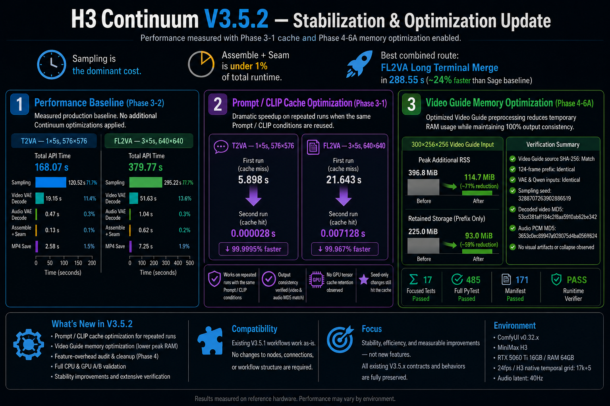

The figure records the accepted optimization measurements. The final packaging gate additionally passed on ComfyUI 0.33.3 with a 172-entry Manifest, including this image.

### What changed

1. **Repeated-run Prompt/CLIP cache** — unchanged T2VA, I2VA, and FL2VA conditioning can reuse CPU-cached Prompt/CLIP results. Reference, scheduled, tokenizer-option, and hook-modified CLIP paths conservatively bypass the cache. Sampling still runs normally.
2. **Video Guide memory optimization** — the complete source remains part of finite validation and SHA-256 identity, but only the required prefix remains stored for VAE/conditioning work.
3. **Stabilization audit** — measured Sampling, Decode, Assembly, saving, optional-feature tax, and retained memory. No speculative Sampling, Driving Audio, Audio hash, Assembly, Seam, Session, or V3.4 optimization was adopted.

### Measured results

| Area | Before | V3.5.2 | Result |
|---|---:|---:|---:|
| T2VA repeated Prompt/CLIP | 5.898398 s | 0.000028 s | Cache HIT, `encode_calls=0` |
| FL2VA repeated Prompt/CLIP | 21.642687 s | 0.007128 s | Cache HIT, `encode_calls=0` |
| Video Guide peak additional RSS | 396.8 MiB | 114.7 MiB | About 71% lower |
| Video Guide retained storage | 225 MiB | 93 MiB | About 59% lower |

Prompt/CLIP figures measure only the conditioning subphase, not total generation time. The Video Guide memory benchmark uses deterministic 300×256×256 RGB input with a 124-frame required prefix. A separate GPU A/B used an actual 15-second / 360-frame Video Guide and produced identical decoded video and audio PCM.

The measured Sage-only production baselines on the tested RTX 5060 Ti 16 GB / 64 GB system were 168.069 seconds for 1×5-second 576×576 T2VA and 379.765 seconds for 3×5-second 640×640 FL2VA Long Terminal Merge. These are configuration-specific baselines, not universal speed guarantees. Sampling remained the dominant cost; Continuum Assemble + Seam stayed below 1%.

> **V3.6.0 is the current release.** V3.5.3 remains the maintenance/compatibility baseline, and V3.5.2 remains the accepted Stabilization & Optimization baseline. Older Node IDs, backend socket keys, and saved-workflow loading remain intentionally supported. The withdrawn experimental Last Queued Seed override is not included.

## V3.5.1 Reference Audio & Compatibility Update

V3.5.1 added two focused features without changing the V3.4 Sampling, Conditioning, Terminal Merge, Assembly, Seam, or Run Storage contracts:

1. **Optional Reference Audio** — native H3 audio conditioning that does not replace the generated final audio.
2. **Conditioning Bridge V3.5** — one complete Core-compatible `MODEL` and `CONDITIONING` object per Continuum physical group for external sampler workflows.

The Reference Audio sockets are permanently defined by Python `INPUT_TYPES`. Dynamic socket changes and the UI-only `Hidden / Show` control were removed to prevent workflow save/reload value shifts. Node IDs, backend keys, Sampling, Conditioning, standard Seed handling, and other widgets are unchanged.

All V3.4 node IDs and backend socket keys remain registered intentionally for saved-workflow compatibility. Existing V3.4/V3.5 workflows continue to load; V3.5.1 clarified the displayed input names without rewriting saved links.

### Reference inputs at a glance

The displayed names intentionally describe different jobs. They are not interchangeable pairs:

| Displayed input | Connect from | Purpose | Final audio behavior |
|---|---|---|---|
| `reference_image_1`–`reference_image_3` | Still-image `IMAGE` | Persistent identity, subject, or appearance references | No audio |
| `Video Guide Frames` | Video loader `IMAGE` frame batch | Persistent motion, framing, timing, and appearance guidance across chunks | Does not carry the video's audio |
| `Driving Audio` + `Driving Audio VAE` | Audio loader, or video loader `AUDIO`, plus the matching audio VAE | Audio guidance whose effective source stream is preserved for final output | Replaces generated final audio with the selected source stream |
| `Reference Audio (Optional)` + `Reference Audio VAE (Optional)` | Standalone audio plus the matching audio VAE | Native H3 conditioning only | Does not copy or replace the generated final audio |

For the common video-with-sound case, connect the loader's `IMAGE` output to `Video Guide Frames` and its `AUDIO` output to `Driving Audio`. Do not connect that audio to `Reference Audio (Optional)` unless conditioning-only behavior is specifically intended.

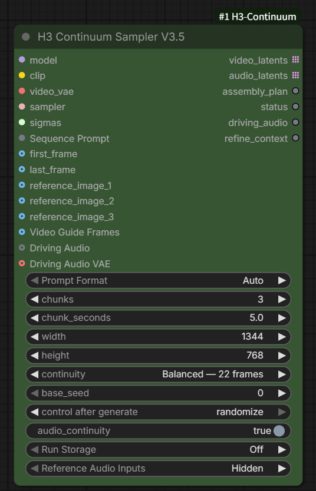

`Reference Audio (Optional)` and `Reference Audio VAE (Optional)` are always present exactly as defined by the node's Python input schema. V3.5.1 no longer adds or removes these sockets dynamically and has no frontend-only `Hidden`/`Show` widget. This keeps positional widget values aligned when workflows are saved and reloaded; backend input keys and existing workflow links are unchanged.

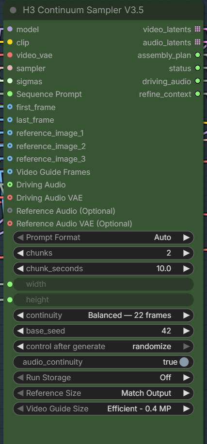

### Conditioning Bridge V3.5

`H3 Continuum Conditioning Bridge V3.5` is the Advanced connection point for external sampling. Connect `model`, `clip`, the externally processed `video_latents`, `assembly_plan`, and `refine_context`; connect `video_vae` only when the selected conditioning path requires it. The node returns parallel `group_models` and `conditioning` lists whose length equals the physical-group count. Each list item remains a complete ComfyUI object—conditioning entries are never flattened into the physical-group list.

```text
H3 Continuum Sampler V3.5.video_latents
  -> external H3 latent processor (for example LBH)
  -> H3 Continuum Conditioning Bridge V3.5
  -> Core BasicGuider + external sampler
  -> Core Video / Audio VAE Decode
  -> H3 Continuum Assemble + Seam V3.5
```

The external workflow owns AV LATENT pairing, noise, SIGMAS, Audio Lock, sampling, and audio passthrough. The Bridge only exposes the prepared `MODEL` and `CONDITIONING` objects plus the updated Assembly Plan.

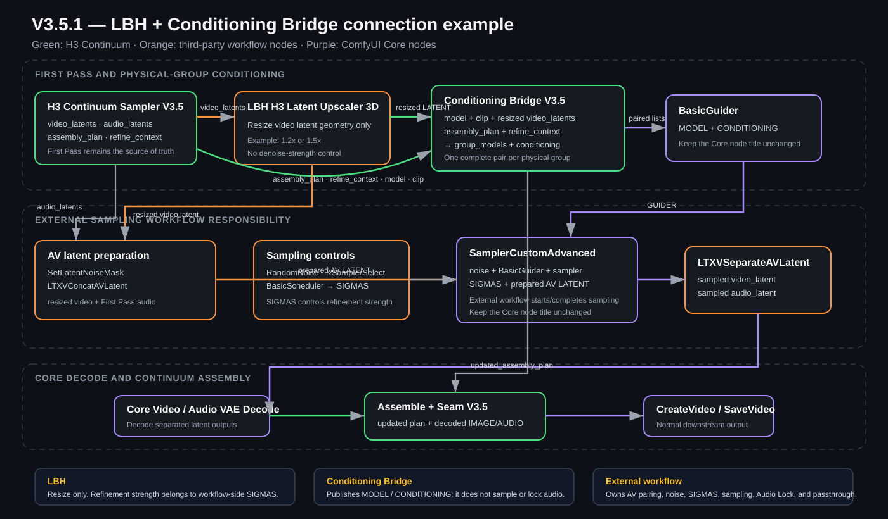

Download the complete connection example: [V3.5.1 LBH + Conditioning Bridge workflow](examples/workflows/MiniMax_H3_Continuum_V351_LBH_Conditioning_Bridge.json).

The example keeps the standard Core titles `BasicGuider`, `BasicScheduler`, and `SamplerCustomAdvanced`. Public examples do not rename Core nodes, so they remain immediately distinguishable from Continuum and third-party nodes. The workflow also uses external nodes for LBH latent upscaling, AV LATENT concatenation/separation, loading/saving, and optional acceleration; install or replace those nodes according to your ComfyUI environment.

LBH changes latent geometry only. It has no Continuum denoise-strength control: use the external `BasicScheduler` SIGMAS to decide how strongly the resized latent is regenerated. A larger LBH scale such as 1.5x may still be fast, but memory, decode, and sampling costs increase with the target canvas.

## What's new in V3.5

V3.5 has two major additions:

1. **Continuum-aware Second Pass / Hi-Res Fix** — refine externally processed H3 latents or use the integrated pixel/VAE 2x path without changing V3.4 sampling.
2. **Low-memory Assemble + Seam** — write the final video IMAGE directly to RAM or a Windows-safe mapped file while preserving Exact Duration, Seam, Terminal Merge order, and audio behavior.

### 1. Second Pass and Hi-Res Fix

**H3 Continuum Hi-Res Fix V3.5** is the one-node Main path. It performs Video VAE Decode, bounded pixel resize, Video VAE Encode, and one low-denoise Second Pass. The integrated Main path remains **Experimental** because long 2x runs can exceed GPU memory.

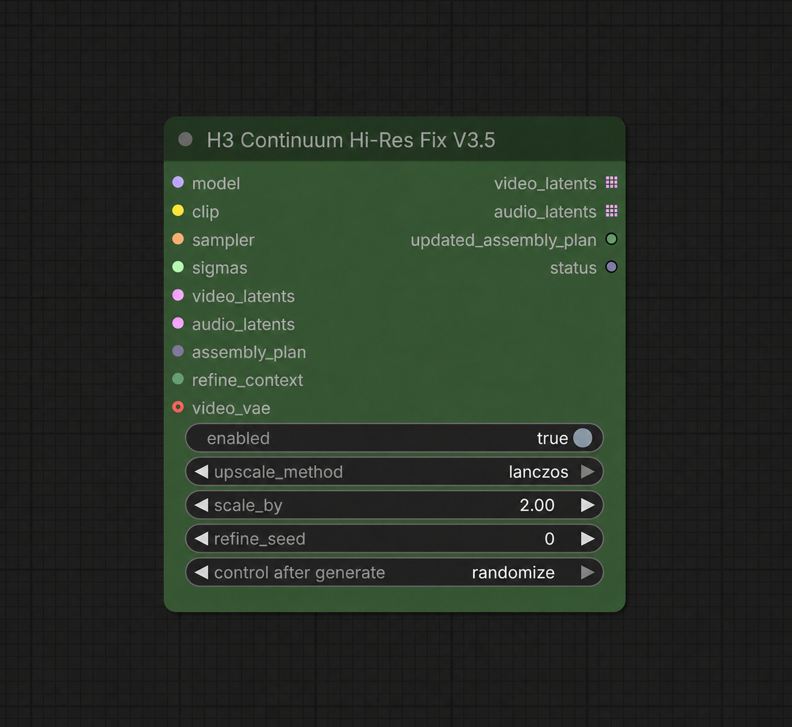

Normal Hi-Res Fix wiring:

```text
H3 Continuum Sampler V3.5
  -> H3 Continuum Hi-Res Fix V3.5
  -> Core Video / Audio VAE Decode
  -> H3 Continuum Assemble + Seam V3.5
```

**H3 Continuum Second Pass V3.5** is the stable Advanced bridge requested in Issue #8. It accepts an externally processed H3 video latent and samples each Continuum physical group once while preserving prompt policy, seed reporting, group order, and the original first-pass audio LATENT object.

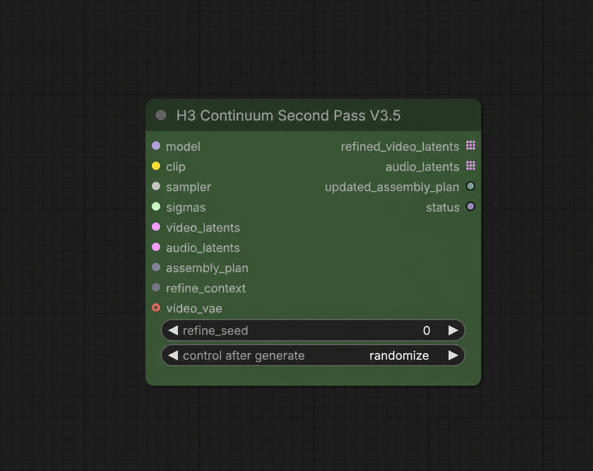

External latent processor wiring, such as LBH:

```text
H3 Continuum Sampler V3.5.video_latents
  -> external H3 latent processor
  -> H3 Continuum Second Pass V3.5
  -> Core Video / Audio VAE Decode
  -> H3 Continuum Assemble + Seam V3.5
```

Connect the original `audio_latents`, `assembly_plan`, and `refine_context` from Sampler V3.5 to the Hi-Res Fix or Second Pass node. Use the same final MODEL and CLIP, plus a separate sampler and workflow-side SIGMAS for the refinement pass. The nodes do not contain an internal denoise value.

The `BasicScheduler` is deliberately omitted from the screenshots. It is still required to create the Second Pass `SIGMAS`. The GPU-tested baseline is:

```text
sampler:   res_multistep
scheduler: simple
steps:     10
denoise:   0.35
```

Do not chain Hi-Res Fix and another Second Pass in the standard path: Hi-Res Fix already performs one Second Pass internally. `H3 Continuum Latent Resize V3.5` is an advanced utility, not the recommended Main 2x path; direct high-ratio interpolation of the 24-channel H3 latent produced persistent artifacts in testing.

If Hi-Res Fix is not connected, V3.4 sampling remains on its original path. V3.5 does not add a forced CPU-offload or low-VRAM sampler mode. `Hi-Res Fix enabled=false` is a lazy exact passthrough and does not evaluate its resize, VAE, or Second Pass dependencies.

See [V3.5 Hi-Res Fix and Second Pass workflow guide](docs/V35_HIRES_FIX.md) for exact sockets, bypass behavior, external-upscaler wiring, and limits.

### 2. Low-memory Assemble + Seam

**H3 Continuum Assemble + Seam V3.5** adds manual RAM / Disk-backed selection and a conservative Auto policy. Disk-backed mode writes the final video IMAGE directly to a mapped file instead of rebuilding the entire completed video in anonymous RAM. Audio remains in RAM.

| Backend | Behavior |
|---|---|
| Auto | Uses RAM only when the final IMAGE is at most 4 GiB and physical-memory reserve is sufficient; otherwise selects Disk-backed. Missing memory counters fail safely to Disk-backed. |
| RAM | Existing in-memory output behavior. |
| Disk-backed | Maps the final video IMAGE to a temporary file; video only. Audio remains in RAM. |

Disk-backed mode preserves the backing file while ComfyUI still references the returned Tensor. Downstream nodes can still allocate a full RAM copy, so Continuum's low-memory guarantee applies to its own assembly stage, not arbitrary downstream implementations.

#### Measured memory reduction

The validated stress case assembled a deterministic `1536 x 1536`, 360-frame float32 IMAGE with a final size of `9.49 GiB`. RAM and Disk-backed outputs were video/audio hash-identical.

| Windows process metric | RAM backend | Disk-backed | Reduction |
|---|---:|---:|---:|
| Private memory | 12.41 GiB | 2.91 GiB | **9.50 GiB** |
| USS | 10.29 GiB | 0.80 GiB | **9.49 GiB** |

This is a **system-RAM/private-commitment** reduction during Continuum Assembly, not a claim that sampler GPU VRAM is reduced. Windows RSS includes resident mapped-file pages and was therefore similar between the two backends; private memory and USS are the relevant measurements. Disk-backed I/O can make final assembly slower, but it does not slow the preceding model sampling path.

#### Optional Windows tip: disable pinned memory

For MiniMax H3 on Windows, starting ComfyUI with `--disable-pinned-memory` can substantially reduce host-RAM pressure. In one local RTX 5060 Ti 16 GB / RAM 64 GB check, a `0.4 MP (640 x 640), 2 x 5s` run completed in `5m 23s`, with about `6.1 GB` sampler RSS and `8.6 GB` after assembly, while showing little practical speed difference from normal startup.

```text
--disable-pinned-memory
```

This is an environment-specific tip, not a default requirement or a universal crash fix. Compare the same workflow and seed with only this option changed, and keep it only when memory use improves without a meaningful speed or stability regression. It disables ComfyUI's pinned host-memory path; it does not guarantee that Windows Shared GPU Memory will never be used.

### GPU acceptance at a glance

| Path | Tested condition | Result |
|---|---|---|
| Main Hi-Res Fix | FL2VA 1 x 5s, 576 -> 1152 | PASS |
| Main Hi-Res Fix | Hybrid FL2VA + Reference 1 x 5s, 576 -> 1152 | PASS |
| Advanced Second Pass | Hybrid/Reference 1 x 5s, 576 x 576 | PASS |
| Main Hi-Res Fix | FL2VA 3 x 5s, 576 -> 1152, RTX 5060 Ti 16 GiB | **CUDA OOM at terminal 77T group** |

For the failed 3 x 5s case, First Pass and the 37T Second Pass group completed. The final logical chunks `[2,3]` remained one 77T Long Terminal Merge physical group and exceeded the tested 16 GiB GPU at its first 1152x1152 Second Pass inference. This is a documented resource limit; the Continuum grouping contract did not change.

## V3.4 compatibility baseline

V3.4 nodes are retained specifically so saved workflows do not break. Their Node IDs, public sockets, Sampling, Conditioning, Terminal Merge, Assembly, Seam, and Run Storage behavior were not replaced by V3.5. Users who do not need Second Pass or disk-backed assembly can continue using V3.4 normally.

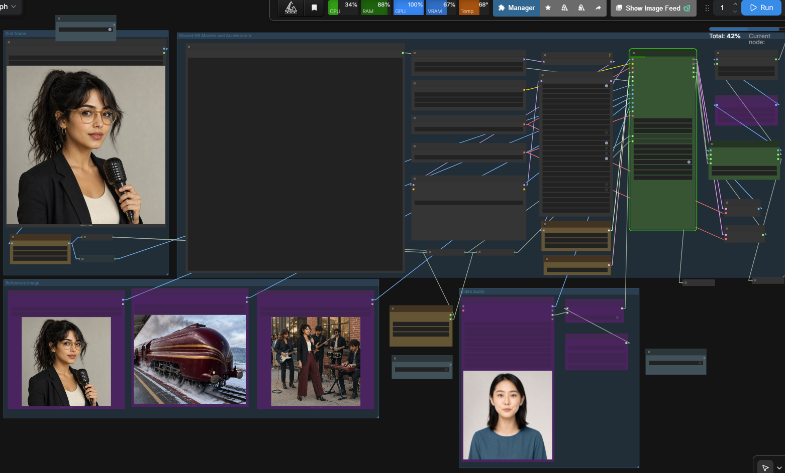

V3.4 focuses on the two reference workflows that are most useful in normal production:

- **Driving Audio**: use an existing audio source as the preserved final audio while it guides the H3 generation across chunks.
- **Video Guide Frames**: use a video loader's IMAGE frame batch as persistent guidance for appearance, motion, framing, and timing without treating it as a frame-by-frame copy.
- **Hybrid FLF + Reference**: use First Frame, Last Frame, and persistent Reference Images together without adding a separate mode or model allowlist.
- **FL2VA Terminal Merge**: keep the final two 5-second FL2VA chunks as one physical 10-second sampling and decode unit for Core-equivalent Last Frame handling.
- **Restartable chunks**: reuse completed chunks with Run Storage and regenerate only the selected part when the generation contract remains compatible.
- **Core compatibility**: remove Continuum-only rejection of unknown upstream/custom nodes and remove the obsolete `strict_compatibility` control.
- **Spectrum interoperability**: use the official H3 Continuum Interop API v1 when Spectrum is installed; Spectrum remains optional.
- **Simpler public interface**: Timeline Video and the earlier timeline-audio paths are hidden from the V3.4 public sampler interface rather than being presented as stable production features.

### Direction change: from timeline generation to preserved references

Earlier development explored Timeline Video and timeline-audio conditioning. Those paths can be useful for experiments, but they are not the default production behavior: chunk boundaries can change visual content, and generated audio can diverge from a supplied song, dialogue, or effects track.

V3.4 therefore prioritizes:

1. **Driving Audio** for cases where the supplied audio should remain the final audio stream.
2. **Video Guide Frames** for cases where a supplied video should guide the generated result without requiring exact frame reproduction.
3. **Chunked generation and Run Storage** for practical retries and long-form work.

This is a usability and reliability decision, not a claim that the experimental timeline paths are impossible. They are hidden from the stable interface while the public workflow stays focused on predictable user-controlled inputs.

## Example workflows

- [V3.6 recommended template](examples/workflows/MiniMax_H3_Continuum_V36.json)
- [V3.5 compatibility template](examples/workflows/MiniMax_H3_Continuum_V35.json)
- [V3.5.1 LBH + Conditioning Bridge connection example](examples/workflows/MiniMax_H3_Continuum_V351_LBH_Conditioning_Bridge.json)
- [V3.4 standard](examples/workflows/MiniMax_H3_Continuum_V34.json)
- [V3.4 Turbo](examples/workflows/MiniMax_H3_Continuum_V34_turbo.json)

The V3.6 template is the recommended starting point. It selects the Standard continuation backend; Hi-Res Fix is disabled by default, the V3.5 Assemble backend remains Auto, and First Frame, Last Frame, and Reference Images 1-3 share one megapixel control. `Video Guide Size` controls the frame batch used by `Video Guide Frames`; the video loader remains responsible for decoding and frame-rate conversion. The V3.5 template remains unchanged for compatibility.

The V3.4 templates remain valid for saved-workflow compatibility.

The templates include optional external nodes such as Spectrum, Video Helper Suite, rgthree, EasyUse, and RTX Video Super Resolution. Install, replace, connect, or bypass them according to your installation. Media and acceleration choices remain under user control.

## V3.4 feature details

### Driving Audio

Driving Audio is the primary V3.4 audio path.

- Source audio guides each chunk at its absolute sequence position.
- The original effective stream is preserved for final output.
- Generated audio and Audio Seam processing are bypassed while Driving Audio is active.
- Audio is not independently rewritten at every chunk boundary.
- Perfect lip sync is not guaranteed; results still depend on H3, source material, prompts, and sampling.

### Video Guide Frames

`Video Guide Frames` provides a persistent native H3 video guide across all chunks. Despite its ComfyUI `IMAGE` socket color, it expects the frame batch produced by a video loader rather than one ordinary still-image reference.

- It guides motion, framing, timing, and appearance.
- It is not a direct pixel-copy or deterministic identity-transfer system.
- Video and audio are independent. Route a loader's IMAGE output to `Video Guide Frames` and AUDIO output to `Driving Audio`.
- Source decoding and frame-rate conversion remain loader responsibilities. Continuum does not impose an unnecessary forced 24 fps conversion.

| Video Guide Size | Purpose |
|---|---|
| Efficient - 0.4 MP | Default; lower token cost and faster iteration. |
| Balanced - 0.6 MP | More detail at a higher compute cost. |
| Match Output | Largest reference input; potentially much slower and heavier. |

#### Conditional size controls and internal resize

The compact V3.5 UI shows each size control only when its corresponding input is connected:

- Connect any of `reference_image_1` through `reference_image_3` to reveal `Reference Size`.
- Connect `Video Guide Frames` to reveal `Video Guide Size`. Earlier workflows and reports may call this control `Video Reference Size`; V3.5.1 uses the clearer display name `Video Guide Size` while preserving the existing backend key and saved-workflow compatibility.

These controls are therefore not missing from a newly created node; they are hidden until relevant. Reference Images and Video Guide Frames are resized internally before VAE encoding. Video Guide Frames preserve their aspect ratio, align to the H3 canvas, and use Lanczos when reduction is needed. Smaller sources are not enlarged automatically. An external resize node is normally unnecessary, but remains useful for deliberate cropping, forced upscaling of a small source, or a custom resize/upscale algorithm. Video decoding and frame-rate conversion remain the loader's responsibility.

### Hybrid First/Last Frame + Reference Images

You need an hybrid version of MiniMax-H3 to make both I2V and reference images work:

https://huggingface.co/smhfacct/Minimax-H3-fl2va-ref2va-hybrid-models

https://www.reddit.com/r/StableDiffusion/comments/1vm62pj/i_tested_out_the_b2049_hybrid_variant_for_r2v/

V3.4 supports First Frame, Last Frame, and persistent Reference Images in the same Continuum run. The public sockets and controls are unchanged: connect the inputs that the selected H3 model supports.

- Pure FL2VA and pure Ref2VA identity contracts remain unchanged.
- The combined path receives a distinct hybrid identity so Run Storage does not reuse incompatible chunks.
- Prompt/reference mismatches produce guidance warnings rather than a Continuum-only execution stop.
- No model-name allowlist or automatic model replacement is used.

Local checks passed with the B2049 hybrid variant. FL-only models could run, but showed less reliable transitions when FLF and Reference Images were combined; a hybrid-capable model is therefore recommended for this path.

### FL2VA Terminal Merge

For 5-second FL2VA workflows, Continuum keeps the final two logical chunks together as one physical sampling and VAE decode unit.

- `2 x 5s`: one 243-frame physical sample, decoded once, then adjusted to the requested 240-frame output.
- `3 x 5s` and longer: earlier chunks use normal Continuation; the final two chunks use one 260-frame physical sample containing the 22-frame continuation context.
- After the terminal physical decode, the 22-frame context prefix is removed. For `3 x 5s`, this gives `124 + 238 = 362` frames before exact-duration adjustment to 360 frames.
- If the final two prompt sections differ, they are rebased internally to a local `[0-5s]` / `[5-10s]` timeline. Identical prompts retain the accepted shared-prompt path.
- The terminal pair uses one physical seed and one physical decode while Run Storage continues to preserve normal logical chunk entries.

Local GPU comparison confirmed that `2 x 5s` matches Core 10-second FL2VA sampling and terminal decode behavior. A `3 x 5s` Timeline run also passed with three logical chunks, two physical sampling passes, two physical decode groups, and a 15.000-second output. The short still period near the supplied Last Frame was also present in the equivalent Core result and is treated as normal FL2VA convergence rather than a Continuum-specific failure.

### Core-first, permissive execution

V3.4 removes or relaxes Continuum-only rejection rules that blocked otherwise runnable Core H3 experiments.

- Prompt problems prefer warnings and fallback behavior instead of stopping.
- Unknown upstream/custom wrapper classes are not blanket-rejected.
- There is no model allowlist and no automatic model replacement.
- The obsolete strict_compatibility control is removed from the V3.4 interface.
- Current Core PackedLayout behavior is supported without requiring the removed legacy frame_count argument.

Hard stops remain only for states that cannot execute safely, including corrupt latent topology, incompatible assembly data, invalid persisted revisions, or unusable mandatory payloads.

### Cleaner interface

The public nodes focus on normal production controls. Developer diagnostics and detailed reports are available through ComfyUI settings.

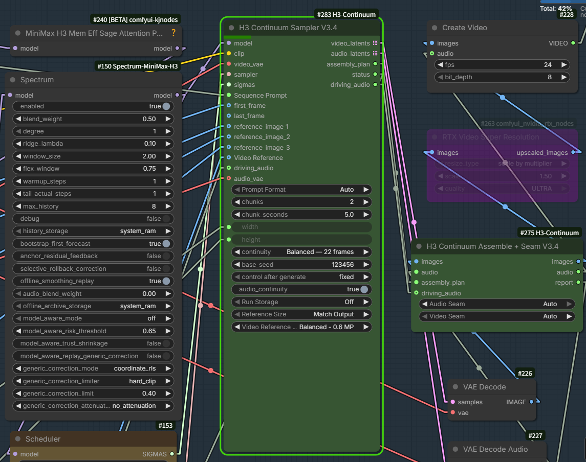

### Timeline paths

Experimental Timeline Video and earlier timeline-audio paths are no longer public V3.4 inputs. They are hidden rather than destructively removed. Existing V3.3 workflows can continue through legacy nodes, but new stable workflows should use `Driving Audio` and `Video Guide Frames`.

## Installation

### Updating an existing installation

For a Git checkout, run the update from the custom-node directory:

```powershell
cd ComfyUI/custom_nodes/ComfyUI-H3-Continuum
git pull --ff-only origin main
```

Restart ComfyUI after the update. If the node was installed with ComfyUI Manager, use its **Update** action instead of running `git pull` manually. Do not mix Manager updates and a separate Git checkout for the same installation.

Search for H3 Continuum or Continuum in ComfyUI Manager, or install manually:

~~~bash
cd ComfyUI/custom_nodes
git clone https://github.com/ukr8b3g-cmyk/ComfyUI-H3-Continuum.git
~~~

Restart ComfyUI after installation or update.

## V3.5 nodes

### H3 Continuum Sampler V3.5

The V3.5 sampler preserves V3.4 generation behavior and adds `refine_context` as the sixth output. Connect it to V3.5 Hi-Res Fix, Second Pass, or Conditioning Bridge paths that need the original conditioning context. V3.5.1 also provides permanently visible optional Reference Audio sockets.

### H3 Continuum Conditioning Bridge V3.5

Advanced external-sampler bridge. It returns aligned `group_models` and complete `conditioning` objects per physical group together with the updated Assembly Plan. It does not create AV LATENT pairs, noise, SIGMAS, Audio Lock, or external sampling policy.

### H3 Continuum Hi-Res Fix V3.5 (Experimental)

Main convenience node. When enabled, it performs the Video VAE pixel-resize round trip and Second Pass internally. When disabled, video/audio LATENT objects and the Assembly Plan pass through unchanged and the sampling/VAE dependencies remain lazy.

### H3 Continuum Second Pass V3.5

Advanced Issue #8 bridge for an externally processed video latent. It samples once per physical group, reads the physical prompt contract from the Assembly Plan, and returns the original first-pass audio LATENT objects.

### H3 Continuum Latent Resize V3.5

Utility that changes only video-latent H/W. It does not sample. Direct 2x interpolation at large square targets is not the accepted Main Hi-Res Fix method.

### H3 Continuum Assemble + Seam V3.5

V3.4-compatible assembly with Auto, RAM, and Disk-backed video-buffer backends. Exact Duration and seam corrections write directly to the selected target buffer.

## V3.4 nodes

### H3 Continuum Sampler V3.4

Main inputs:

- model, clip, video_vae, sampler, sigmas
- Sequence Prompt
- first_frame, last_frame
- reference_image_1 through reference_image_3
- Video Guide Frames
- driving_audio, audio_vae

Outputs:

- video_latents, audio_latents
- assembly_plan, status
- driving_audio

Visible controls:

- Prompt Format, chunks, chunk_seconds
- width, height, continuity
- base_seed, control after generate
- audio_continuity
- Run Storage
- Reference Size
- Video Guide Size

`chunk_seconds` uses one shared duration for every chunk. The default is 5.0
seconds; 5–15 seconds remains the recommended and validated range. Durations up
to 30.0 seconds are supported, but values above 15 seconds can substantially
increase VRAM use and processing time, especially at high resolution. Per-chunk
variable durations are not supported.

### H3 Continuum Assemble + Seam V3.4

Inputs: images, audio, assembly_plan, and driving_audio.

Controls: Audio Seam and Video Seam.

When Driving Audio is connected, preserved source audio is selected for final output and generated audio seam processing is bypassed.

## Connection order

~~~text
H3 model / CLIP / Video VAE / sampler / sigmas
                         |
                         v
              H3 Continuum Sampler V3.4
                 |       |        |
          video_latents  |   assembly_plan
                         |
                  audio_latents

video_latents -> Core VAE Decode ------- images --+
audio_latents -> Core VAE Decode Audio -- audio  --+--> H3 Continuum Assemble + Seam V3.4
assembly_plan -------------------------------------+
driving_audio -------------------------------------+
~~~

For a source video with sound:

~~~text
Video loader IMAGE -> Video Guide Frames
Video loader AUDIO -> driving_audio
~~~

The supplied templates use Video Helper Suite for this split. Any compatible IMAGE/AUDIO loader may be substituted.

## Prompt formats

### Timeline

For **Timeline** mode, each time-range header must be written on its own line. Write the scene description on the following line or lines.

Recommended format:

~~~text
[0-5s]
First section: action, camera movement, and scene progression.

[5-10s]
Continue from the exact final state of the previous section.

[10-15s]
Continue naturally without resetting the scene.
~~~

For 10-second chunks:

~~~text
[0-10s]
Describe the first scene.

[10-20s]
Describe the next scene.

[20-30s]
Continue the sequence.

[30-40s]
Describe the final section.
~~~

**Important:** do not place the prompt text on the same line as the time header.

Correct:

~~~text
[0-5s]
Describe the scene.
~~~

Not recommended:

~~~text
[0-5s] Describe the scene.
~~~

The second form is not recognized as a Timeline header. When **Prompt Format = Auto**, it may therefore be interpreted as a Fixed prompt instead, causing the complete text to be reused across chunks.

The time ranges should normally match the configured `chunk_seconds`.

- `chunk_seconds = 5` → `[0-5s]`, `[5-10s]`, `[10-15s]` ...
- `chunk_seconds = 10` → `[0-10s]`, `[10-20s]`, `[20-30s]` ...
- `chunk_seconds = 15` → `[0-15s]`, `[15-30s]`, `[30-45s]` ...
- `chunk_seconds = 30` → `[0-30s]`, `[30-60s]`, `[60-90s]` ...

#### Global preamble and per-chunk prompting

Text placed before the first Timeline header is treated as a **global preamble** and is automatically included in every chunk prompt. This is a good place for information that should apply throughout the sequence, such as subject definitions, overall style, persistent environment details, or other global instructions.

However, the Timeline sections do not need to contain only the changing action or scene description. For complex scenes, multiple characters, or longer chunks such as 10–15 seconds, it can be useful to repeat important details about the subjects, appearance, location, camera, and current scene state inside each section. More self-contained chunk prompts may sometimes give H3 stronger continuity and reduce cut-like transitions or drift.

Continuum carries visual/audio context from the previous chunk, but that does not guarantee that H3 will preserve every semantic detail automatically. Instead of relying only on phrases such as "continue from the previous chunk," describe the intended next action and important continuity details explicitly.

For example:

~~~text
Subject: A woman in a red jacket.
Style: cinematic nighttime photography.

[0-15s]
A woman in a red jacket stands at the nightclub bar, speaking with two people beside her. Medium shot, slow handheld camera movement, crowded dance floor visible behind them.

[15-30s]
The same woman in the same red jacket continues the conversation at the same bar with the same two people. The camera remains close and slowly moves around the group as one person replies.

[30-45s]
The woman turns toward the dance floor while remaining beside the bar. Keep the same clothing, nightclub environment, nearby characters, and continuous camera style.
~~~

The global preamble is optional. If fully self-contained prompts inside every Timeline section give better continuity for a particular model or scene, that is also a valid approach.

### Other prompt formats

**List** prompts use `---` separators.

**Fixed** reuses one prompt for every chunk.

**Auto** detects Timeline, List, or Fixed formatting from the supplied text.

If Timeline syntax cannot be parsed, V3.4 reports a warning and falls back to an applicable prompt mode rather than rejecting an otherwise runnable workflow.

## Run Storage

Run Storage preserves completed chunks and can reuse them after restarting ComfyUI. Regenerate From selects the first chunk to regenerate; earlier compatible chunks remain unchanged.

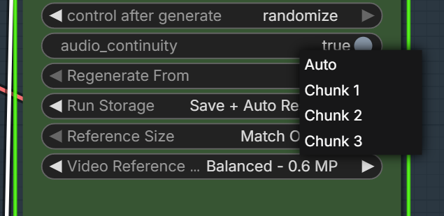

- Use a fixed seed for reproducible resume.
- Changing persistent models, LoRAs, references, prompts, resolution, or sampling settings can create a new revision.
- Unknown upstream node classes no longer cause rejection by themselves; reuse still depends on compatible observable contracts and hashes.

## Spectrum interoperability

Spectrum is optional. Current Spectrum releases officially support H3 Continuum Interop API v1.

- Chunk 1 uses the normal initial path.
- Chunk 2 and later request Actual Prefix 2.
- Successful continuation logs accepted H3 Continuum API v1, actual prefix=2.
- Unsupported Spectrum versions fall back without a private patch.

See [Spectrum v0.2.15 H3 Continuum interoperability](https://github.com/xmarre/ComfyUI-Spectrum-MiniMax-H3#v0215-h3-continuum-interoperability).

Turbo LoRA and Spectrum are not mutually exclusive. Quality and speed remain workflow-dependent.

## Issue and pull-request response

### Issue #3

V3.4 removes blanket rejection of unknown upstream/custom class names. Run Storage evaluates the observable generation contract instead of treating an unfamiliar wrapper as automatically incompatible.

See [Issue #3](https://github.com/ukr8b3g-cmyk/ComfyUI-H3-Continuum/issues/3).

### Issue #4

V3.4 follows the current Core H3 layout contract and no longer requires the legacy frame_count parameter. The old strict-compatibility toggle is not part of the public interface.

See [Issue #4](https://github.com/ukr8b3g-cmyk/ComfyUI-H3-Continuum/issues/4).

### Issue #7

V3.4 allows First Frame, Last Frame, and Reference Images to be used together without requiring the separate BigStationW node or introducing a model allowlist. Hybrid presentation ordering and Run Storage identity are handled by Continuum while pure FL2VA and pure Ref2VA behavior remain unchanged.

The combined path was exercised locally with the B2049 hybrid variant. FL-only models were less consistent for this specific combination, so the README recommends a hybrid-capable model rather than rejecting other models in code.

See [Issue #7](https://github.com/ukr8b3g-cmyk/ComfyUI-H3-Continuum/issues/7).

### Pull request #1 and #2

These older partial pull requests were superseded by the consolidated [Pull request #5](https://github.com/ukr8b3g-cmyk/ComfyUI-H3-Continuum/pull/5). V3.4 selectively includes the compatibility direction needed for the current Core H3 contract, while the broader upstream synchronization and release-automation scope remains a separate upstream review.

The older pull requests are not represented as merged V3.4 changes.

### Pull request #5

PR #5 is the consolidated upstream-to-fork proposal covering current H3 compatibility, reference-input handling, assembly memory behavior, exact-duration handling, continuation-reference interoperability, and CI/release automation. V3.4 already contains the user-facing stability decisions described above; the PR remains an upstream review item and is not claimed as merged here.

## V3.4 input connection patterns

V3.4 separates the video-guide frame input from the driving-audio input. Choose the connection pattern that matches your source material.

### 1. Audio only

Connect `Load Audio` to `Driving Audio`. Use this when an existing song, dialogue track, or sound effect should remain the final audio. `Video Guide Frames` is not required.

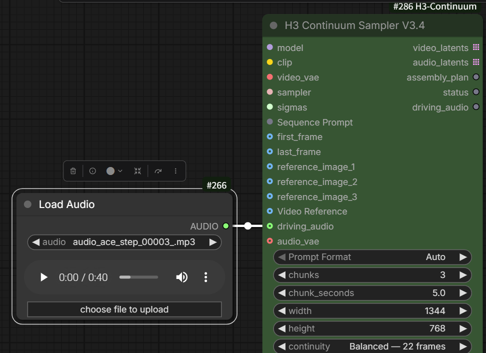

### 2. Video with its own audio

Connect `Load Video (Upload)` `IMAGE` to `Video Guide Frames`. If the uploaded video contains the audio you want to preserve, connect its `AUDIO` output to `Driving Audio` as well.

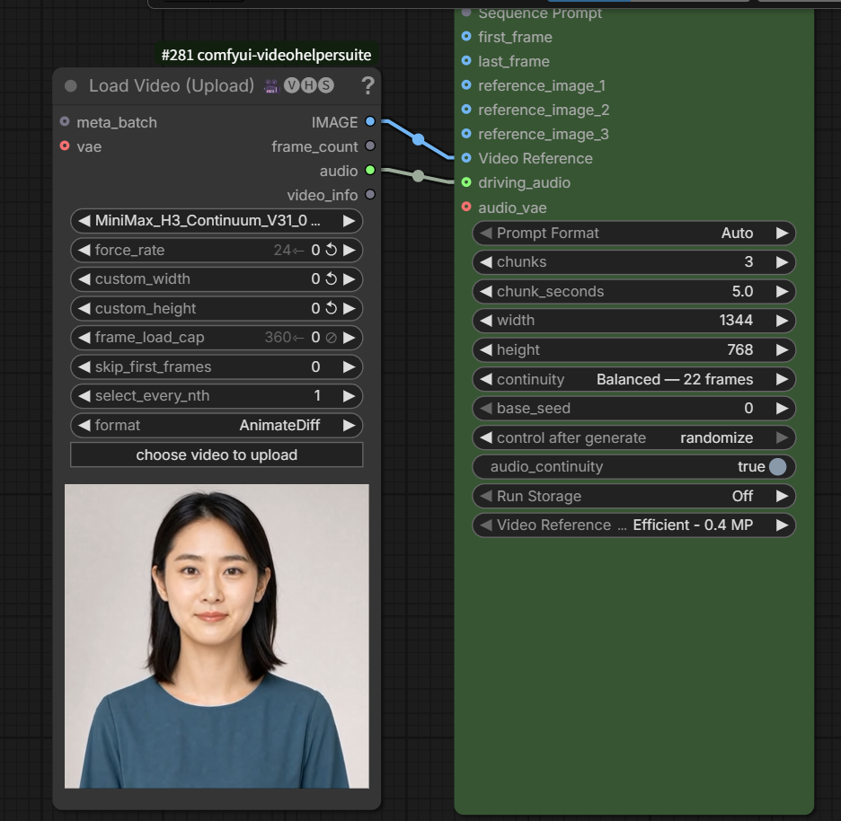

### 3. Video and audio from separate sources

Connect `Load Video (Upload)` `IMAGE` to `Video Guide Frames`, then connect a separate `Load Audio` node to `Driving Audio`. Use this when the video guide and the final audio source are different files.

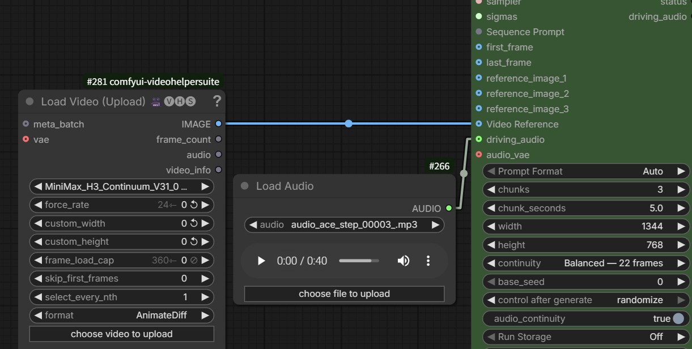

Both inputs are optional. Connect `Video Guide Frames` when video guidance is needed, and connect `Driving Audio` when the supplied audio should be preserved in the final output.

### Video Guide Frames frame rate

Use a 24 fps source for `Video Guide Frames`. `Load Video (Upload)` may accept files recorded at 25 fps or another frame rate, but acceptance alone does not guarantee correct temporal alignment with H3. For a non-24 fps source, set `force_rate` to `24` in `Load Video (Upload)`, or convert the file to 24 fps before loading it. If the source is already 24 fps, leave `force_rate` at its default and do not resample it.

## Current validation status

The V3.6 release gate includes the complete PIG-0 through PIG-5 Production Integration acceptance: backend-scoped Run Storage, real-cache Save/Resume/Regenerate From, atomic Terminal Merge reuse, Reference Image/Audio retention, bit-exact protected prefixes, GPU workflow output, numeric Audio Seam analysis, and subjective Audio PASS. Final automated validation is `527 passed`; the complete package checklist is recorded in `PACKAGE_VALIDATION.txt`. Source/runtime registration, native PackedLayout, Fixed 3x5 prompt planning, JavaScript UI harnesses, Prompt/CLIP cache equality, Video Guide bit-exact A/B, V3.5 Second Pass/Hi-Res, and V3.5.3 distribution-integrity checks remain covered.

V3.4 compatibility paths have been exercised locally with:

- 1, 2, and 3 chunks
- standard and Turbo paths
- Spectrum enabled and disabled
- I2VA, Reference, and selected FL2VA configurations
- Hybrid FLF + Reference with the B2049 hybrid variant
- Core-equivalent `2 x 5s` FL2VA Terminal Merge
- `3 x 5s` FL2VA with the final two logical chunks merged into one 260-frame physical sample and decode group
- Driving Audio with short, exact-length, and longer sources
- Video Guide Frames with source audio routed separately to Driving Audio
- 0.4 MP and 0.6 MP reference sizing
- Run Storage reuse and selected-chunk regeneration
- Core VAE Decode and final assembly

Additional V3.5 acceptance includes:

- Advanced Second Pass Bridge for 1x5 T2VA, 3x5 T2VA, and 3x5 FL2VA Long Terminal Merge
- first-pass audio LATENT object passthrough through Second Pass
- RAM / Disk-backed bit-exact assembly, cache/requeue, Preview, Save, VHS, interrupt, stale cleanup, and a 9.49 GiB mapped IMAGE stress
- Auto backend selection in both the real 1.65 GiB Long Terminal Merge case and the 9.49 GiB stress case
- Experimental integrated Main Hi-Res Fix for FL2VA 1x5, 576x576 to 1152x1152
- Hybrid FL2VA + Reference 1x5 through both the integrated 576-to-1152 Main Hi-Res Fix and the direct 576x576 Advanced Second Pass node

No OOM was observed in the cited recent local V3.4 checks, including two-chunk 800 x 800 runs. This is not a universal memory guarantee. Model precision, LoRAs, source resolution, optional nodes, GPU, and RAM affect memory use.

## Limits

- Continuation does not guarantee frame-perfect identity or motion.
- Video Guide Frames guides H3; it does not reproduce every source frame.
- Driving Audio preserves selected audio, but visual lip synchronization remains model-dependent.
- FL2VA may settle on the supplied Last Frame before the requested duration ends; equivalent Core runs can show the same behavior.
- Long, high-resolution sequences may exceed system RAM during final decode and assembly even when chunk sampling succeeds.
- Disk-backed assembly lowers anonymous/private memory commitment for the final Continuum IMAGE, but Core Decode and downstream nodes may still allocate large RAM copies.
- Main Hi-Res Fix 3x5 2x is not accepted on the tested RTX 5060 Ti 16 GiB: the 37T group completed at 1152x1152, but the terminal 77T group failed at its first Second Pass inference with CUDA OOM. Reference/Hybrid-specific 1x5 acceptance passed; longer Hybrid/Reference cases remain unverified.
- Direct high-ratio interpolation with Latent Resize can create persistent H3 artifacts; use the Pixel/VAE Main path or an appropriate external H3 latent processor.
- Match Output can be substantially slower than 0.4 MP or 0.6 MP.
- Seam correction may keep the native boundary when a proposed correction is not safer.
- Optional template nodes must be installed, replaced, or bypassed by the user.

## License

See [LICENSE](LICENSE).
