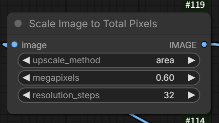
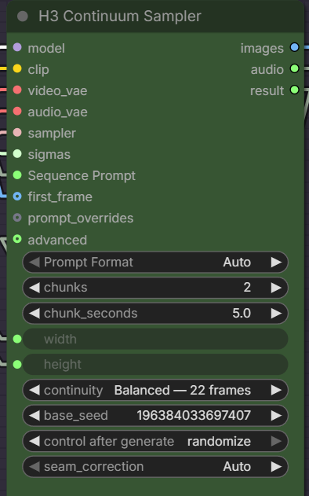
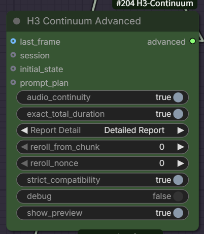

# ComfyUI-H3-Continuum 2.1.7

Native long-form MiniMax H3 video and audio continuation for ComfyUI.

**H3 Continuum Sampler** generates 1 to 16 H3 chunks as one sequence. It carries the previous raw video and audio latent into the next chunk, keeps accepted chunk latents on CPU, and defers VAE decoding until sampling is complete.

<!-- h3-standard-workflow -->
## Standard workflow

[Download the standard **H3 Continuum V2** template bundle](examples/H3_Continuum_V2.zip) (recommended).

[Download the workflow JSON only](examples/H3_Continuum_V2.json).

The ZIP contains the workflow, its reference image, and a short setup guide. Extract it, copy `H3_Continuum_V2_reference.webp` into `ComfyUI/input/`, then drag `H3_Continuum_V2.json` onto the ComfyUI canvas.

It is a practical 3 x 5-second starting point for an RTX 5060 Ti 16GB system. Change `chunks`, `chunk_seconds`, resolution, seed, and prompts as needed. The graph uses the stable facade nodes and keeps session, reroll, and report wiring optional.

Related projects:

- [ComfyUI Spectrum MiniMax H3](https://github.com/xmarre/ComfyUI-Spectrum-MiniMax-H3) is the optional sampling accelerator used by the bundled graph.
- [H3 Motion Context](https://github.com/NikoDemon80/ComfyUI-H3-Motion-Context) is a separate clip-chaining implementation. See the comparison below; it is not required by Continuum.

### Models referenced by the workflow

All model URLs stored in the JSON point to the `Comfy-Org/MiniMax-H3` distribution used for ComfyUI workflows. No third-party checkpoint host is referenced:

- `diffusion_models/minimax/minimax_h3_fl2va_pruned_int8_convrot.safetensors`
- `text_encoders/qwen3vl_32b_minimax_h3_nvfp4_awq.safetensors`
- `vae/minimax_h3_video_vae_fp16.safetensors`
- `vae/minimax_h3_audio_vae_fp32.safetensors`

No model weights are bundled in this repository. The workflow also contains optional/custom helper nodes from Spectrum, KJNodes (Sage Attention), rgthree, and ComfyUI-Easy-Use. Install those packages or replace/bypass their helper nodes.

## Why H3 Continuum exists

Continuum was created to make SVI-style long-form continuation practical with native MiniMax H3: generate several manageable chunks, carry motion and audio context forward, and assemble one result without manually rebuilding the graph for every clip.

The main benefit is not only continuity. A native monolithic 15-second H3 generation can put substantial pressure on VRAM. Continuum samples shorter chunks separately, carries only the required raw AV latent context, stores completed chunk data outside the active sampling path, and defers decoding until sampling is complete. This can make a 3 x 5-second sequence less likely to run out of VRAM on a 16GB GPU, although resolution, model precision, accelerators, offload settings, and available system RAM still determine the actual limit.

The standard workflow uses the INT8 ConvRot H3 checkpoint, SageAttention CUDA++, and optional Spectrum acceleration as a practical RTX 5060 Ti 16GB starting point. Spectrum is not required for continuity and should be disabled for native-trajectory quality comparisons.

Continuum was developed independently before H3 Motion Context was discovered. Both address H3 continuation, but they use different workflow and orchestration designs. No H3 Motion Context source code is used by Continuum.

## Quick start

1. Install the custom node and restart ComfyUI.
2. Add **H3 Continuum Sampler**.
3. Connect the normal H3 model, CLIP, VAEs, sampler, and sigmas.
4. Connect one **Text (Multiline)** node to **Sequence Prompt**.
5. For image-to-video, connect the source image to **first_frame**.
6. Connect **images** and **audio** to your normal video output node.
7. Start with two 5-second chunks and the settings shown below.

Most users only need **H3 Continuum Sampler**. The helper nodes are optional.

## Installation

### Git installation

From the ComfyUI custom_nodes directory:

~~~bash
git clone https://github.com/ukr8b3g-cmyk/ComfyUI-H3-Continuum.git
~~~

Restart ComfyUI, then search for **H3 Continuum Sampler**.

For Stability Matrix, the destination is normally similar to:

~~~text
D:\StabilityMatrix\Data\Packages\<ComfyUI package>\custom_nodes\
~~~

### ZIP or Windows installer

1. Extract the repository as **ComfyUI-H3-Continuum**.
2. Place it in **ComfyUI/custom_nodes/**.
3. Run **install_windows.bat** if you want the included Windows installer to copy and validate the package.
4. Restart ComfyUI.

If an older **ComfyUI-H3-Continuum-Join** folder exists, remove or rename it before starting ComfyUI. Do not load both folders at the same time.

No additional pip packages are required beyond the normal ComfyUI MiniMax H3 environment.

## Standard connection

~~~text
H3 MODEL loader
    |
    +-> optional SageAttention
    +-> optional Sol-Attn
    +-> optional LoRA
    +-> optional Spectrum
    |
    v
H3 Continuum Sampler.model

CLIP loader -----------------------> clip
MiniMax H3 Video VAE -------------> video_vae
MiniMax H3 Audio VAE -------------> audio_vae
Sampler --------------------------> sampler
Sigmas ---------------------------> sigmas
Text (Multiline) -----------------> Sequence Prompt
Load Image -----------------------> first_frame

H3 Continuum Sampler.images ------> Create Video.images
H3 Continuum Sampler.audio -------> Create Video.audio
~~~

The accelerator chain is optional. A typical accelerated order is:

~~~text
H3 MODEL -> SageAttention -> Sol-Attn -> LoRA -> Spectrum
~~~

When troubleshooting, start with fewer accelerators and add them back one at a time.

### Main inputs

| Input | Connect |
| --- | --- |
| **model** | The final MODEL from the normal H3 model or accelerator chain |
| **clip** | MiniMax H3 text encoder / CLIP output |
| **video_vae** | MiniMax H3 Video VAE |
| **audio_vae** | MiniMax H3 Audio VAE |
| **sampler** | The sampler used by the normal H3 workflow |
| **sigmas** | The corresponding sigma schedule |
| **Sequence Prompt** | One external Text (Multiline) STRING |
| **first_frame** | Source image for image-to-video |
| **prompt_overrides** | Optional H3 Continuum Clip Overrides pack |
| **advanced** | Optional H3 Continuum Advanced pack |

### Main outputs

| Output | Use |
| --- | --- |
| **images** | Connect directly to the image/video frames input of the output node |
| **audio** | Connect directly to the audio input of the output node |
| **result** | Optional packed State, Session, and report data |

<!-- h3-node-guide -->
## Sampler and Advanced controls

### Input image scaling

The bundled workflow uses **Scale Image to Total Pixels** before `first_frame`:

- `upscale_method: area` is appropriate for reducing a larger source image with stable averaging.
- `megapixels: 0.60` preserves the source aspect ratio while targeting approximately 0.6 million pixels.
- `resolution_steps: 32` rounds width and height to model-friendly multiples of 32.
- The bundled portrait is reduced from 848 x 1264 to approximately 640 x 960; the exact rounded size is supplied to the Continuum sampler through the image-size nodes.
- If a 16GB GPU runs out of VRAM, reduce this first to `0.30 MP`, which is approximately 448 x 672 for the same portrait.

This node changes generation resolution, not the Continuum context length. Increasing megapixels raises VRAM use and generation time for every chunk.

The main sampler is sufficient for a normal first run:

- `Sequence Prompt`: one fixed prompt, a `---`-separated list, or a timeline prompt.
- `Prompt Format`: `Auto` is the recommended default.
- `chunks`: number of generated clips.
- `chunk_seconds`: requested duration of each clip.
- `width` / `height`: inherited from the connected image-size path when linked.
- `continuity`: `Balanced - 22 frames` is the general-purpose default.
- `base_seed` and `control after generate`: define the chunk seed sequence.
- `seam_correction`: `Auto` is the safe default; it keeps the legacy video seam when correction does not improve the measured boundary.
- `prompt_overrides`: optional sparse per-clip replacement pack.
- `advanced`: optional settings pack. Leave it disconnected to use normal defaults.

Use **H3 Continuum Advanced** only when the basic node is not enough:

- `last_frame`: optional final-frame anchor.
- `session`: resumes or reuses a Continuum session.
- `initial_state`: begins from a saved Continuum state.
- `prompt_plan`: accepts an externally prepared prompt plan.
- `audio_continuity`: keeps audio context across chunk boundaries.
- `exact_total_duration`: trims or pads the assembled result to the requested duration.
- `Report Detail`: controls report verbosity; use Detailed Report for diagnostics.
- `reroll_from_chunk`: regenerates from a selected chunk; `0` disables reroll.
- `reroll_nonce`: changes a reroll without replacing the main seed.
- `strict_compatibility`: fails closed when the native H3 layout contract is incompatible.
- `debug`: enables additional diagnostic logging.
- `show_preview`: enables the sampling preview.

### Wiring reminder

For a standard graph, connect the patched MODEL path to `model`, the MiniMax H3 text encoder to `clip`, the video/audio VAEs to their matching inputs, the sampler and sigmas, a multiline text node to `Sequence Prompt`, and the scaled source image to `first_frame`. Connect `images` and `audio` to Create Video or Save Video.

`prompt_overrides`, `advanced`, and the Result helper are optional. Use **H3 Continuum Result** only when you need `last_state`, `session`, or the text report.

## Recommended first run

| Setting | Recommended value |
| --- | --- |
| **Prompt Format** | Auto |
| **chunks** | 2 |
| **chunk_seconds** | 5.0 |
| **width / height** | Match the intended H3 generation resolution |
| **continuity** | Balanced - 22 frames |
| **base_seed** | Fixed while comparing settings |
| **control after generate** | fixed for A/B testing |
| **seam_correction** | Auto for normal use |

This produces approximately 10 seconds.

For a native-continuity comparison, use the same prompt and seed and compare:

~~~text
Seam Correction = Off
Seam Correction = Auto
~~~

**Auto** is the normal recommendation. It keeps the native seam unless the guarded correction produces a safely measurable improvement.

### Seam Correction modes

- **Auto**: Native-first mode. Applies post-decode correction only when the guarded candidate improves the measured seam.
- **Off**: No post-decode seam correction. Use this to inspect Native Continuity directly.
- **Basic**: Runs the V2.1 seam-correction path directly.

### Continuity profiles

- **Auto - conservative**: Chooses a conservative context profile from the previous state.
- **Fast - 5 frames**: Lowest overlap and lowest continuity cost.
- **Balanced - 22 frames**: Recommended starting point.
- **Strong - 39 frames**: More context, with higher cost and a greater risk of over-constraining motion.

## Sequence Prompt

Connect a single **Text (Multiline)** node to **Sequence Prompt**.

### Auto

Auto detects Fixed, List, or Timeline syntax. This is recommended for normal use.

### Fixed

One prompt is used for every chunk.

~~~text
A single continuous cinematic performance. Preserve the same person,
lighting, camera direction, motion, voice, and music across every chunk.
~~~

### List

Separate one prompt per chunk with a line containing three hyphens.

~~~text
The woman begins singing while the camera slowly pushes in.
---
She continues the same phrase without a cut, reset, or pose jump.
---
She resolves the final note naturally and releases a soft breath.
~~~

If fewer List sections are supplied than the configured chunk count, the last section is reused.

### Timeline

Use time or chunk sections in one multiline prompt.

~~~text
[0-5s]
The woman begins singing. The piano phrase remains unresolved.

[5-10s]
Continue from the exact preceding breath, pose, camera movement, and melody.

[10-15s]
Complete the melody naturally during the final second.
~~~

Chunk headers are also accepted:

~~~text
[Chunk 1]
Opening action.

[Chunk 2]
Continuous middle action.

[Chunk 3]
Natural ending.
~~~

## How continuation works

For every continuation chunk, Continuum:

1. Reads the accepted previous raw H3 video and audio latent.
2. Extracts a phase-valid video and audio context window.
3. Adds that context as fixed reference rows.
4. Keeps new target audio and video rows separate and writable.
5. Clones the workflow MODEL once for the current chunk.
6. Samples the next chunk without decoding and re-encoding the prior result.
7. Stores the accepted full chunk latent on CPU.
8. Decodes and assembles all accepted chunks after sampling finishes.

The workflow input MODEL is not modified. Each chunk clone has its own Spectrum runtime/history.

When valid continuation context exists, Continuum emits Spectrum Interop API v1 with an Actual Prefix request of 2. Older or unsupported Spectrum versions ignore the hint and continue normally.

## Optional helper nodes

These nodes are not needed for the basic workflow.

### H3 Continuum Clip Overrides

Use this only when selected clips need prompts different from the main Sequence Prompt.

Connect one **Text (Multiline)** to **Override Script** and use explicit sparse sections:

~~~text
[Clip 2]
Move to a closer shot while preserving the same motion and voice.

[Clip 5]
Finish the song naturally and hold the final note.
~~~

Only Clip 2 and Clip 5 are replaced. All unspecified clips continue using the main Sequence Prompt.

**[Chunk N]** is also accepted. Duplicate clip numbers and clip numbers outside the configured chunk count are rejected.

Connect the pack output to **H3 Continuum Sampler.prompt_overrides**.

### H3 Continuum Advanced

Use this node for resume data and infrequent controls. Connect its output to **H3 Continuum Sampler.advanced**.

Important controls include:

- **last_frame**: Optional final-frame anchor for the final chunk.
- **session**: Continue or reroll from a prior V2 Session.
- **initial_state**: Start from a compatible saved State. Do not connect both Session and Initial State.
- **prompt_plan**: Advanced or compatibility prompt-plan input.
- **audio_continuity**: Continue the prior raw audio latent.
- **exact_total_duration**: Correct the assembled output to the requested total duration.
- **diagnostics**: Basic, Detailed Report, or Off.
- **reroll_from_chunk**: Keep accepted earlier chunks and regenerate from this one-based chunk number.
- **reroll_nonce**: Derive a different reroll seed without changing the base seed.
- **strict_compatibility**: Stop on unknown or unsafe H3 layout contracts.
- **debug**: Enable internal diagnostic logging.
- **show_preview**: Enable the normal sampling preview.

### H3 Continuum Result

Connect the Sampler **result** output when you need to expose:

- **last_state**
- **session**
- **report**

For ordinary final video generation, this node is unnecessary.

## Sessions and rerolling

A Session stores accepted CPU latents, prompts, seeds, dimensions, and continuation metadata.

Typical advanced use:

~~~text
H3 Continuum Sampler.result
    -> H3 Continuum Result.session
    -> H3 Continuum Save Session
~~~

Later:

~~~text
H3 Continuum Load Session
    -> H3 Continuum Advanced.session
    -> H3 Continuum Sampler.advanced
~~~

Resolution changes are rejected rather than silently resizing State or Session data.

## Diagnostics and debugging

Use **Basic** diagnostics for normal testing. Use **Detailed Report** when inspecting seam scores, selected cuts, audio correlation, correction fallback, and per-chunk context.

Set **debug=true** only when deeper runtime information is needed. The single-clone implementation reports object IDs without retaining the objects:

~~~text
Continuum model lifetime: input=<id> chunk=<id> parent=<id> base=<id>
~~~

For the expected single-clone path, every chunk parent should be the same workflow input MODEL:

~~~text
chunk1.parent -> input MODEL
chunk2.parent -> input MODEL
chunk3.parent -> input MODEL
~~~

With a compatible Spectrum version, continuation chunks should also log:

~~~text
Spectrum H3: accepted H3 Continuum API v1, actual prefix=2
~~~

**0 models unloaded** by itself is normal model-management information. The relevant leak warnings are:

~~~text
Potential memory leak detected with model MiniMaxH3
WARNING, memory leak with model MiniMaxH3
~~~

If those warnings occur, compare identical one-chunk and two-chunk runs, then test Spectrum, Sol-Attn, and Sage individually.

## Special and compatibility nodes

The following nodes remain available for advanced workflows or saved-workflow compatibility:

- **H3 Continuum Sampler V2**: Legacy/Core identifier used by older V2 workflows.
- **H3 Continuum Prompt Plan**: Explicit prompt-plan construction and inspection.
- **H3 Continuum Save Session**
- **H3 Continuum Load Session**
- **H3 Continuum Session Info**
- V1 Join, Finish, Assemble, Save State, and Load State nodes.

New workflows should normally use the compact **H3 Continuum Sampler** facade.

## Compatibility and safety

- Native H3 PackedLayout is preserved.
- layout.position_ids identity is preserved when MM-RoPE coordinates are adjusted.
- State and Session schema remain compatible.
- V1 node identifiers remain registered.
- Video and audio VAEs are not run between H3 chunks.
- Full accepted chunk latents are stored on CPU.
- SageAttention, Sol-Attn, LoRA, and Spectrum remain external packages.
- Unknown H3 layout contracts fail clearly instead of producing a subtly incorrect continuation.

<!-- h3-related-projects -->
## Related projects and implementation scope

| Project | Primary purpose | Workflow model | Main technical difference |
| --- | --- | --- | --- |
| **H3 Continuum** | Generate and assemble 1-16 H3 chunks | One integrated sampler with optional facade packs | Carries raw paired AV latent context, manages prompts/seeds/session/reroll, defers decode, and can apply post-decode seam correction. |
| **H3 Motion Context** | Continue motion and sound from one clip into another | Explicit context, trim, and optional save/load nodes across runs | Pins prior video/audio context into the next native H3 generation and trims the repeated context from the delivered clip. |
| **Spectrum MiniMax H3** | Reduce H3 sampling time | MODEL wrapper before the guider/sampler | Forecasts selected post-transformer hidden features. It is an approximate accelerator, not a clip-continuity system, and may change the generated result. |

Continuum does not copy, vendor, or bundle source code from Spectrum or H3 Motion Context. Compatibility uses ComfyUI's MODEL/payload behavior. For a supported Spectrum build, Continuum emits a small API v1 metadata hint requesting at least two actual solver steps at the start of a continuation chunk; unsupported builds ignore it and continue normally.

### License and external-content boundaries

- This repository is licensed under [GPL-3.0](LICENSE).
- [Spectrum MiniMax H3](https://github.com/xmarre/ComfyUI-Spectrum-MiniMax-H3/blob/main/LICENSE) is GPL-3.0.
- [H3 Motion Context](https://github.com/NikoDemon80/ComfyUI-H3-Motion-Context/blob/main/LICENSE) is GPL-3.0.
- The separate [ComfyUI workflow templates repository](https://github.com/Comfy-Org/workflow_templates) is MIT-licensed.
- Model files, model cards, and other custom-node packages remain external and keep their own licenses and usage terms.

The MIT license of the template repository does not change the licenses of model weights or third-party custom nodes. This project does not redistribute MiniMax H3 weights.

### Tested environment

- GPU: NVIDIA GeForce RTX 5060 Ti 16GB.
- System memory: 64GB RAM.
- Verified baseline environment: 3 x 5-second runs at approximately 448 x 672 (0.3 MP), using the INT8 ConvRot checkpoint and SageAttention CUDA++.
- Bundled template profile: 3 x 5 seconds at 0.6 MP. Treat this higher-resolution profile as a starting point and monitor VRAM on the first run.
- Longer-than-15-second chains are supported by the node design but have not yet been validated in this environment.
- OOM avoidance is not guaranteed; peak usage depends on resolution, precision, model patches, Spectrum settings, ComfyUI offload behavior, and other loaded nodes.

## Development checks

Use the same Python environment as ComfyUI:

~~~bash
python -m compileall -q .
pytest -q
~~~

Current local validation for this change:

~~~text
74 passed
~~~

GPU validation should compare identical prompts, seeds, resolutions, samplers, and sigmas across:

~~~text
Native
Sage
Sage + Sol-Attn
Sage + Spectrum
Sage + Sol-Attn + Spectrum
~~~

## License

GPL-3.0-or-later. External accelerator source code is not bundled.
