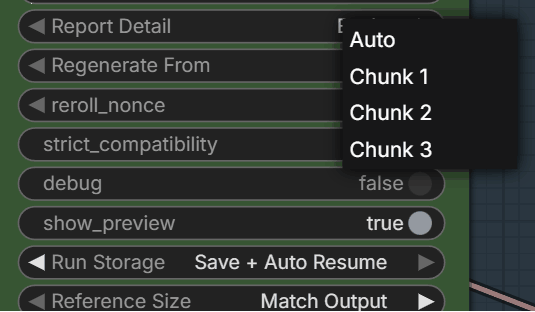

# ComfyUI-H3-Continuum 3.2.1

Native long-form MiniMax H3 video and audio continuation for ComfyUI.

**Stable release:** V3.2.1. The production path has passed local syntax and pytest checks, GitHub Actions, Windows generation, Ref2VA Reference + Continuation, Spectrum Actual Prefix 2, and complete Run Storage resume.

https://github.com/user-attachments/assets/bfa8c683-fc9d-48f1-9cdb-477ca110cdf2

**H3 Continuum Sampler V3.2** generates 1 to 16 linked H3 chunks, carries raw video/audio latent context between chunks, supports T2VA, I2VA, FL2VA and multi-image Reference conditioning, and can resume completed chunks from disk.

V3 delegates video and audio decoding to normal **ComfyUI Core VAE Decode nodes**. No model weights or third-party accelerator code are bundled.

## Key features

- Raw paired video/audio latent continuation without decode/re-encode between chunks.
- One production sampler UI with normal controls first and infrequent controls marked Advanced.
- T2VA, First Frame, Last Frame, First + Last Frame, and Reference conditioning.
- Up to two persistent Reference images across every chunk.
- Disk-backed Run Storage with automatic resume and compatible Revision reuse.
- Fixed, List, and Timeline prompts through one Sequence Prompt input.
- ComfyUI Core Video/Audio VAE Decode and a separate Continuum Assemble stage.
- Optional Spectrum Actual Prefix 2 interoperability.
- External SageAttention, LoRA, Turbo, and Spectrum MODEL chains remain composable.
- Existing legacy node identifiers remain registered for saved-workflow compatibility.

## Installation

From `ComfyUI/custom_nodes/`:

```bash
git clone https://github.com/ukr8b3g-cmyk/ComfyUI-H3-Continuum.git
```

Restart ComfyUI and search for **H3 Continuum Sampler V3.2**.

For ZIP installation, extract the repository as `ComfyUI-H3-Continuum` under `ComfyUI/custom_nodes/`, then restart ComfyUI.

Use an up-to-date ComfyUI. ComfyUI v0.32.0 or later is recommended for the current MiniMax H3 Core VAE fixes and memory improvements.

No additional Python package is required beyond a working ComfyUI MiniMax H3 environment.

## Standard connection

```text
H3 MODEL Loader
  -> optional SageAttention
  -> optional Turbo/LoRA
  -> optional Spectrum
  -> H3 Continuum Sampler V3.2.model

MiniMax H3 CLIP/Text Encoder ------> clip
MiniMax H3 Video VAE -------------> video_vae
Sampler --------------------------> sampler
Sigmas ---------------------------> sigmas
Text (Multiline) -----------------> Sequence Prompt
Optional images ------------------> first_frame / last_frame / reference_image_1/2

video_latents --> Core VAE Decode -----------+
audio_latents --> Core VAE Decode Audio -----+--> H3 Continuum Assemble V3
assembly_plan -------------------------------+

H3 Continuum Assemble V3.images/audio --> Create Video
```

The square grid icon on `video_latents` and `audio_latents` means a list of chunk latents. Connect each output to one normal Core decode node; ComfyUI maps the decoder across the chunk list.

The `video_vae` input is used for image conditioning when needed. Continuum does not perform final Video VAE decoding internally.

## Conditioning modes

The sampler selects the mode from connected image inputs.

| Connected images | Mode |
| --- | --- |
| None | T2VA + Continuation |
| First Frame | I2VA + Continuation |
| Last Frame | Last-frame-conditioned + Continuation |
| First + Last Frame | FL2VA + Continuation |
| Reference 1, optionally Reference 2 | Reference + Continuation |

Reference images and First/Last Frame are mutually exclusive. `Reference 2` cannot be used without `Reference 1`.

For the formally supported Reference path, connect a MiniMax H3 **Ref2VA** MODEL upstream. With **Strict Compatibility** enabled (the default), Reference generation stops unless the upstream base checkpoint can be verified as Ref2VA. FL2VA MODEL + Reference conditioning has also worked in local testing, but requires Strict Compatibility to be disabled and remains experimental.

Reference prompts should identify the images explicitly:

```text
<Picture 1> defines the subject's face and identity.
<Picture 2> defines the subject's clothing, body design, and skateboard.
```

Reference images persist across all Continuum chunks.

### Reference Size

- **Match Output**: preserve aspect ratio and downscale toward the output pixel area.
- **Max Identity**: retain a larger identity reference, downscaling only when necessary.

Both modes avoid stretching and use crop-free Reference preprocessing.

## Quick start

1. Add **H3 Continuum Sampler V3.2**.
2. Connect MODEL, CLIP, Video VAE, sampler, sigmas, and one Text (Multiline) node.
3. Set `Prompt Format = Auto`.
4. Start with `chunks = 3`, `chunk_seconds = 5.0`, and `Balanced - 22 frames`.
5. Connect the raw latent outputs to Core VAE Decode and Core VAE Decode Audio.
6. Connect decoded outputs and `assembly_plan` to **H3 Continuum Assemble V3**.
7. Connect Assemble images/audio to Create Video.

Recommended safe defaults:

| Setting | Starting value |
| --- | --- |
| Prompt Format | Auto |
| Continuity | Balanced - 22 frames |
| Audio Continuity | On |
| Audio Seam | Off |
| Report Detail | Basic |
| Regenerate From | Auto |
| Run Storage | Off for short tests; Save + Auto Resume for long runs |
| SageAttention | Auto when backend compatibility is unknown |

## Sequence Prompt

### Fixed

One prompt is reused for all chunks.

```text
A continuous cinematic shot. Preserve the same subject, camera direction,
lighting, movement, voice, soundscape, and music across every continuation.
```

### List

Separate one prompt per chunk with a line containing three hyphens.

```text
Opening action.
---
Continue seamlessly from the exact previous movement.
---
Complete the action naturally without a cut or pose reset.
```

If fewer sections are provided than `chunks`, the last section is repeated.

### Timeline

```text
[0-5s]
Opening action.

[5-10s]
Continuous middle action.

[10-15s]
Natural ending.
```

`Prompt Format = Auto` detects Fixed, List, or Timeline syntax.

## Run Storage and automatic resume

For long generations:

```text
Run Storage      = Save + Auto Resume
Regenerate From  = Auto
reroll_nonce      = 0
```



Each completed raw AV chunk is atomically saved. If generation stops, Queue the same compatible workflow again:

```text
Chunk 1 saved
Chunk 2 saved
Chunk 3 interrupted

Next Queue:
Chunk 1 reused
Chunk 2 reused
Chunk 3 generated
```

Run Storage creates deterministic Revisions from the sampling contract. When Run Name and Auto Resume ID are blank, a stable storage ID is derived from the sampler node. It tracks observable inputs including:

- H3 MODEL loader and ordered MODEL patch/wrapper chain.
- LoRA/Turbo enabled state, filename, and strength.
- CLIP/Qwen encoder and Video VAE loaders.
- Sampler, exact sigma schedule, resolution, duration, continuity, seed, and prompts.
- Conditioning mode, First/Last Frame hashes, and Reference image hashes/settings.

Changing FL2VA to Ref2VA, changing LoRA strength, or changing another tracked setting creates or selects a different Revision. Returning to an earlier compatible configuration reuses its earlier Revision.

The upstream graph and runtime MODEL/CLIP/VAE weight probes are both retained. Unknown wrappers or incomplete runtime probes fail safe: chunks may still be saved, but automatic reuse is disabled when identity cannot be established reliably.

Saved chunk files are verified by size and SHA-256 before reuse. Storage schema changes preserve old files but do not automatically reuse unverifiable older chunks.

Even when all sampling chunks are reused, Core VAE Decode and final assembly run again. A reused 15-second test can therefore still take roughly one minute.

### Regenerate from a chunk

Select `Chunk N` in `Regenerate From` to reuse chunks before N and regenerate N onward. Keep `Auto` for normal resume. Chunk regeneration requires `Run Storage = Save + Auto Resume`.

`reroll_nonce = 0` uses automatic Revision behavior. A positive nonce is retained for compatibility and explicit branch selection.

## Spectrum-aware continuation

With a compatible [ComfyUI Spectrum MiniMax H3](https://github.com/xmarre/ComfyUI-Spectrum-MiniMax-H3), Continuum requests **Actual Prefix 2** for continuation chunks through Interop API v1.

```text
Chunk 1: normal path
Chunk 2+: inherited raw AV Context
          -> at least two Actual Transformer steps
          -> normal Spectrum forecast schedule
```

This does not add solver steps. It protects the first evaluations after a new continuation Context before forecasting begins.

A compatible receiver logs:

```text
Spectrum H3: accepted H3 Continuum API v1, actual prefix=2
```

Actual Prefix 2 is active only when the Spectrum log reports that the Continuum API request was accepted. Older or incompatible Spectrum versions continue without that receiver behavior.

### Standard and Turbo profiles

```text
Quality
  standard approximately 20-step H3 sampling
  Spectrum ON
  Actual Prefix 2 automatic

Fast
  Turbo / 8-step profile
  Spectrum OFF

Experimental
  Turbo + Spectrum
```

Turbo + Spectrum is not the recommended default because local testing showed a higher risk of artifacts. Sol-Attn is also not part of the current recommended continuity profile.

## Why Core Decode is external

Continuum owns sampling, continuation planning, chunk metadata, context trimming, audio alignment, exact duration, and final assembly.

ComfyUI Core owns Video/Audio VAE execution, tiled decode behavior, memory strategy, and future H3 VAE improvements.

This allows the normal Core `VAE Decode` to benefit from ComfyUI updates without copying H3 VAE implementation code into Continuum. Use Core `VAE Decode (Tiled)` when the normal decode path is unsuitable for the selected resolution or available memory.

Full raw chunks are decoded before Continuum trims repeated context. Trimming latents before decode would change temporal VAE conditioning.

## Tested results

### V3.2.1 stable acceptance

```text
Release baseline       Commit 2be54bd / ComfyUI v0.32.0
GPU                    NVIDIA GeForce RTX 5060 Ti 16GB
Python checks          PASS
pytest                 129 passed
GitHub Actions         GREEN
Local package sync     100 files matched / 0 hash differences
Conditioning           Ref2VA Reference + Continuation
Reference images       2
Chunks                 3 x 5 seconds
Continuity             Balanced 22
Spectrum Interop       Actual Prefix 2 accepted
```

The initial 1056 x 608 run generated and stored all three chunks (`0 reused / 3 generated`) in 1073.81 seconds. Its manifest completed with `resume_safe = true`, and all three stored chunk SHA-256 values matched. The follow-up run reused all three chunks (`3 reused / 0 generated`) and completed Core decode and assembly in 116.86 seconds.

The sampling contract also distinguished MODEL family, prompt, resolution, Run Storage mode, upscale path, and Reference configuration changes without observed cross-condition chunk reuse.

Local validation environment:

```text
GPU: NVIDIA GeForce RTX 5060 Ti 16GB
System RAM: 64GB
ComfyUI: v0.32.0 generation
```

Observed successful runs include:

- 3 x 5 seconds at approximately 0.3 MP, 0.5 MP, and 0.6 MP.
- 6 x 5 seconds (30 seconds) at approximately 0.3 MP.
- 12 x 5 seconds (60 seconds) at approximately 0.3 MP.
- 12 x 5 seconds at approximately 0.5 MP without OOM; generation was substantially slower.
- Reference + Continuation with two images using both FL2VA and Ref2VA MODEL tests.
- V3.2.1 Revision switching: FL2VA -> Ref2VA -> FL2VA.
- LoRA strength change created a new Revision; restoring the prior strength reused the earlier Revision.
- Complete 3-chunk reuse reported `3 reused / 0 generated`; Core decode/assembly took about 58-61 seconds at 736 x 416.

These are local results, not minimum hardware guarantees. Resolution, model precision, patches, offload behavior, and other loaded nodes determine actual limits.

## Diagnostics

`status` is a normal STRING output. Connect it to Core **Preview as Text** when you need the sampling and Run Storage report.

Useful lines include:

```text
Conditioning mode: Reference + Continuation.
interop=emitted actual_prefix=2
3 reused, 0 generated
resume=complete
```

`accelerator markers not detected (informational only)` is not an error. It only means the optional accelerator marker was not observable.

Use `Report Detail = Basic` normally. Enable detailed diagnostics and `debug` only when troubleshooting.

## Compatibility and scope

- Native MiniMax H3 PackedLayout is preserved.
- Video and audio VAEs are not run between sampling chunks.
- Accepted raw chunk latents are retained on CPU.
- MODEL input is cloned once per chunk; the workflow MODEL is not mutated.
- SageAttention, LoRA/Turbo, Spectrum, and model weights remain external.
- Unknown H3 layout contracts fail clearly.
- Legacy V1/V2/V3 node identifiers remain registered for older workflows but are not the recommended starting point.

Continuum is independently implemented. It does not copy or bundle source code from Spectrum or [H3 Motion Context](https://github.com/NikoDemon80/ComfyUI-H3-Motion-Context).

## Development checks

```bash
python -m compileall -q .
python -m pytest -q
```

The GitHub Actions workflow runs compileall and the full pytest suite with its explicit test dependencies.

## License

MIT. Model files and third-party custom nodes retain their own licenses. MiniMax H3 weights are not redistributed.
