# ComfyUI-H3-Continuum 3.9.1 — V3.9

## 3.9.1 — what changed (2026-10-04)

This patch fixes Second Pass conditioning, Take reuse and Review audio:

- **Second Pass:** preserve audio-only/mixed keyframes and inherit the verified conditioning and Reference assignments of the actual Review output, including a single middle chunk.
- **Take reuse:** include sampler closures and MODEL CFG/wrappers in compatibility checks to prevent reuse under different generation settings.
- **Review Driving Audio:** cut the source PCM once at the physical group's natural time, with the same start position for Exact ON/OFF.
- **Audio resampling:** prefer ComfyUI Core's standard API, with the legacy fallback for older Core versions. The Reference Encode Cache limitation for direct VAE weight changes is documented below.

**Updating from 3.9.0:** restart ComfyUI and refresh the browser after updating. Existing v5 Takes and history remain readable and are not deleted, but cannot be reused as prefixes for new v6 generation. Start a new Full Video or choose **Start again from Chunk 1**. Public node IDs, widget order and official workflows remain unchanged; keep using the **V3.9** nodes.

The repaired code passed **1,696 CPU tests / 1 skipped**, targeted Review Second Pass GPU checks and an integrated generation/reuse check. Browser acceptance remains pending. Optional latent-upscale doubled outlines are tracked separately in [Issue #27](https://github.com/ukr8b3g-cmyk/ComfyUI-H3-Continuum/issues/27); they are not a required gate for these fixes. This is a main-source update, not a new GitHub Release or Registry publication.

## 3.9.1 repair details

Second Pass preserves audio-only keyframes and adapts only the video component of mixed keyframes. Review Driving Audio uses the retained natural frame range of the physical decode group, measured before projection. Exact ON/OFF share that PCM origin. Completely empty Review intervals receive silence for the selected video duration; partially short audio stays short with Exact OFF.

New generation uses Sampling Contract v6 and Graph Contract v4, including sampler code/closures and MODEL CFG/wrapper settings. Saved v5 Takes, raw tensors and provenance remain readable, but cannot be reused in v6 generation. Start a new Full Video or use Review's **Start again from Chunk 1** to create a new revision. Old Takes remain intact. Unobservable external settings still allow fresh generation with reuse disabled; incompatible explicit Take/Retry requests are not replaced with a different Take.

Reference/Driving resampling prefers Core's standard API and uses legacy TorchAudio only when that API is absent. Preserved output PCM keeps its original waveform and sample rate.

**Reference Encode Cache limitation:** direct weight mutation inside the same VAE object is not detected automatically. Call `v3.ref_encode_cache.clear_ref_encode_cache()` afterwards or reload into a new VAE object. Unchanged VAE/input pairs continue to hit the cache. Decode Cache Helper reset affects a separate cache and does not clear Reference Encode Cache.

This repair stays within V3.9: public node IDs, socket/widget order, official workflows, Run Storage v3 and State/Session formats are retained. LoRA Plan is not included. CPU checks and browser/GPU acceptance are separate.

V3.9 also projects captured conditioning onto the actual Review output groups before Second Pass. A partial prefix or a single middle chunk can inherit its own conditioning and Reference assignments when the context validates. Full-sequence completion and saved Takes are unchanged; missing or mismatched context keeps the diagnostic prompt-only fallback.

The repaired runtime passed **1696 CPU tests, 1 skipped**, and three targeted GPU cases at **512×512 / 24 fps**: a two-group partial prefix, Chunk 2 alone, and complete three-group reuse. All groups inherited verified conditioning; saved FLAC matched the corresponding source PCM exactly and existing Takes/raw files were preserved. This validates the targeted repair. Browser acceptance remains pending; optional latent-upscale double outlines are a separate investigation in Issue #27. Historical V3.8 releases and tags remain available unchanged.


*V3.9 is current on `main`: fixed Image 1–9 slots, per-chunk Reference selection, and one Reference Images connection to the V3.9 Sampler.*

## Getting started video

[H3 Continuum V3.9 — Getting Started: Chunks, Prompts & Reference Images](https://youtu.be/AKJxBXaiG6Q) (12:26)

Learn basic First Image setup, chunk settings, Review/Take retries, Timeline prompting, and Reference Images. Includes English narration and subtitles, seven timestamped chapters, version-labeled UI stills, and actual generated examples.


*This V3.8X2 card is retained for comparison. Its “CURRENT MAIN” label describes the time it was made; V3.9 is current now. The V3.8 Sampler and V3.8X2 workflow remain available, but their Reference wiring is not automatically converted to V3.9.*

## External INT Width/Height fix on main (2026-10-01)

Fixed the visible Width/Height input binding in both V3.8 and V3.9. External INT connections now stay aligned with their displayed controls through workflow save/reload and tab switching. Connected controls are read-only; their displayed numbers are saved Manual reserve values, not a prediction of the upstream node's runtime output. Disconnecting restores local editing.

To set exact dimensions from Core **Int** nodes, choose **Size Source = Manual** and connect the Width and Height INT inputs. **First Image** still uses the image and Resolution setting; connected dimensions do not override it or automatically change Size Source. If no active First Image is available, the existing Manual fallback applies. Dimension validation and backend input order/defaults are unchanged.

Validation: **1569 CPU tests passed, 1 skipped**, including 22/22 new frontend regression cases and 60/60 existing Review cases; Chrome save/reload and five tab round trips for both versions. One V3.9 GPU smoke run with external INT values produced exactly **480×640, 96 frames at 24 fps, with 4-second audio** in **107.3 s** (20 sampling steps); the entire saved video decoded successfully. This is a short single-condition check, not long-form or all-model acceptance. Sampling, Run Storage, the earlier Review/cache repairs, official workflow JSONs/ZIPs and historical Releases are unchanged.

Update Continuum from `main`, then **hard-refresh the browser (Ctrl+F5)** to load the new JavaScript. This fix alone does not require a ComfyUI backend restart; restart normally if the update also brings Python changes or new node definitions. This remains a main-source fix, not a new Release or Registry package.

## V3.9 performance fix on main (2026-10-01)

V3.9 could repeat unnecessary prompt-conditioning preparation when **Prompt Format = Fixed** and **no Reference Images are selected**. This repair reuses the existing bounded conditioning cache when its inputs are unchanged. First Image is supported; List/Timeline prompts, selected Reference Images, Reference Audio, Timeline Video and terminal-pair groups keep their existing paths. This is not the Decode Cache Helper and does not skip Sampling.

In the tested `2 × 5 s`, 480×640 First Image workflow, group preparation fell from about **10.76 s to 0.013 s**. In the post-fix same-session comparison (three measured runs per version, after warm-up), median total time was **273.58 s for V3.8 vs 273.78 s for V3.9**; the ranges overlapped. The earlier roughly 6% gap was no longer observed under these conditions. This does **not** establish a speed fix for every workflow, model or GPU, or a GPU-kernel speedup.

Update Continuum from `main` and **fully restart ComfyUI** to load the Python changes. Validation: **1558 CPU tests passed, 1 skipped; all 8 GPU generation runs succeeded** on ComfyUI 0.38.0 / RTX 5060 Ti 16 GB. Seeds, chunk/frame contracts, Run Storage, V3.8X2/V3.9 official workflows and ZIPs, and historical Releases are unchanged. This is a main-branch fix, not a new Release or Registry package.

## Review restoration fix on main (2026-10-01)

Switching to another workflow and back could hide Review actions even though saved Takes still existed. This frontend repair waits for workflow restoration before reading history and ignores stale results from previous graphs. Real generation-setting changes still disable Review/Take application; restoring the original settings re-enables the actions.

Update the custom node from `main`, then refresh the browser to load the new JavaScript. Validation: 60/60 frontend regression cases, 108 focused CPU tests, five Chrome tab round trips, and a Chrome Base Seed edit/restore test; saved Take metadata stayed unchanged. Sampling, Run Storage contracts, V3.8X2/V3.9 workflow files and historical Releases are unchanged. GPU continuation was not tested for this repair. [Details and verification limits](docs/REVIEW_RESTORATION_REPAIR.md).

## Start here: V3.9 and the retained V3.8X2 workflow

The ComfyUI **Templates → ComfyUI-H3-Continuum** gallery offers two separate entries: the user-selected [V3.9 workflow](examples/workflows/MiniMax_H3_Continuum_V39.json) and [V3.8X2 workflow](examples/workflows/MiniMax_H3_Continuum_V38X2.json). The [V3.8X2 workflow ZIP](examples/workflows/MiniMax_H3_Continuum_V38X2.zip) contains **both unchanged JSON workflows** for one-download setup; the [V3.9 ZIP](examples/workflows/MiniMax_H3_Continuum_V39.zip) contains only V3.9. These are workflow archives, not custom-node installers. The V3.8 Sampler remains available, so existing V3.8X2 workflows still load. V3.9 does not automatically convert their Reference connections or saved Runs/Takes: preserve the old workflow and open the dedicated V3.9 graph for new work.

The selected V3.9 template has 32 nodes. Image loaders 1–6 are wired to the new helper and bypassed by default; slots 7–9 remain available but require the user to add and connect their own image loaders. Choose actual files and enable only the desired images. The saved size controls are **First Image + Draft — 0.30 MP**, and the separate First Image loader is enabled; select your own First Image file before Queue. The saved 480×640 Width/Height values apply only in Manual mode. `Reference Image Size` is `Match Output`; it resizes conditioning after source-image load, not the source files themselves. For a clear per-chunk Reference test, turn First Image and Last Image off, switch to Manual, and use Reference Images alone. First/Last additionally constrain the video; Last Image may merge the final two logical chunks into one physical group, which requires the same effective Reference set in both. A subject may remain visible in later chunks through video continuity even after its Reference is no longer assigned.

In the helper, `All chunks` uses connected images throughout; `Per chunk` provides an image-by-chunk table. The template starts in `Per chunk` with all assignments off: after enabling a loader, tick the chunks that should use it. Slot numbers never shift: Image 1 is `@R1` and Image 9 is `@R9`, even when intervening slots are empty. In Sequence Prompt, describe the action for each chunk and use `@R` tags only for active References; their actual `<Picture N>` numbers are resolved per group. Unused tags warn without stopping generation. Start with short chunks and pre-resized images: source images may consume RAM before the Sampler's Reference Image Size setting applies.

V3.9.1 is the current source version on `main`. Download versioned source from [GitHub Releases](https://github.com/ukr8b3g-cmyk/ComfyUI-H3-Continuum/releases); ComfyUI Registry publication is separate. Historical Releases and tags remain available. Configured 1024×1024 Reference-only GPU/API runs succeeded, but the unchanged default template and browser save/reload remain separate acceptance gates. For a reproducible older environment, use the matching historical Release/tag and workflow; the retained V3.8 Sampler on current `main` specifically supports V3.8X2 workflows.

`pyproject.toml` declares ComfyUI `>=0.32.0`; earlier real-generation/GPU validation used ComfyUI `0.34.2`, and the scoped Fixed cache comparison above used `0.38.0`. The minimum declaration does not establish V3.9 runtime acceptance on 0.32.0. The latest recorded Windows CPU run is `1696 passed / 1 skipped / 0 failed`; the earlier separate Linux rerun report records `1534 passed / 3 skipped / 0 failed` and does not include the new cache or external INT tests. Neither replaces browser save/reload or GPU acceptance for the unchanged official template.

## V3.9 Reference Images

### Reference Images node: choose the image for each chunk


*Example UI, not the downloadable workflow's default assignments.* Image 1–9 are fixed slots: Image 1 is always `@R1`, even when other slots are empty. With `Reference Use = Per chunk`, tick the image/chunk intersections you want; each row's `All` / `Off` buttons select or clear that image across chunks. In this screenshot, Image 1 is assigned to Chunks 1 and 2, while other images have different assignments. The official V3.9 workflow starts with its image loaders bypassed and every assignment unchecked; choose real image files, enable their loaders, then tick the intended chunks.

### Sampler V3.9: connect the helper once


Connect the helper's green `reference_images` output to the Sampler's single `Reference Images (Optional)` input. The V3.8X2 workflow uses its own V3.8 Sampler and older Reference sockets; opening it does not convert those connections to V3.9. This screenshot shows a **Manual 480×640 example**, not the official V3.9 workflow's saved **First Image + Draft 0.30 MP** setting. `Reference Image Size = Match Output` controls Reference conditioning size after image loading; it does not pre-resize source files or set output resolution.

V3.9 now connects all nine fixed Reference Images through one **H3 Continuum Reference Images V3.9** node. Its in-node table selects All chunks or specific chunks. The V3.9 Sampler has one typed Reference Images connection and keeps Sequence Prompt, First/Last, Review and the rest of its generation controls. Use `@R1` for Image 1; the backend converts active tags to the group's actual `<Picture N>`. Both modes use the same group-routing engine.

Prompt parsing never blocks generation. If an explicit Timeline cannot be parsed, the original text falls back to Fixed with diagnostic `H3C-P100`. An uncovered Timeline chunk reuses the previous prompt and reports `H3C-P101`. Select the image for each chunk in the Reference Images node; `@R1`–`@R9` in Sequence Prompt refer to those fixed image numbers.

For the supplied `2 × 10 s` workflow, put each time header on its own line and describe only that chunk's action. For example, after enabling the matching image loaders and checking their chunk assignments:

```text
[0-10s]
@R1 walks forward through a quiet hallway. The camera follows smoothly.

[10-20s]
@R2 enters from the right. The camera turns to follow @R2.
```

Use the actual subjects and actions from your images; this is a syntax example, not a saved prompt in the downloadable workflow. Do not place prompt text on the same line as `[0-10s]`: that is not a Timeline header. A Reference can still influence a chunk without an explicit `@R` mention when its checkbox is enabled.

The [official V3.9 workflow](examples/workflows/MiniMax_H3_Continuum_V39.json) is the latest user-supplied JSON, copied without editing; its [single-workflow ZIP](examples/workflows/MiniMax_H3_Continuum_V39.zip) is also available. It preserves the full V38X2 model/LoRA, Decode Cache, Finalize and Save chain. Six image loaders are prewired (initially bypassed); to use Image 7–9, add `H3 Continuum Load Image` nodes and connect them to the matching helper slots. The Sequence Prompt input remains connected but is intentionally blank: write your own prompt before Queue. The saved graph uses `Timeline`, two 10-second chunks, `Full Run` (displayed as Generate Full Video), First Image + Draft 0.30 MP size selection, and a separate Project ID. The earlier [Reference Inline migration fixture](examples/workflows/MiniMax_H3_Continuum_V39_Reference_Inline.json) remains available unchanged. See the [step-by-step Reference Images guide](docs/V39_REFERENCE_INLINE.md). Replace local media and model filenames as needed before Queue; enabling an image requires choosing a real file. Seven to nine active references can be particularly memory-intensive: start with fewer, smaller source images. A full ComfyUI backend restart and browser hard-refresh are required before the new node definitions appear. Browser save/reload and GPU acceptance of this unchanged default graph are still pending; a GitHub Release does not imply these gates or a Registry package have been completed.

**Compatibility:** Existing V3.8X2 workflows still use the V3.8 Sampler and old Reference Images 4–9 helper. V3.9 needs its new helper and connection. Open the new V3.9 workflow instead of only changing the Sampler type in an old graph: older V3.9 prototype workflows with direct 1–3 connections and Sampler-side routing widgets need manual rewiring, and their saved widget positions may differ. Accepted V3.8 Runs/Takes are not automatically migrated. Keep a copy of the previous workflow and use a new Run Name for V3.9.

Earlier browser checks covered the previous V3.9 controls. The new helper has GPU/API execution evidence; its browser save/reload and the unchanged default template's full acceptance are still open. CPU/JS and manifest results are separate; no V3.9 Release/Registry publication is implied.

**Version boundary:** V3.8X2 package 3.8.3 and V3.9.0 are separate workflows. This update does not create a V3.8X2 or V3.9 GitHub Release, tag, maintenance branch, or Registry version; it does not remove any older Release. The existing [`v3.8.0` tag](https://github.com/ukr8b3g-cmyk/ComfyUI-H3-Continuum/tree/v3.8.0) remains the reproducible V3.8.0 baseline.

## Loader persistence repair on main (2026-09-21, after 3.8.3)

The current paired V3.8X2 workflows now use **Core Load Audio** and **Core Load Video -> H3 Continuum Video Adapter**. The adapter has Force Rate (default 24) and IMAGE/AUDIO outputs, but **no Enable switch or file selector**. Core owns video selection/upload/save; the established duration-preserving frame selection is reused and audio is passed unchanged. To disable Video Guide, bypass the adapter or the whole video-input group; do not bypass only Load Video while leaving its required-input adapter active.

**H3 Continuum Load Image remains**, including Enable Image. Its mode observer now delegates to inherited Core setters (Issue #23), and no longer replaces the widget collection while drawing or saving. Enable is appended after Core's widgets; Core handles the filename and native Bypass persistence. The older Audio/Video node IDs remain loadable as deprecated compatibility nodes, not as the recommended new-workflow loaders. The V3.8X2 baseline registered ten node IDs including these two legacy nodes; V3.9 adds the V3.9 Sampler and Reference Images helper as separate IDs, for twelve total. V3.8 Sampler inputs, generation parameters, Decode Cache, Finalize and existing latent/storage contracts are unchanged.

After updating, restart ComfyUI and reload/refresh the frontend. A workflow that already omitted its filename or saved an incorrect mode cannot recover those missing values: reselect the intended file and Bypass state, then save once. Existing user workflows and saved Takes are not automatically rewritten. Changing upstream node types can legitimately create a new Run Storage revision; preserve the original workflow when resuming accepted runs.

Validation details and limits: [Loader repair record](docs/LOADER_PERSISTENCE_REPAIR.md). CPU/store-model regression tests are not a substitute for the pending Windows Core 0.36.0 / frontend 1.53.6 browser tab-switch acceptance. No Release/tag or Registry publication is implied by this main-branch repair. Older loader screenshots below describe the retained legacy nodes.


## Timeline Video — Experimental on main

The existing video IMAGE input is now displayed as **`Timeline Video Frames`** and has one appended optional control, **`Video Reference Mode`**. Existing workflows and API calls that do not contain the new setting keep the old behavior through the default **`Repeat Reference`** mode.

- **`Repeat Reference`** keeps the legacy Video Guide contract: each physical generation group receives the same bounded prefix from the source. It does not loop or stretch a short source.
- **`Follow Timeline`** uses the 24 fps source interval corresponding to each physical output group. Continuation-prefix frames are not consumed twice. If the source ends, the remaining groups continue without video reference; a final usable partial interval may receive only H3's short frame-grid padding.

This setting is independent of `Prompt Format = Timeline`. It does not add a new socket or loader, does not use the source video's audio automatically, and does not provide frame-perfect motion copying. The complete decoded IMAGE batch is still held in system memory, so this feature is not a long-input RAM optimization.

Use the existing connection:

```text
Core Load Video -> H3 Continuum Video Adapter -> Timeline Video Frames
```

The two comparison workflows are intentionally separate from the unchanged official V3.8X2 workflows:

- [Follow Timeline JSON](examples/workflows/MiniMax_H3_Continuum_V38X2_Timeline_Experimental_Follow.json) | [ZIP](examples/workflows/MiniMax_H3_Continuum_V38X2_Timeline_Experimental_Follow.zip)
- [Repeat Reference JSON](examples/workflows/MiniMax_H3_Continuum_V38X2_Timeline_Experimental_Repeat.json) | [ZIP](examples/workflows/MiniMax_H3_Continuum_V38X2_Timeline_Experimental_Repeat.zip)

Local acceptance passed with full CPU `1424 passed / 1 skipped / 0 failed`, browser save/reload, and Follow/Repeat `2 x 5 s` GPU runs at 704x416, 24 fps, 240 frames, and 10-second 32 kHz stereo audio. Follow changed to the later source interval for Chunk 2 while Repeat retained the shared prefix; both completed without OOM, NaN, allocation failure, or crash. Peak observed VRAM was about 15.6–15.7 GiB on the tested RTX 5060 Ti 16 GB system, so 16 GB headroom was small. This is a functional mode-separation result, not a universal speed or subjective-quality guarantee. See [Timeline Video Experimental](docs/TIMELINE_VIDEO_EXPERIMENTAL.md).

> **V3.8X2** is the product and workflow label for package `3.8.3`. It keeps the V3.8 production sampler and adds optional Reference Images 4–9 plus the built-in Decode Cache Helper. The older V3.8.0 package remains available from tag [`v3.8.0`](https://github.com/ukr8b3g-cmyk/ComfyUI-H3-Continuum/tree/v3.8.0).
 


## Official V3.8X2 workflows

- **Standard name:** [JSON](examples/workflows/MiniMax_H3_Continuum_V38X2.json) | [ZIP](examples/workflows/MiniMax_H3_Continuum_V38X2.zip)
- **Helper-explicit name:** [JSON](examples/workflows/MiniMax_H3_Continuum_V38X2+Decode_Cache_Helper.json) | [ZIP](examples/workflows/MiniMax_H3_Continuum_V38X2+Decode_Cache_Helper.zip)

The two V3.8X2 JSON names contain the **same official graph**; they are distribution aliases, not different configurations. Both include the built-in Decode Cache Helper with its saved `Auto / RAM 256MB / Disk 8GB / reset_token 0` settings and the nine-reference helper connection. The standard V3.8X2 ZIP now also contains the separate V3.9 JSON, while the helper-explicit ZIP contains only its correspondingly named V3.8X2 JSON. Older V3.8X workflows remain available for existing projects.

## Nine Reference Images: memory warning

Reference Images 1–3 connect directly to the Sampler. Optional images 4–9 connect through `H3 Continuum Reference Images` and then to `Reference Images (Optional)`. Using all nine is a high-resource configuration, not the normal minimum requirement.

The acceptance run completed on an **RTX 5060 Ti 16 GB / 64 GB system** only after the nine source references were kept near **0.30 MP each**. With `512 × 608` output, `3 × 5 seconds`, Spectrum Off, LoRA Off, Sage Attention, and Balanced 22-frame continuity, Sampling used about **15.0–15.5 GiB of 16,311 MiB VRAM**. There was little 16 GB headroom.

When using many references, especially all nine, resize copies of the source images to about 0.30 MP before loading or connecting them. The Sampler still performs its normal conditioning resize, but smaller source files reduce input and preprocessing pressure. Larger references, larger output sizes, extra wrappers, or concurrent GPU work may require a higher-spec GPU and more system RAM. Nine references are optional and are not guaranteed to improve quality over three.

## Built-in Decode Cache Helper

### Important: this is not an unconditional new-generation speedup

**Manual cache clear:** normally no action is needed. Press the Helper's "キャッシュをクリア" (Clear cache) button to discard that Helper's cache on the next Queue and run native Decode again. It does not delete immediately or queue automatically. The internal `reset_token` remains serialized for workflow/API compatibility and increments once per click (wrapping to 0 at the INT limit). Creating, loading, or cloning a node does not change it. Without JavaScript, or in API workflows, change `reset_token` through the traditional numeric input.

**The Helper saves time only when unchanged latents are decoded again. It does not accelerate Sampling.** A first MISS runs native Decode and stores the result; hashing and storage can make that run slower. Generating different latents with a new random seed each time normally produces MISS, so this feature should not be expected to speed up that usage.

Concrete reuse scenarios:

- **Continue by adding chunks:** when existing chunk latents are retained and decoded again for output, cached existing chunks can HIT; newly generated chunks initially MISS.
- **Fix / partial regeneration:** unchanged chunk latents can HIT when submitted again; regenerated chunks whose latent contents changed MISS.
- **Complete / Resume output:** decoding retained latents again without resampling can benefit. Merely playing an existing video file is not a cache use case.
- **Retry from Decode onward, or change Finalize/output settings:** reuse applies when the same latents and decode-related metadata reach the Helper and Decode runs again.
- **Regenerate with a fixed seed:** reuse requires identical resulting latent contents. The same seed alone does not guarantee HIT.

The action names themselves do not enable reuse. **Each Video/Audio entry must match in latent contents, shape, dtype, decode-related metadata, and VAE identity, and its cache entry must still exist in that Helper.** If ComfyUI reuses an existing output without executing Decode, there is no additional Decode saving attributable to this Helper. Connect the Helper and select `Auto` or `RAM`. In its report, `hit` means reuse, `miss` means native Decode, and `off` / `bypass` mean no cache reuse.

Cache reuse is process-local and does not survive Python restarts. Eviction and VAE identity changes can also cause MISS. Changing mode, RAM/Disk budgets, or `reset_token` clears this implementation's Helper cache. Keeping `reset_token = 0` does not reset it on every Queue.

V3.8X2 ships `H3DecodeCacheHelper` inside this Continuum package. It remains a separate public node under `MiniMax H3/Continuum/Helpers`; no second custom-node addon is needed. The original nine IDs remain registered for compatibility; the loader migration adds H3ContinuumVideoAdapter. Sampler, Finalize, Assembly Plan, Core Decode, and saved Sampler widget/socket contracts are unchanged.

Connect Sampler `video_latents` and `audio_latents` plus their native Video/Audio VAE inputs to the Helper, then connect Helper `images` and `audio` to Finalize. Keep the Sampler `assembly_plan` directly connected to Finalize. The [official V3.8X2 workflow](examples/workflows/MiniMax_H3_Continuum_V38X2.json) preserves its saved graph and settings. It contains no Core VAE Decode nodes, so returning to Core direct Decode requires adding those two Core nodes and reconnecting Finalize, or loading a prior Core-direct V3.8X workflow. Do not simply remove the Helper and expect automatic rewiring.

`Auto` caches full physical Video decodes on private process-local disk and small Audio decodes in bounded RAM. `Off` delegates native Decode and clears the Helper cache. Cache failure falls back to native Decode; native Decode, OOM and queue interruption are not retried. Files are not reused across Python restarts. Keep only one provider of the `H3DecodeCacheHelper` node ID: the previous standalone addon must be disabled or removed during the migration, after a verified built-in installation.

At 736×416 (0.306MP), 3×5 seconds, Euler/simple 6 steps, Turbo FL2V v1.2, a warm backend and three Video HITs, one measured configuration produced a **mechanistic estimate of about 47 seconds / 24.5% less Full Run Total**. One direct A/B pair observed 50.887 seconds / 26.46%, and two Complete/Resume re-decode pairs averaged 46.309 seconds / 79.826% less Total. These are narrow observations, not repeated universal averages or an unconditional 20%+ speed promise. The first MISS can be slower, new Sampling is not accelerated, and a changed latent or VAE identity produces a MISS.

**Historical V3.8X workflow: [JSON](examples/workflows/MiniMax_H3_Continuum_V38x.json) | [ZIP](examples/workflows/MiniMax_H3_Continuum_V38x.zip)** — [Published releases](https://github.com/ukr8b3g-cmyk/ComfyUI-H3-Continuum/releases)

✅ V3.8X on `main` includes the September 8, 2026 Review hotfix: Review Each Chunk continuation, stale `Regenerate From` state, completed-sequence extension, and Render History queue handling are repaired. Update with `git pull --ff-only origin main` (or ComfyUI Manager **Update**), restart ComfyUI, and hard-refresh the browser if the old UI remains. Existing saved Takes are preserved. Issue #13 remains a separate open long-continuation quality issue and is not part of this hotfix.


H3 Continuum is a Production Sampler for generating, reviewing, partially regenerating, and resuming long-form MiniMax H3 video without restarting the entire work. V3.8 has two product layers: **Main / Production** and **Advanced**.

## Install or update first

For a new Git installation:

```bash
cd ComfyUI/custom_nodes
git clone https://github.com/ukr8b3g-cmyk/ComfyUI-H3-Continuum.git
```

For an existing Git checkout:

```bash
cd ComfyUI/custom_nodes/ComfyUI-H3-Continuum
git pull --ff-only origin main
```

Restart ComfyUI after cloning or pulling. If ComfyUI Manager installed the node, use its **Update** action instead of mixing Manager updates with a second Git checkout.

To install the historical V3.8.0 package into a separate checkout instead:

```bash
cd ComfyUI/custom_nodes
git clone --branch v3.8.0 --single-branch https://github.com/ukr8b3g-cmyk/ComfyUI-H3-Continuum.git ComfyUI-H3-Continuum-v3.8.0
```

Use only one Continuum checkout at a time. ComfyUI Manager **Update** tracks `main`; it does not select historical tags.

Download the current V3.8X2 workflow: [JSON](examples/workflows/MiniMax_H3_Continuum_V38X2.json) or [combined V3.8X2/V3.9 ZIP](examples/workflows/MiniMax_H3_Continuum_V38X2.zip). The V3.8X2 JSON is one Spectrum-capable graph, also usable with [LightX2V Turbo](https://github.com/ModelTC/Minimax-H3-Turbo); both Spectrum and all Turbo LoRA entries are saved disabled. Install its external Spectrum, rgthree, and KJNodes nodes before opening it. ComfyUI-Easy-Use is not required. See [Spectrum and Turbo setup](#turbo-lora-and-spectrum-in-supplied-workflows) below.

## Prompt and skill downloads

- [V3.9 Reference Images prompt skill](write-h3-v39-reference-prompts/SKILL.md) | [ZIP](write-h3-v39-reference-prompts.zip) — for fixed `@R1`–`@R9` image slots and per-chunk assignments. Use it with the V3.9 Reference Images node; it is separate from the general Continuum prompt skill below.
- [LLM system prompt ZIP](H3-Continuum-LLM-System-Prompt-v1.zip) — system instructions and reference material for Continuum prompt authoring.
- [Continuum prompt skill ZIP](H3-Continuum-Skill-v1.zip) — general chunk-aware prompt authoring for Codex and other compatible agents.
- [Continuum Dance Director skill ZIP](minimax-h3-continuum-dance-director.zip) — long-form choreography prompts for one primary dancer, with body and camera continuity across chunks.

These are optional prompt-authoring resources, not ComfyUI custom nodes. Extract each ZIP and follow its included instructions. They do not change the sampler or guarantee generated motion or image quality.

## You can ask an AI to read this manual

This README is intentionally detailed. You do not have to memorize it. Give its GitHub URL or this file to a web-enabled AI, describe your target video, GPU/VRAM, available First Image/audio, and whether you want to review every chunk. Ask it to use the **exact V3.8 labels** below.

Example request:

```text
Read the current ComfyUI-H3-Continuum V3.8 README. I have a 16 GB GPU and want
to create a 30-second I2VA video, reviewing every chunk. Tell me exactly which
Continuum inputs and controls to use, what must stay fixed between Queue runs,
and what output length I should expect after each action. Do not use older V3.7 UI.
```

AI products, plans, and repository-reading behavior change frequently. If a URL is not read correctly, paste or upload this README instead. Do not send private workflows, local paths, tokens, or credentials to a public AI service. The README and the UI remain the source of truth; an AI summary can still be wrong.

## V3.8 supported surface

The V3.8X2 baseline registers ten node IDs, including two deprecated loader compatibility IDs; V3.9 adds a separate Sampler and Reference Images helper. Current official workflows use Core Load Audio and Core Load Video plus the Video Adapter.

- **H3 Continuum Sampler V3.8** — the Main sampler
- **H3 Continuum Finalize** — decoded Video/Audio assembly with optional seam handling
- **H3 Continuum Load Image**
- **H3 Continuum Load Audio** (legacy compatibility; new workflows use Core Load Audio)
- **H3 Continuum Load Video** (legacy compatibility; new workflows use Core Load Video + Video Adapter)
- **H3 Continuum Video Adapter** — Core VIDEO to H3 IMAGE/AUDIO, default 24fps, no Enable
- **H3 Continuum Second Pass** — the Advanced bridge for external latent processing or upscaling
- **H3 Continuum Reference Audios** — an ordered Reference Audio 1/2/3 bundle helper
- **H3 Continuum Reference Images** — optional additional Reference Images 4–9
- **Decode Cache Helper** — the existing optional decoded-result cache

The current frontend uses `Show Advanced Settings` / `Hide Advanced Settings` to change presentation without changing generation values. Saved drafts that still contain the former frontend-only `H3 Continuum View` property are migrated to the matching collapsed/expanded view and the legacy property is removed. If the frontend extension is unavailable, the complete Python-defined interface remains visible and executable.

The official V3.8X2 workflow uses the Helper path:

```text
H3 Continuum Sampler V3.8
  -> Decode Cache Helper
  -> H3 Continuum Finalize
  -> Create Video
  -> Save Video
```

The Helper delegates cache MISS entries to native Core Video/Audio Decode. A manually wired direct Core Decode path remains supported, but it has no decoded-result cache. Save and upscaling remain external. Hi-Res Fix is not part of the V3.8X2 standard workflow; use Second Pass as the bridge when an external latent processor or upscaler is needed. External processors may change only Video LATENT spatial geometry while preserving physical groups, B/C/T, finite values, first-pass Audio, and the original Assembly Plan. Finalize accepts public `IMAGE`/`AUDIO` outputs and does not require a specific decoder class. SageAttention, Sol-Attn, and Spectrum remain external MODEL wrappers. See the [V3.8 Open Integration Contract](docs/V38_OPEN_INTEGRATION_CONTRACT.md).

## Complete V3.8 UI reference

This section covers every user-facing control and socket on the seven public V3.8 nodes. Names such as `Power Lora Loader (rgthree)`, Spectrum, SageAttention, Core VAE Decode, and Core Save Video belong to ComfyUI or another extension. They may be used in a supplied workflow, but they are not Continuum controls.

### H3 Continuum Sampler V3.8: required graph inputs

| Input | What it does | Normal use |
|---|---|---|
| `model` | MiniMax H3 diffusion model, including any upstream MODEL wrappers or selected LoRA | Required |
| `clip` | MiniMax H3 text encoder | Required |
| `video_vae` | Encodes connected image conditioning; Continuum does not use it for final decoding | Required by the node; unused by pure T2VA |
| `sampler` | ComfyUI sampling algorithm | Required |
| `sigmas` | Noise schedule and effective step count | Required |
| `Sequence Prompt` | Complete text, list, timeline, or JSON sequence prompt | Required |

The Sampler returns six outputs: a list of `video_latents`, a list of `audio_latents`, one `assembly_plan`, a text `status`, the selected `driving_audio` when used, and a `refine_context` for the Advanced Second Pass. Raw latent lists normally go through Core Video/Audio Decode before Finalize.

### H3 Continuum Sampler V3.8: optional media inputs

| Input | Role | Important distinction |
|---|---|---|
| `first_frame` | First Image for I2VA or FL2VA | Can also supply the output aspect ratio when `Size Source = First Image` |
| `last_frame` | Optional final-image constraint for FL2VA | Can trigger a Long Terminal Merge; the final pair may become one atomic review unit |
| `reference_image_1`–`reference_image_3` | Ordered appearance, identity, subject, or scene references | They never become the implicit size source |
| `Reference Images (Optional)` | Additional images 4–9 bundled by `H3 Continuum Reference Images` | Empty inputs are skipped; encoding remains in the Sampler |
| `Video Guide Frames` | A video loader's IMAGE frame batch, applied as a persistent guide | It does not carry the source video's audio; frames are interpreted at 24 fps |
| `Driving Audio` + `Driving Audio VAE` | Original audio timeline used as native guide conditioning | The selected source audio becomes final audio; generated audio and Audio Seam are bypassed |
| `Reference Audio (Optional)` + `Reference Audio VAE (Optional)` | Legacy single conditioning-only audio reference | Generated audio remains final audio |
| `Audio References (Optional)` | Ordered bundle from `H3 Continuum Reference Audios` | Do not connect this together with the legacy single Reference Audio path |
| `Still Image Guide (Optional)` | Compatibility socket inherited from the V3.7 guide contract | Experimental; not part of the V3.8X2 official workflow |

#### First Image, Last Image, and Reference Images


- **First Image** establishes the opening image and is the normal visual starting point for I2VA/FL2VA. It is also the only media input that can drive `Size Source = First Image`.
- **Last Image** constrains the sequence ending. Leave it `OFF` for T2VA and ordinary I2VA. With a connected Last Image, extending or regenerating the sequence may rebuild the terminal pair.
- **Reference Images 1–9** guide identity or appearance throughout generation. Inputs 1–3 remain on the Sampler; optional inputs 4–9 are on `H3 Continuum Reference Images`, connected to the Sampler's `Reference Images (Optional)` socket. The helper only bundles images: resizing, hashing, and VAE encoding remain in the existing Sampler path. Empty slots are skipped; Picture numbers follow active slot order after any First/Last Image. Existing three-loader templates still work unchanged.

Saved workflows with the earlier direct image 4/5 inputs migrate those links into a bundle after graph loading. Migration preserves the original source links and only removes a legacy input after its new link is verified. If a source is unavailable or its destination is occupied, the legacy link is retained with a warning. Old API prompts remain accepted; supplying both legacy and bundle images for the same slot is an explicit input conflict.


Every `H3 Continuum Load Image` has `Enable Image`. `ON` loads through ComfyUI Core. `OFF` uses native node bypass and makes that optional path behave as unconnected without deleting the node or cable. First, Last, and up to nine Reference Image inputs can therefore be connected without forcing every input to be active. An empty image bundle returns no reference and does not change the zero-to-three-image sampling/reuse contract.

| Public loader | Controls | Outputs |
|---|---|---|
| `H3 Continuum Load Image` | `Enable Image`, `image` file | `IMAGE`, `MASK` |
| `H3 Continuum Load Audio` | `Enable Audio`, `audio` file | `AUDIO` |
| `H3 Continuum Load Video` | `Enable Video`, `Video` file, `Force Rate` | `images`, `audio` |

#### Video, audio, and their bypass switches


- `H3 Continuum Load Video`: `Enable Video`, `Video`, and `Force Rate`. `Force Rate = 0` uses source FPS; a positive value drops/duplicates frames to that rate while preserving nominal duration and audio. Connect `images` to `Video Guide Frames` when visual video guidance is wanted. Connect `audio` to `Driving Audio` only when the source audio should guide and become the final output.
- `H3 Continuum Load Audio`: `Enable Audio` and the audio file. Use it for Driving Audio or Reference Audio according to the socket you connect.
- The node titled `Audio Switch` in the example image is ComfyUI Core's `If/Else Switch` (`ComfySwitchNode`); `Fast Groups Bypasser (rgthree)` belongs to the rgthree extension. Neither is a Continuum node or a requirement of Continuum. The Continuum loaders already provide their own native ON/OFF controls.

`Audio Continuity` is different from both audio inputs: it passes the previously generated audio context into the next generated chunk. It does not import a source track. Driving Audio replaces final generated audio; Reference Audio only conditions generation.

### Main Sampler controls

| Displayed control | Meaning | Recommended starting point |
|---|---|---|
| `Prompt Format` | `Auto`, `Fixed`, `List`, or `Timeline` interpretation of `Sequence Prompt` | `Auto` unless you need to force one parser |
| `Continuity` | Prior Video context retained at each chunk boundary | `Balanced — 22 frames` for Standard audiovisual continuation |
| `Base Seed` | Base for deterministic per-chunk seed derivation | Keep the value unchanged when continuing, comparing, or selecting Takes |
| `Control After Generate` | What ComfyUI does to `Base Seed` after a Queue | `fixed` for `Review Each Chunk`, resume, and controlled comparisons |
| `Audio Continuity` | Carries generated-audio context across boundaries | `true` for normal audiovisual generation |
| `Chunks` | Planned total chunk count, from 1 to 16 | Enter the final total, not the number to add next |
| `Seconds per Chunk` | Duration shared by every chunk | 5–15 seconds is the validated range; see duration notes below |
| `Total Length` | Read-only `Chunks × Seconds per Chunk` | Check only; it never edits either input |
| `Size Source` | `First Image` or `Manual` output geometry | First Image for I2VA/FL2VA; Manual for T2VA or exact dimensions |
| `Resolution` | First-Image sizing preset | `Draft — 0.30 MP` for tests, `Balanced — 0.60 MP` for more detail, or `Native 768` for the H3-native short edge |
| `Custom MP` | Custom First-Image pixel budget | Visible only when `Resolution = Custom` |
| `Width` / `Height` | Exact output canvas in 32-pixel steps | Visible/editable only in Manual mode; 32–16384 is accepted |
| `Run` | `Generate Full Video` or `Review Each Chunk` | Use Review when you want a human decision after each physical group |
| `Progress` | Saved raw chunks, safe resume, and Take history | Review turns it On automatically; enable it for resume/regeneration |
| `Ready to Queue` | Plain-language summary of the next Queue | Read it before pressing ComfyUI's top-right blue `Run` button |
| `Show Advanced Settings` / `Hide Advanced Settings` | Shows or hides technical controls | Visibility only; it does not change their values |

`Continuity = Balanced — 22 frames` with `Continuation Backend = Standard` and `Audio Continuity = true` uses the current Masked AV route. `Fast — 5 frames`, `Strong — 39 frames (Experimental)`, and `Auto — conservative` safely resolve to the older Reference Context route while generated-audio continuity is on. With Audio Continuity off, Standard uses the Video-only masked route.

#### Choose First Image sizing or Manual sizing


`Size Source = First Image` preserves the connected First Image aspect ratio. `Resolution` then chooses its pixel area:

| Preset | Target |
|---|---|
| `Draft — 0.30 MP` | Fastest and lowest-memory First Image starting point |
| `Balanced — 0.60 MP` | More detail with greater memory and processing cost |
| `Native 768` | 768 px short-edge target with a 1344 px long-edge cap |
| `Custom` | `Custom MP` selected by the user; separate from the Native 768 cap |


`Size Source = Manual` ignores the preset and uses exact Width/Height values. Both must be multiples of 32. Manual is the normal choice for T2VA and also supports a 32×32 diagnostic canvas when only generated audio is being checked.


If First Image mode is selected but no usable First Image reaches the Sampler, V3.8 uses the stored Manual Width/Height as a safe fallback and reports the dimensions in `status`. Select `Size Source = Manual` to inspect or edit those values; Width/Height are hidden in the First Image facade. Reference Images and Video Guide never become implicit size sources. The historical `Auto / Landscape / Portrait / Square` values are migration/API compatibility values, not current Main choices.

Size selection is built into the V3.8 Sampler. A separate megapixel, empty-latent, or image-size node is not required for the normal Continuum workflow.

#### Choose a chunk duration

- **5 seconds** is a valid H3 duration and the fastest practical choice for workflow checks, Review UI checks, and quick Takes.
- **8–10 seconds** usually reduces the number of handoffs while keeping each Queue easier to review and rerun.
- **15 seconds** is the [upstream MiniMax H3 native maximum per generation](https://github.com/MiniMax-AI/cli/blob/main/skill/h3-video/SKILL.md) and minimizes the number of boundaries, but it increases per-chunk time and memory. Longer is not automatically higher quality.
- Continuum accepts 4–30 seconds for compatibility and experimentation. Values above 15 seconds are not the same as an upstream native-duration recommendation and can be expensive at high resolution.

For an audio-only listening diagnostic, use T2VA, `Size Source = Manual`, and a very small canvas such as 32×32, then play the saved video and ignore its picture. This is useful for hearing music or boundary continuity; it is not evidence of normal-resolution video quality.

### Advanced Sampler controls

| Control | When it appears | Meaning |
|---|---|---|
| `Continuation Backend` | Advanced open | `Standard` is the V3.8 path; `Compatibility` restores the older Reference Context route for comparison |
| `Regenerate From` | Advanced open and Progress On | `Auto` resumes the longest compatible prefix; `Chunk N` reuses earlier chunks and rebuilds N through the target |
| `Variation Nonce` | Explicit `Regenerate From = Chunk N` | `0`: automatic variation selection with interrupted-run resume; `1` or higher: a fixed variation value. Base Seed and the other generation settings stay unchanged |
| `Run Name (Optional Override)` | Advanced open and Progress On | Stable name for resume and Render History; blank uses the Sampler's automatic identity |
| `Reference Image Size` | Advanced open and a Reference Image connected | `Match Output` is practical; `Max Identity` preserves more reference detail and may use more memory |
| `Video Guide Size` | Advanced open and Video Guide connected | `Efficient — 0.4 MP`, `Balanced — 0.6 MP`, or `Match Output` |

Frontend-managed IDs, selected Take IDs, one-shot review actions, diagnostics, preview, and legacy compatibility values are deliberately not editable as ordinary node widgets. The corresponding settings or action buttons below are the supported interface.

### Review-state controls

When `Run = Review Each Chunk`, `Progress` is On, and a review unit is ready, the settings view changes to this action view:

| Button | What the next top-right ComfyUI `Run` does |
|---|---|
| `Use it and continue` | Accepts the current result, reuses it, and generates one next physical group |
| `Try this chunk again` | Keeps the earlier accepted prefix and creates another Take of the current review unit |
| `Start again from Chunk 1` | Selects a fresh branch from Chunk 1 with current settings and automatic variation; press Queue afterward. Saved Takes are kept. The selection resets to Auto after Queue |
| `Use it and finish the rest` | Accepts the current result and generates every remaining group without further review pauses |
| `Back to Settings` | Shows the normal settings; does not queue, reset, or discard the review |
| `Return to Review` | Returns from settings to the pending review; does not undo edited values |
| `Render History — N Takes` | Opens or closes stored Take browsing; N is Take count, not chunk count |
| `Previous Take` / `Next Take` | Changes the selected stored Take only |
| `Use This Take` | Makes the selected Take canonical on the next Queue; no new sampling is required |
| `Continue From Here` | Branches from the selected Take and generates the next review unit |

The action button selects intent and gains a `✓`; it does not start generation. Press ComfyUI's top-right blue `Run` button afterward. Full step-by-step examples begin in [Review, continue, and revise a chunked video](#review-continue-and-revise-a-chunked-video).

### H3 Continuum Reference Audios

`H3 Continuum Reference Audios` bundles up to three standalone audio references behind one `Audio References (Optional)` Sampler socket. Connect the references without gaps and use `<Audio 1>`, `<Audio 2>`, and `<Audio 3>` in the same order in the prompt. One shared Core Audio VAE encodes each reference independently. This path never replaces generated final audio and does not change the separate Driving Audio contract. Existing workflows may keep using the legacy single `Reference Audio (Optional)` socket; do not connect the legacy and bundled paths together.

Its complete interface is `Reference Audio 1 (Optional)`, `Reference Audio 2 (Optional)`, `Reference Audio 3 (Optional)`, one shared `Reference Audio VAE`, and the `audio_references` output. Leave no gap in the connected order: do not connect Audio 1 and Audio 3 while leaving Audio 2 empty.

The small arrow/triangle seen beside `audio_references` is ComfyUI's connection direction/cable rendering, not an additional option. Place this helper to the left of the Sampler or use a reroute node if the cable crosses the node body.

### H3 Continuum Finalize

Finalize is normally left wired in the workflow rather than operated repeatedly. It assembles the decoded physical groups into the exact requested timeline. Required inputs are decoded `images`, decoded `audio`, and the Sampler's `assembly_plan`; optional `driving_audio` preserves the selected source track.

| Control | Meaning | Normal choice |
|---|---|---|
| `Audio Seam` | `Auto` corrects decoded audio boundaries only; `Off` leaves them unchanged | `Auto` unless diagnosing audio |
| `Video Seam` | `Auto`, experimental `Auto 2`, `Analyze Only`, or `Off` | Keep the supplied workflow value; use Analyze Only when measuring without altering frames |
| `Buffer Backend` | `Auto`, `RAM`, or `Disk-backed` storage for the assembled IMAGE buffer | `Auto` |

`Exact Total Duration` is managed as On and `Report Detail` is controlled from ComfyUI Settings. Driving Audio bypasses generated audio and Audio Seam, but Video Seam can still apply. Finalize outputs final `images`, final `audio`, and a text `report` for the downstream Save Video node.

### H3 Continuum Second Pass

Second Pass is the Advanced bridge after the complete first pass. It takes `model`, `clip`, `sampler`, low-denoise `sigmas`, externally processed `video_latents`, the matching first-pass `audio_latents`, the original `assembly_plan`, and a separate `refine_seed`. Optional `refine_context` restores the physical group's First/Last/Reference conditioning; optional `video_vae` is used only when that context requires image re-encoding.

Its outputs are `refined_video_latents`, bit-exact first-pass `audio_latents`, an `updated_assembly_plan`, and `status`. Complete Review first: Second Pass is not supported on a partial Review sequence. It is not an automatic Hi-Res button and does not include an upscaler.

### ComfyUI Settings added by Continuum

| Setting | Default | Effect |
|---|---:|---|
| `H3 Continuum: Sampling Preview` | On | Shows live sampling previews; Off only reduces preview overhead |
| `H3 Continuum: Developer Diagnostics` | Off | Enables developer-only logging/assertions; leave Off for normal use |
| `H3 Continuum: Detailed Report` | Off | Adds read-only detail to Sampler status and Finalize report; generated tensors are unchanged |

### Turbo LoRA and Spectrum in supplied workflows


The four MiniMax H3 Turbo files shown in the example come from the LightX2V MiniMax-H3-Turbo project: [GitHub](https://github.com/ModelTC/Minimax-H3-Turbo) and [Hugging Face files](https://huggingface.co/lightx2v/Minimax-h3-Turbo). `FL2VA` files are for T2VA/I2VA/first-last workflows; `Ref2VA` is for Reference-to-Video. `_768p` identifies the training-resolution family. Select **one LoRA matching the task**—do not enable all four together merely because they are listed.

| File shown | Intended path | Distilled target recorded by the file/repository |
|---|---|---|
| `minimax_h3_fl2v_turbo_8step_v1.0_comfyui_bf16.safetensors` | FL2VA / T2VA, 544p family | 8-step; the upstream table also lists 4-step inference as an option for this checkpoint |
| `minimax_h3_fl2v_turbo_8step_v1.0_768p_comfyui_bf16.safetensors` | FL2VA / T2VA, 768p family | 8-step |
| `minimax_h3_ref2v_turbo_8step_v1.0_768p_comfyui_bf16.safetensors` | Ref2VA, 768p family | 8-step |
| `minimax_h3_fl2v_turbo_4step_v1.2_768p_comfyui_bf16.safetensors` | FL2VA / T2VA, 768p family | 4-step |

The number in a Turbo filename is its distilled NFE target. Use the matching upstream recommendation unless a provided workflow explicitly documents a tested exception. In particular, using a 4-step LoRA with `Steps = 6` is a workflow-specific experiment, not the LightX2V default. `Euler`/`simple`, the actual Steps value, and the selected LoRA must be recorded together when comparing results.

`Power Lora Loader (rgthree)`, KJNodes SageAttention, and Spectrum are external components. Continuum does not install, enable, or tune them. The [V3.8X2 workflow](examples/workflows/MiniMax_H3_Continuum_V38X2.json) is the supplied graph, distributed under two official filename aliases as matching JSON and ZIP pairs. Its saved default has Spectrum disabled and no Turbo LoRA enabled. These three custom-node packages are required to open the complete graph, including when switching it to Turbo. ComfyUI-Easy-Use is not required.

The supplied prompt, media selections, and node titles have deliberately been preserved. Choose files available on your computer, disable unused optional inputs, and enter your own prompt before generating. Models, LoRAs, images, and audio are not included. A custom title such as `Save 3x5s Video` is only a saved label: actual duration follows the Sampler's `Chunks` and `Seconds per Chunk`, not that title.

The same graph can be used as the quick Turbo path: disable Spectrum, enable exactly one task-matched LightX2V Turbo LoRA, then select the sampler and Steps intended for that LoRA or for a separately documented tested variation. The supplied graph lists the FL2VA Turbo 4-step v1.2 768p file but leaves it disabled in the Spectrum default. The previously tested `Euler` / `simple` / `Steps = 6` setup with that 4-step LoRA is a workflow-specific variation, not the LightX2V upstream default. Do not enable Spectrum and a Turbo LoRA together merely because both controls are present.

### Known long-continuation limitation: Issue #13

[Issue #13](https://github.com/ukr8b3g-cmyk/ComfyUI-H3-Continuum/issues/13) remains open. Repeated continuation can increase contrast, edge energy, or apparent sharpness on some prompts and trajectories. V3.8 Standard has **no active production mitigation** for this issue; it preserves the accepted Masked AV behavior.

An experimental prefix-amplitude renormalization produced a strong improvement in one `6 × 5 s` run, but a later frozen `4 × 8 s` A/B/C gate did not reproduce the target drift and therefore applied gains of `1.0`; Standard and the experimental arm were bit-exact. The older Compatibility route did not justify replacing Standard and raised a separate boundary-audio concern. The accurate release statement is therefore: **the issue is not proven fixed, the current Standard path is unchanged, and experimental mitigation stays Default Off**. Report the first and worst affected chunk, workflow JSON, prompt, seed, model/LoRA, Steps/SIGMAS, size, Continuity, and Audio Continuity when reproducing it.

> **Support boundary:** The original V3.8 launch surface had seven IDs. V3.8X2 registers ten IDs including the Video Adapter and two deprecated loader compatibility IDs; V3.9 adds two more, for twelve. Some retain earlier IDs, including Finalize (`H3ContinuumAssembleSeamV35`) and Second Pass (`H3ContinuumSecondPassV35`); this does not make all older workflows compatible. Use the matching historical Release/tag for unsupported node IDs. See [V3.8 Release and Migration Policy](docs/V38_RELEASE_AND_MIGRATION.md).

The accepted 16GB GPU gates reached about `15.5-15.6 GiB` in the most complex cases. Actual use varies by GPU, driver, backend, model precision, resolution, and connected nodes; this is not a universal 16GB guarantee.

### Review, continue, and revise a chunked video

> **Live UI verification:** The repaired Review flow was rechecked in ComfyUI on 2026-09-07. The current walkthrough used Turbo4, actual `Steps = 4`, Euler/simple, `Draft — 0.30 MP`, and Spectrum Off. Chunk 1 reached the three-action review screen; `Use it and continue` then reused the accepted first chunk, generated only Chunk 2, and reached `Saved sequence is complete`. `Try this chunk again` was also live-validated after the Review repair. Timings below are measurements from that machine, not speed guarantees.

Start here when you already have a working V3.8 workflow and want to keep good chunks, retry a result, or extend a sequence. These instructions use the labels displayed on **H3 Continuum Sampler V3.8**. The **blue `Run` button at the top right of ComfyUI** starts execution. It is different from the Sampler's `Run` setting (`Review Each Chunk` or `Generate Full Video`). Continuum's review messages still say “press Queue”; on the frontend shown here, that means clicking the top-right blue `Run` button. Older frontends may label that button `Queue`.


Choose the task you need:

- [Prepare the settings for continuation](#1-prepare-the-settings-for-continuation)
- [Understand the first, shorter output](#2-generate-and-review-the-first-chunk)
- [Keep the result and generate the next chunk](#3-keep-the-result-and-generate-the-next-chunk)
- [Try the current chunk again](#4-try-the-current-chunk-again)
- [Keep the result and finish everything remaining](#5-keep-the-result-and-finish-everything-remaining)
- [Go back to settings without losing the review](#6-go-back-to-settings-without-losing-the-review)
- [Choose an earlier Take or branch from it](#7-choose-an-earlier-take-or-branch-from-it)
- [Regenerate from a particular chunk](#8-regenerate-from-a-particular-chunk)
- [Add more chunks to a completed sequence](#9-add-more-chunks-to-a-completed-sequence)
- [Understand continuation time and check reuse](#10-understand-continuation-time-and-check-reuse)
- [Troubleshoot a missing action or unexpected result](#11-troubleshoot-a-missing-action-or-unexpected-result)

#### Before you begin: total length is not the next Queue's output length

`Chunks` is the **total number of chunks you want**, not the number to add on the next Queue. `Seconds per Chunk` is the duration of each chunk. `Total Length` is the planned final duration; it is not a progress counter.

For example, `Chunks = 6` and `Seconds per Chunk = 5` means a 30-second target. With `Run = Review Each Chunk`, the first Queue normally creates only Chunk 1: a 5-second video. Continuing generates the next review unit. During review, the preview/save output is the **current review unit** (normally 5 seconds), not an accumulating preview. After the run reaches `complete`, or after `Use it and finish the rest` generates the remaining chunks, Finalize outputs the assembled completed sequence.

The screenshots show **two chunks as a small example**. The same controls apply to three, four, five, six, or another supported total.

> **Last Image exception:** The examples below assume ordinary, separately generated chunks. When Last Image uses Long Terminal Merge, the final pair is generated and reviewed together. Continuing or retrying that pair operates on both chunks as one unit. Do not expect a separate review stop between them.

#### 1. Prepare the settings for continuation

1. Find `Base Seed` and keep its current number. You do not need to copy the number in the screenshot.
2. Directly below it, set `Control After Generate` to `fixed`.


3. Set `Chunks` to your intended **final total**. Use `2` for the screenshot's example, or your own total such as `6`.
4. Set `Seconds per Chunk` to the duration you want. The example uses `5`.
5. Check `Total Length`: two chunks of 5 seconds should show `10 seconds`; six should show `30 seconds`.
6. Set `Run` to `Review Each Chunk`.
7. Set `Progress` to `On — Resume and Takes available`.
8. If `Regenerate From` is visible under `Show Advanced Settings`, leave it at `Auto` for normal continuation.
9. Check that the green `Ready to Queue` card describes the total and says `Review each chunk`.


**Keep these settings while continuing:** `Base Seed`, `Control After Generate = fixed`, `Seconds per Chunk`, and `Progress = On — Resume and Takes available`. Keep the same workflow, prompt, input media, model, sampler, step schedule, size, and continuation settings too. Leave `Run Name (Optional Override)` unchanged. Changing generation inputs can make saved chunks incompatible; keeping the seed alone does not guarantee reuse.

For ordinary continuation, do not increase `Chunks` after every Queue. If the goal is six chunks, leave it at `6` until those six are complete.

#### 2. Generate and review the first chunk

1. Click the top-right blue `Run` button once.
2. Wait for the workflow, including video saving, to finish.
3. Play the resulting video. In the 5-second example, the first output is **5 seconds**, even though `Total Length` says 10 or 30 seconds.
4. Look at the Sampler. While more chunks remain, it should show `Chunk 1 is ready for review` and the actions below.


The shorter output is intentional: Continuum is waiting for your decision before spending time on later chunks. If your total is only one chunk, it is already complete; there is no next chunk within that target.

`Render History — 68 Takes` in this screenshot is a count of stored Takes from that run's history. It does **not** mean the target is 68 chunks. Your count will differ.

#### 3. Keep the result and generate the next chunk

1. Click `Use it and continue` on the review panel.
2. Confirm the button now shows `✓ Use it and continue`. The card says `Selected: Use it and continue. Press Queue to run this action.`


3. Click the top-right blue `Run` button. Clicking the review button alone does not start generation.
4. Wait for completion and play the new output. The accepted chunks are reused; the next chunk is newly generated.
5. If the target is not yet complete, review the new chunk and repeat from step 1.

**Example:** With `Chunks = 6` and three 5-second chunks already completed, this action reuses Chunks 1–3 and generates Chunk 4. The saved video becomes 20 seconds, and you review Chunk 4 next. It does not immediately generate Chunks 5–6.

With the screenshot's `Chunks = 2`, continuing after Chunk 1 completes the target and produces a 10-second video. There is no third chunk unless you increase the target as described in [section 9](#9-add-more-chunks-to-a-completed-sequence).


At completion, `Try this chunk again` means “make another Take of the last reviewed chunk,” here Chunk 2. It does not mean that Continuum discarded Chunk 1. Use `Back to Settings` to change the target or `Render History` to inspect stored Takes.

#### 4. Try the current chunk again

Use this when the **chunk currently being reviewed** is the one you want to replace.

1. Keep `Base Seed` unchanged and `Control After Generate = fixed`. Do not switch to `randomize` to get another Take.
2. Click `Try this chunk again` on the review panel.
3. Confirm that this action has the `✓`, then click the top-right blue `Run` button.
4. Play the new result. Continuum keeps the earlier accepted chunks and creates another Take of the reviewed chunk, with its own variation managed internally.
5. If you like it, use `Use it and continue`. Otherwise, repeat `Try this chunk again` and the top-right blue `Run` button, or select an older Take from `Render History`.

**Example:** While reviewing Chunk 3 of a six-chunk target, retrying reuses Chunks 1–2 and generates a new Chunk 3. The output is still 15 seconds, not 20 or 30 seconds. Chunks 4–6 have not been generated on this path yet. The older Take remains in history.


To replace an earlier chunk after moving past it, use [Render History](#7-choose-an-earlier-take-or-branch-from-it) or [Regenerate From](#8-regenerate-from-a-particular-chunk), not the current-chunk retry button.

If you change the seed, prompt, references or other generation inputs after a review, the panel shows **Settings changed** and withdraws the old Continue/Retry/Finish actions. Queue the current settings for the backend to decide compatible reuse, or select **Start again from Chunk 1** and then Queue for an explicit restart. This is non-destructive: existing Takes remain in Render History. If you manually select `Regenerate From = Chunk N`, press Queue directly; Review buttons no longer discard that boundary.

#### 5. Keep the result and finish everything remaining

1. Play and approve the chunk currently being reviewed.
2. Leave `Chunks` at the final total you want.
3. Click `Use it and finish the rest`.
4. Confirm its `✓`, then click the top-right blue `Run` button.
5. Wait for all remaining chunks and the final video to finish. This Queue does not pause for a review after each remaining chunk.

These three buttons are different even though all require `Queue`:

| While reviewing Chunk 3 of a six-chunk, 5-second-per-chunk target | Reused chunks | Newly generated chunks on the next Queue | Saved duration |
|---|---|---|---|
| `Use it and continue` | 1–3 | 4 | 20 seconds |
| `Try this chunk again` | 1–2 | A new Take of 3 | 15 seconds |
| `Use it and finish the rest` | 1–3 | 4–6 | 30 seconds |

For a two-chunk target after Chunk 1, `Use it and continue` and `Use it and finish the rest` produce the same remaining amount: only Chunk 2 is left. Their difference becomes clear with a larger target.

#### 6. Go back to settings without losing the review

1. On the review panel, click `Back to Settings`.
2. The normal controls appear again. You can inspect `Chunks`, `Run`, `Progress`, and the other settings.
3. Click `Show Advanced Settings` only if you need controls such as `Regenerate From` or `Run Name (Optional Override)`.
4. To go back without changing the operation, click `Return to Review`.


**Neither navigation button queues work, deletes a Take, resets the run, nor cancels a selected action.** `Return to Review` also does not undo settings you edited. Before the next Queue, select the action you actually want and check its `✓`.

`Show Advanced Settings` and `Hide Advanced Settings` only show or hide controls; they do not turn those settings on or off. `Back to Settings` is not a “start over” button.

#### 7. Choose an earlier Take or branch from it

A **Take** is a stored version of a generated result. A **branch** is an alternative continuation from a chosen result; the old history is retained.

1. On the review panel, click `Render History — … Takes`.
2. Use `Previous Take` and `Next Take` to choose a stored result. Read the displayed chunk and branch information; selecting an entry by itself does not replace your current sequence.


3. Choose one of the following actions, then click the top-right blue `Run` button:
   - `Use This Take`: make the selected stored result the active result. This action runs no new sampling; the output path can still decode and save the selected sequence.
   - `Continue From Here`: keep the sequence through the selected Take and generate the next review unit on a new continuation path.
4. Review the resulting output before continuing again.

**Example:** To keep an older Chunk 2 and make a new Chunk 3, select that Chunk 2 Take and use `Continue From Here`, then the top-right blue `Run` button. Do not select Chunk 3 if Chunk 3 is the part you want replaced. Later chunks from the old path are not automatically attached to the new one.

Keep `Regenerate From = Auto` when using Take actions. Do not combine an explicit `Regenerate From` selection with `Use This Take` or `Continue From Here`. If the selected Take already completes the configured total, `Continue From Here` has no next chunk to generate.

#### 8. Regenerate from a particular chunk

Use this when you know the **first chunk that must be redone**. Unlike retrying the current review, this can rebuild a longer section of an existing sequence.

1. Click `Back to Settings` if you are on the review panel.
2. Keep `Base Seed`, the total `Chunks`, and `Seconds per Chunk` unchanged. Keep `Control After Generate = fixed` and `Progress = On — Resume and Takes available`.
3. Click `Show Advanced Settings`.
4. Set `Regenerate From` to the first chunk to redo, such as `Chunk 3`. Earlier chunks can be reused only if their inputs remain compatible.
5. Set `Variation Nonce`, which appears for explicit regeneration. Keep `Base Seed` fixed. `0` selects a new variation automatically after a completed regeneration; a compatible interrupted regeneration resumes its existing variation instead. A value of `1` or higher fixes the variation: keep it to reproduce/resume that variation, or change it to request another. Repeating the same positive value with identical inputs does not request a different result. This is separate from `Try this chunk again`, which advances the review variation automatically.


6. Set `Run` to `Generate Full Video` to rebuild everything from the selected chunk through your target in one Queue.


7. Click the top-right blue `Run` button, wait for completion, and check the new full-length output.
8. Before ordinary continuation or review actions, set `Regenerate From` back to `Auto` so that the next Queue is not another explicit request to redo that section.

**Example:** With a completed six-chunk sequence, `Regenerate From = Chunk 3` and `Run = Generate Full Video` reuse compatible Chunks 1–2 and regenerate Chunks 3–6. This is **four newly generated chunks**, not only Chunk 3. Later chunks depend on the changed continuation and must follow the new path.

If you want a review pause instead, choose `Run = Review Each Chunk` in step 6. The next Queue generates the first requested review unit, not the whole remaining section. After reviewing it, select `Use it and continue` to proceed one unit at a time, or `Use it and finish the rest` to complete the section. Keep earlier-chunk inputs unchanged if you want those chunks reused.

#### 9. Add more chunks to a completed sequence

**You do not need Render History just to make a completed video longer.** For an ordinary extension, go back to the normal settings, increase the target `Chunks`, and Queue again. `Chunks` is the **final total number of chunks**, not the number you want to add next.

For the simplest and safest extension, keep the existing generation conditions unchanged: the same Sampler/workflow and run identity, `Base Seed`, `Control After Generate = fixed`, `Seconds per Chunk`, prompt, model/LoRA, media, dimensions, sampling schedule, Continuity, and Audio Continuity. Keep `Progress = On — Resume and Takes available` and `Regenerate From = Auto`.

**Example: extend a completed 2 × 5-second sequence to 3 × 5 seconds**

1. Finish the original two chunks. The completed target is `Chunks = 2`, so the saved video is 10 seconds.
2. Click `Back to Settings`. You do **not** need to open `Render History`.
3. Change `Chunks` from `2` to `3`. `Total Length` changes from 10 seconds to 15 seconds.
4. Keep `Progress = On — Resume and Takes available` and `Regenerate From = Auto`. Keep the prompt and the existing generation inputs unchanged for this ordinary extension.
5. Use `Run = Review Each Chunk` if you want to review the new chunk, or `Run = Generate Full Video` if you want all currently missing chunks generated in one Queue.
6. Click the top-right blue `Run` button.

With compatible saved progress, the expected work is:

- Chunk 1 → reused; no new Sampling
- Chunk 2 → reused; no new Sampling
- Chunk 3 → newly generated
- final saved sequence → 3 chunks / 15 seconds

The same rule applies to a larger extension. For example, changing `Chunks` from `3` to `5` means the new target is five total chunks; it does **not** mean “add five.” Review mode first generates Chunk 4, then Chunk 5 on the next accepted continuation. Full-video mode generates the missing Chunks 4–5 in one Queue.

Switching `Generate Full Video` ↔ `Review Each Chunk` by itself does **not** mean restart from Chunk 1. A Chunk 1 restart happens only when you explicitly choose `Start again from Chunk 1`, explicitly set Advanced `Regenerate From = Chunk 1`, or the backend determines that the stored prefix is incompatible with the current generation contract.

`Render History` is for a different job: browsing stored Takes, selecting an older Take, or branching with `Continue From Here`. Normal append-style extension does not require History. `Previous Take` / `Next Take` only browse stored results; they do not generate a new chunk.

**Do not assume append-only reuse with Last Image.** Extending a sequence changes where its final-image constraint belongs. The former last chunk, or a terminal pair, may need regeneration. Likewise, changing the prompt or other generation-contract inputs can invalidate saved progress. `Progress = On` enables compatibility checking; it does not force incompatible chunks to be reused.

The extension path is covered by CPU compatibility tests, including two-to-three chunks and Last Image invalidation. It is not the same GPU test as the two-chunk review timing example below; arbitrary extensions and media combinations have not all been GPU-verified.
#### 10. Understand continuation time and check reuse

Continuing does not mean saving only the new segment. With compatible saved progress, the normal workflow:

1. Reuses the accepted chunks' stored Video/Audio latents without sampling them again.
2. Samples the requested new chunk or remaining section.
3. Decodes the completed sequence so far, runs `H3 Continuum Finalize`, and saves the combined video again.

The full-output work grows as the sequence gets longer. Consequently, the next Queue can take as long as the first, or longer, even though earlier chunks are **not** being sampled again. Loading, preparation, decoding, assembly, saving, and other workflow overhead all contribute to total time.

The latest live GPU check used Turbo4, Euler/simple, actual `Steps = 4`, Spectrum Off, and `Draft — 0.30 MP` with `Chunks = 2`, `Seconds per Chunk = 5`, and Review enabled:

| Queue | Sampler work | H3 Continuum Sampler node time | Saved video |
|---|---|---:|---:|
| First | Generate Chunk 1 | 103.802 s | 5 seconds |
| After `Use it and continue` | Reuse Chunk 1; generate Chunk 2 | 43.738 s | 10 seconds |

Each Queue sampled one chunk with four steps. The second Queue did not sample Chunk 1 again; it sampled only the requested next chunk, then decoded, finalized, and saved the combined 10-second sequence. The first Queue also included cold-start/model preparation effects, so the difference must not be treated as a general speed ratio. Full-sequence decode and save work still occurs on continuation.

To inspect your own run:

1. Open ComfyUI Settings and search for `H3 Continuum: Detailed Report`.
2. Enable that setting before the Queue you want to inspect.
3. After completion, inspect the Sampler's `status` output through a text-display node in your workflow.
4. In the two-chunk example's second Queue, look for `1 reused, 1 generated, 2 total`. Detailed fields should show `sampled_physical_groups=1` and, with four steps, `sampling_steps_total=4`, not `8`.

The report field names are diagnostic text, not controls you need to set. For a larger target, use the reported reused/generated counts rather than timing alone. Terminal Merge can combine two chunks into one sampled group, so its group count differs from its chunk count.

#### 11. Troubleshoot a missing action or unexpected result

| What you see | What to check or do |
|---|---|
| A 5-second video despite a longer `Total Length` | In `Review Each Chunk`, this is the expected first output. Review it, select an action, then click the top-right blue `Run` button. |
| No next-chunk action | Check whether the configured total is already complete. Otherwise, wait for Queue completion and verify `Run = Review Each Chunk` and `Progress = On — Resume and Takes available`. If you opened settings, click `Return to Review`. |
| No review panel even though an incomplete Review run finished successfully | Inspect the Sampler's `status` and any ComfyUI error. This is not a reason to assume all chunks finished or to change `Base Seed`; the frontend must receive the saved review state. |
| Clicking an action appears to do nothing | Check its `✓`, then click ComfyUI's top-right blue `Run` button. The action button only selects what Queue will do. |
| `Set Control After Generate to fixed` | Set that exact control to `fixed` and retain the original `Base Seed` used for the saved chunks. |
| Settings disappeared behind the review panel | Click `Back to Settings`. Use `Return to Review` to come back; neither navigation button resets the run. |
| The next Queue takes as long as the first | Check reused/generated counts. Full-sequence decoding and saving still run; elapsed time alone cannot tell you whether chunks were resampled. |
| Earlier chunks are generated again | Check `Progress`, saved files, run identity, `Base Seed`, and changed generation inputs. Check that `Regenerate From` is `Auto` unless you intentionally requested regeneration. |
| Retrying changed more than one chunk | A terminal pair is one review unit. Also distinguish `Try this chunk again` from `Regenerate From`, which rebuilds the chosen chunk and its following section. |
| You want to stop choosing an action after every chunk | At the review panel, select `Use it and finish the rest`, then click the top-right blue `Run` button. Keep `Chunks` at your intended final total. |

Driving Audio can be used with Review and Smart Regenerate. The Continuum Image, Audio, and Video loaders support native bypass for optional media paths.

> **Second Pass limitation:** Finish the reviewed sequence before running Second Pass. Second Pass / `refine_context` is not supported on a partial Review sequence.

## Archived implementation notes (pre-V3.8; not the current guide)

The version-labelled sections below are retained temporarily as source history only. They do not describe the V3.8 standard workflow, public surface, or recommended wiring. For an older workflow, use the migration policy and its matching historical Release/tag.

### V3.7 High-Resolution Refinement Foundation

V3.7 adds **H3 Continuum Sampler V3.7** and completes two foundations for resolution-changing Second Pass workflows without changing V3.6 Production defaults or the existing SIGMAS socket.

### Conditioning survives a resolution change

The Conditioning Adapter rebuilds First/Last images, continuation context, and an owned Still Image Guide at the target latent geometry. Physical-group ownership, Long Terminal Merge, Core PackedLayout/RoPE reconstruction, and first-pass Audio passthrough are preserved. Correctness gates passed at 704×704 and 1152×1152; larger canvases still require substantially more memory and processing time.

### RefineSchedule gives refinement ranges explicit meaning

The internal, versioned `RefineSchedule` contract supports `External`, `Full`, `Tail`, and `Partial`. `External` preserves the incoming SIGMAS tensor exactly, while `Tail` and `Partial` select exact ranges from the same source schedule. The accepted internal Tail 6 gate reproduced the six-evaluation suffix and preserved decoded Audio PCM bit-exact. This contract is an implementation foundation rather than a new public widget, and Production defaults remain unchanged.

### Tail 6 cuts Second Pass time by about one third

The largest practical benefit in V3.7 is a shorter high-resolution Second Pass when the internal schedule uses Tail 6. Instead of evaluating all ten points, Tail 6 runs the exact low-sigma suffix that performs the final refinement work.

| Second Pass range | Sampling time |
|---|---:|
| Tail 10 | **100.27 s** |
| Tail 6 | **64.18 s** |
| Saved | **36.09 s / 36.0%** |

In this gate, Tail 6 finished in about 64% of the Tail 10 time: roughly 1 minute 4 seconds instead of 1 minute 40 seconds. A separate Learned Latent Upscaler gate measured `121.17 s -> 66.32 s` for Tail 10 versus Tail 6, about 45% lower, while API total changed from `170.70 s` to `119.61 s`, about 30% lower. These measurements are configuration-specific and are not universal speed guarantees.

`RefineSchedule` does not make each model evaluation faster. It gives Continuum an exact, versioned way to manage and execute the Tail 6 range; the speedup comes from running six evaluations instead of ten. Tail 6 is not enabled automatically, and V3.7 does not change Production defaults.

### Still Image Guide remains Experimental

V3.7 can map one Still Image Guide from an absolute frame to its owning physical group and rebuild it from the original image during a high-resolution Second Pass. Its positioning, Terminal Merge ownership, Run Storage identity, and non-owner isolation passed correctness testing. Core Add Guide uses hard-anchor semantics, however, so a Guide can cause an abrupt trajectory change at the anchor and can redirect later motion. **Still Image Guide is Experimental and remains on Production HOLD.** It should not be treated as a smooth transition control.

### V3.6.1 Maintenance Hotfix

V3.6.1 fixes focused fail-open/compatibility issues without changing the accepted Balanced 22 Masked AV path. Mixed Timeline/List prompts now report `H3C-P105`; Timeline parsing ignores only standalone `---` lines, keeps existing uncovered-chunk fallback, and never stops generation because of prompt syntax.

With `Continuation Backend = Standard` and Audio Continuity enabled, `Balanced — 22 frames` continues to use Masked AV. `Fast — 5 frames`, `Strong — 39 frames`, and `Auto — conservative` now resolve to the accepted Reference Context transport before Run Storage identity is created. The selected UI values are not rewritten, and the status report states the resolved transport and reason. Standard with Audio Continuity disabled remains Masked Video; Compatibility remains Reference Context.

Run Storage now treats every absent Last Frame spelling as the same empty identity. A normal no-Last-Frame run can therefore extend from two to three chunks as `2 reused, 1 generated`, including narrowly compatible V3.6.1 caches whose former final chunk stored `none`. A real connected Last Frame and the Long Terminal Merge atomic pair remain strict. Turning Run Storage Off also resets the hidden Regenerate From and Variation Nonce values to `Auto` and `0` before queueing.

### V3.6 Masked AV Continuation

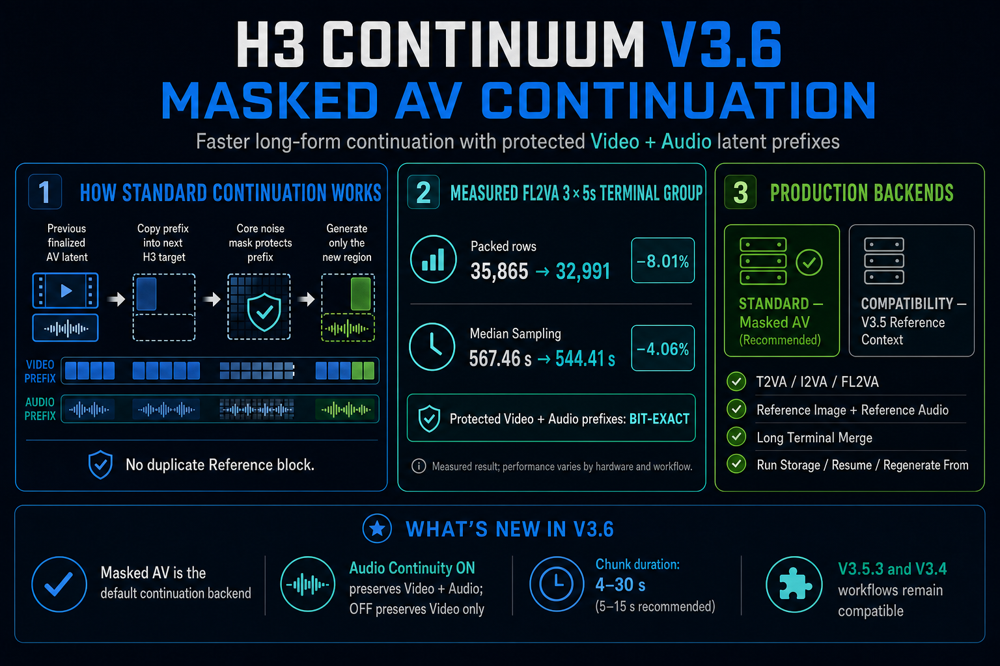

V3.6 adds **H3 Continuum Sampler V3.6**. Its Standard continuation backend places the previous finalized Video and Audio latent prefixes directly inside the next H3 target and protects them with Core noise masks. Unlike the V3.5 Reference Context route, it does not append the same prior frames as a separate Reference block, reducing the packed sequence processed by H3.

| Continuation Backend | Purpose |
|---|---|
| `Standard` | Recommended V3.6 path. Balanced 22 + Audio Continuity uses Masked AV; Fast 5, Strong 39, and Auto safely fall back to Reference Context. When Audio Continuity is off, Masked Video is used. |
| `Compatibility` | Advanced fallback using the accepted V3.5 Reference Context behavior. |

Internal transport identifiers are not exposed in the UI. Run Storage identity follows the resolved transport: Balanced 22 Masked AV stays separate from Reference Context, while a non-Balanced Standard fallback safely shares the identical accepted Reference contract. `Regenerate From` treats the Long Terminal Merge logical pair `[2,3]` as one atomic physical sample.

### Accepted behavior

- T2VA, I2VA, Reference Image + Reference Audio, Balanced 22-frame Joint AV, and 3×5-second FL2VA Long Terminal Merge GPU gates passed.
- Protected Video and Audio prefixes finalize bit-exact; generated regions remain owned by the sampler.
- The accepted Reference Image + Reference Audio output passed subjective audio listening with no reported click, dropout, or stereo-positioning defect.
- In the tested FL2VA Terminal Group 2 pairs, Standard removed 2,874 packed rows (`8.01%`) and reduced median Sampling time by `4.06%` versus Compatibility. Performance varies by model, hardware, and workflow.
- `chunk_seconds` now accepts 4.0–30.0 seconds with a 5.0-second default and 0.1-second step. The 5–15 second range remains recommended and validated; longer high-resolution chunks can substantially increase VRAM use and runtime.

In the historical V3.6 package, V3.5.3, V3.5, and V3.4 Node IDs remained registered for saved workflows. V3.5.3 retained its original Reference Context behavior rather than being silently redirected to the V3.6 backend. This is not a V3.8 registration guarantee.

## V3.5.3 Maintenance Hotfix

V3.5.3 is a distribution-integrity maintenance release. It repairs the public Conditioning Bridge workflow's Width/Height links, removes stale orphan link IDs from the published V3.4/V3.5 templates, corrects Hybrid `<Picture N>` warning numbering, and repairs one legacy PNG for strict image decoders.

There are no changes to generation behavior, nodes, sockets, Sampling, Conditioning payloads, Terminal Merge, Assembly, Seam, Run Storage, Prompt/CLIP caching, Video Guide optimization, or V3.4 compatibility. Existing V3.5.x workflows continue to load unchanged.

## V3.5.2 Stabilization & Optimization Update

V3.5.2 adds no new generation mode. It stabilizes the V3.5.x release, removes repeated Prompt/CLIP work when safe, and lowers temporary memory for long Video Guide inputs while preserving existing workflow and generation contracts.

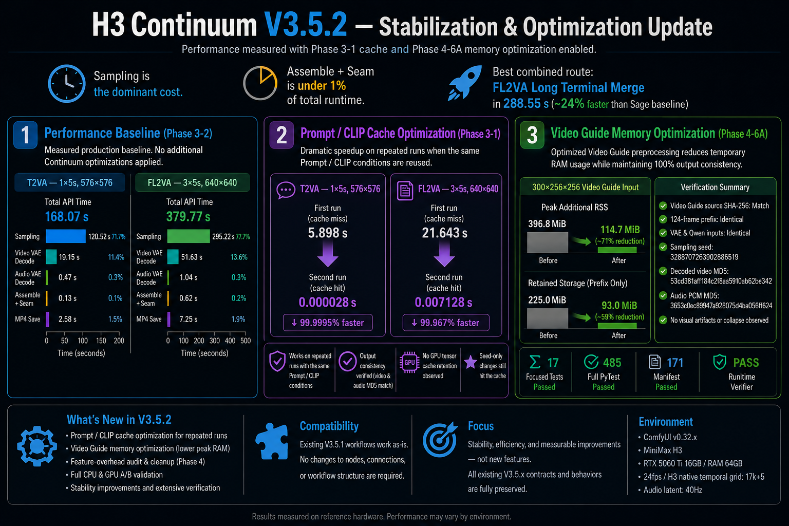

The figure records the accepted optimization measurements. The final packaging gate additionally passed on ComfyUI 0.33.3 with a 172-entry Manifest, including this image.

### What changed

1. **Repeated-run Prompt/CLIP cache** — unchanged T2VA, I2VA, and FL2VA conditioning can reuse CPU-cached Prompt/CLIP results. Reference, scheduled, tokenizer-option, and hook-modified CLIP paths conservatively bypass the cache. Sampling still runs normally.
2. **Video Guide memory optimization** — the complete source remains part of finite validation and SHA-256 identity, but only the required prefix remains stored for VAE/conditioning work.
3. **Stabilization audit** — measured Sampling, Decode, Assembly, saving, optional-feature tax, and retained memory. No speculative Sampling, Driving Audio, Audio hash, Assembly, Seam, Session, or V3.4 optimization was adopted.

### Measured results

| Area | Before | V3.5.2 | Result |
|---|---:|---:|---:|
| T2VA repeated Prompt/CLIP | 5.898398 s | 0.000028 s | Cache HIT, `encode_calls=0` |
| FL2VA repeated Prompt/CLIP | 21.642687 s | 0.007128 s | Cache HIT, `encode_calls=0` |
| Video Guide peak additional RSS | 396.8 MiB | 114.7 MiB | About 71% lower |
| Video Guide retained storage | 225 MiB | 93 MiB | About 59% lower |

Prompt/CLIP figures measure only the conditioning subphase, not total generation time. The Video Guide memory benchmark uses deterministic 300×256×256 RGB input with a 124-frame required prefix. A separate GPU A/B used an actual 15-second / 360-frame Video Guide and produced identical decoded video and audio PCM.

The measured Sage-only production baselines on the tested RTX 5060 Ti 16 GB / 64 GB system were 168.069 seconds for 1×5-second 576×576 T2VA and 379.765 seconds for 3×5-second 640×640 FL2VA Long Terminal Merge. These are configuration-specific baselines, not universal speed guarantees. Sampling remained the dominant cost; Continuum Assemble + Seam stayed below 1%.

> **V3.8.0 is the historical release baseline.** V3.8X2 remains a separate package-3.8.3 workflow, while V3.9 source is available on `main`. Historical implementation modules remain in source because V3.8X2 reuses them internally. The current registration has ten V3.8X2 IDs plus two V3.9 IDs. Use the matching historical Release/tag for workflows requiring other IDs. Still Image Guide remains Experimental.

## V3.5.1 Reference Audio & Compatibility Update

V3.5.1 added two focused features without changing the V3.4 Sampling, Conditioning, Terminal Merge, Assembly, Seam, or Run Storage contracts:

1. **Optional Reference Audio** — native H3 audio conditioning that does not replace the generated final audio.
2. **Conditioning Bridge V3.5** — one complete Core-compatible `MODEL` and `CONDITIONING` object per Continuum physical group for external sampler workflows.

The Reference Audio sockets are permanently defined by Python `INPUT_TYPES`. Dynamic socket changes and the UI-only `Hidden / Show` control were removed to prevent workflow save/reload value shifts. Node IDs, backend keys, Sampling, Conditioning, standard Seed handling, and other widgets are unchanged.

In the historical V3.5.1 package, V3.4 node IDs and backend socket keys remained registered for saved-workflow compatibility. V3.4/V3.5 workflows continued to load there; V3.5.1 clarified the displayed input names without rewriting saved links. V3.8 instead uses the seven-node support boundary above.

### Reference inputs at a glance

The displayed names intentionally describe different jobs. They are not interchangeable pairs:

| Displayed input | Connect from | Purpose | Final audio behavior |
|---|---|---|---|
| `reference_image_1`–`reference_image_3` | Still-image `IMAGE` | Persistent identity, subject, or appearance references | No audio |
| `Video Guide Frames` | Video loader `IMAGE` frame batch | Persistent motion, framing, timing, and appearance guidance across chunks | Does not carry the video's audio |
| `Driving Audio` + `Driving Audio VAE` | Audio loader, or video loader `AUDIO`, plus the matching audio VAE | Audio guidance whose effective source stream is preserved for final output | Replaces generated final audio with the selected source stream |
| `Reference Audio (Optional)` + `Reference Audio VAE (Optional)` | Standalone audio plus the matching audio VAE | Native H3 conditioning only | Does not copy or replace the generated final audio |

For the common video-with-sound case, connect the loader's `IMAGE` output to `Video Guide Frames` and its `AUDIO` output to `Driving Audio`. Do not connect that audio to `Reference Audio (Optional)` unless conditioning-only behavior is specifically intended.

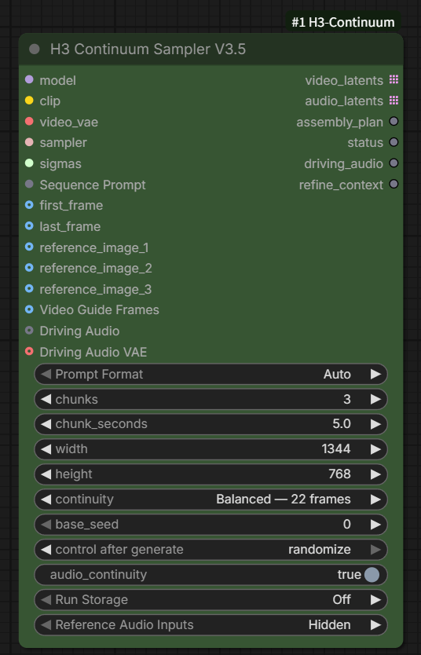

`Reference Audio (Optional)` and `Reference Audio VAE (Optional)` are always present exactly as defined by the node's Python input schema. V3.5.1 no longer adds or removes these sockets dynamically and has no frontend-only `Hidden`/`Show` widget. This keeps positional widget values aligned when workflows are saved and reloaded; backend input keys and existing workflow links are unchanged.

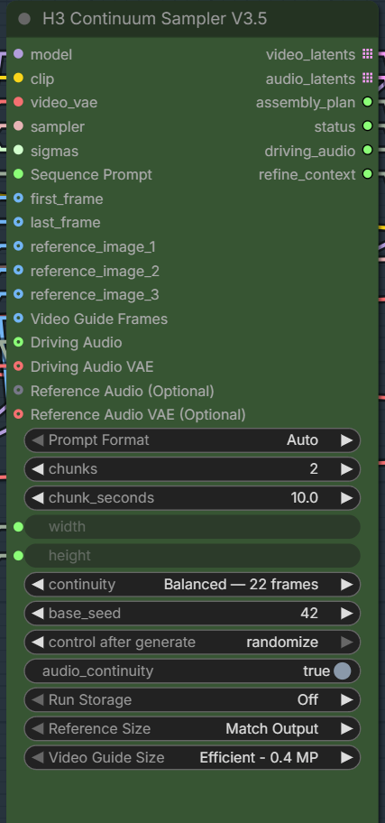

### Conditioning Bridge V3.5

`H3 Continuum Conditioning Bridge V3.5` is the Advanced connection point for external sampling. Connect `model`, `clip`, the externally processed `video_latents`, `assembly_plan`, and `refine_context`; connect `video_vae` only when the selected conditioning path requires it. The node returns parallel `group_models` and `conditioning` lists whose length equals the physical-group count. Each list item remains a complete ComfyUI object—conditioning entries are never flattened into the physical-group list.

```text
H3 Continuum Sampler V3.5.video_latents
  -> external H3 latent processor (for example LBH)
  -> H3 Continuum Conditioning Bridge V3.5
  -> Core BasicGuider + external sampler
  -> Core Video / Audio VAE Decode
  -> H3 Continuum Assemble + Seam V3.5
```

The external workflow owns AV LATENT pairing, noise, SIGMAS, Audio Lock, sampling, and audio passthrough. The Bridge only exposes the prepared `MODEL` and `CONDITIONING` objects plus the updated Assembly Plan.

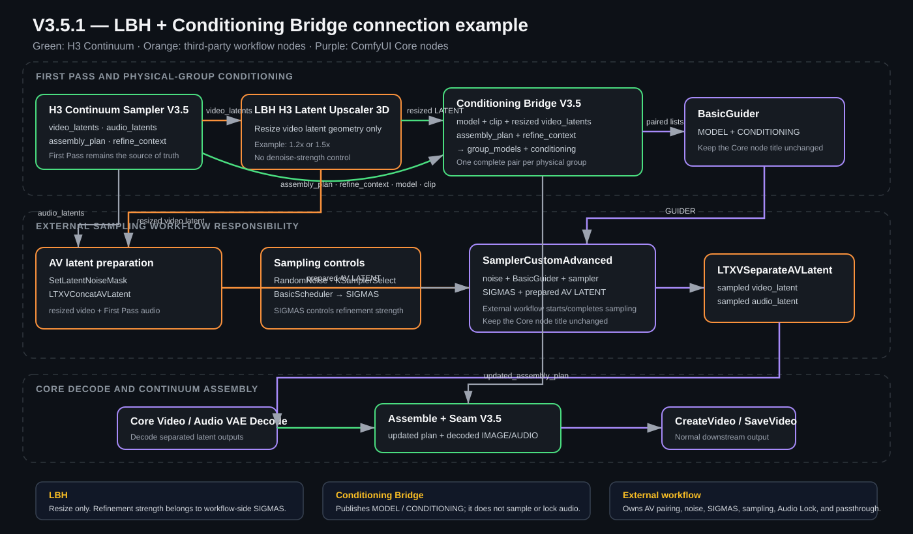

The retired V3.5.1 LBH + Conditioning Bridge example is available only from its matching historical Release/tag; it is not a V3.8 workflow.

The example keeps the standard Core titles `BasicGuider`, `BasicScheduler`, and `SamplerCustomAdvanced`. Public examples do not rename Core nodes, so they remain immediately distinguishable from Continuum and third-party nodes. The workflow also uses external nodes for LBH latent upscaling, AV LATENT concatenation/separation, loading/saving, and optional acceleration; install or replace those nodes according to your ComfyUI environment.

LBH changes latent geometry only. It has no Continuum denoise-strength control: use the external `BasicScheduler` SIGMAS to decide how strongly the resized latent is regenerated. A larger LBH scale such as 1.5x may still be fast, but memory, decode, and sampling costs increase with the target canvas.

## What's new in V3.5

V3.5 has two major additions:

1. **Continuum-aware Second Pass / Hi-Res Fix** — refine externally processed H3 latents or use the integrated pixel/VAE 2x path without changing V3.4 sampling.
2. **Low-memory Assemble + Seam** — write the final video IMAGE directly to RAM or a Windows-safe mapped file while preserving Exact Duration, Seam, Terminal Merge order, and audio behavior.

### 1. Second Pass and Hi-Res Fix

**H3 Continuum Hi-Res Fix V3.5** is the one-node Main path. It performs Video VAE Decode, bounded pixel resize, Video VAE Encode, and one low-denoise Second Pass. The integrated Main path remains **Experimental** because long 2x runs can exceed GPU memory.

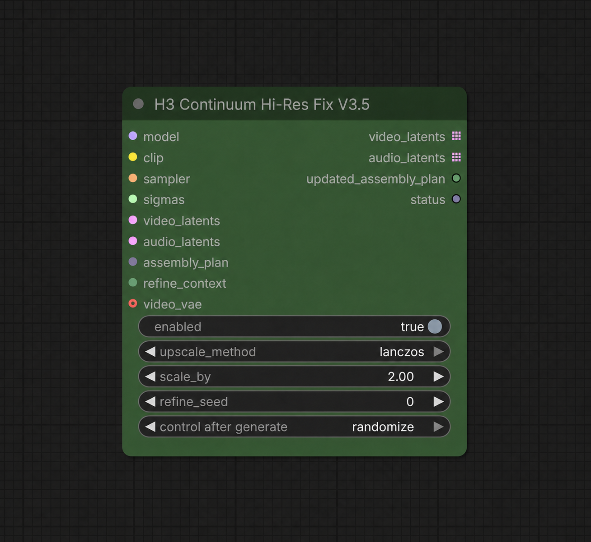

Normal Hi-Res Fix wiring:

```text
H3 Continuum Sampler V3.5
  -> H3 Continuum Hi-Res Fix V3.5
  -> Core Video / Audio VAE Decode
  -> H3 Continuum Assemble + Seam V3.5
```

**H3 Continuum Second Pass V3.5** is the stable Advanced bridge requested in Issue #8. It accepts an externally processed H3 video latent and samples each Continuum physical group once while preserving prompt policy, seed reporting, group order, and the original first-pass audio LATENT object.

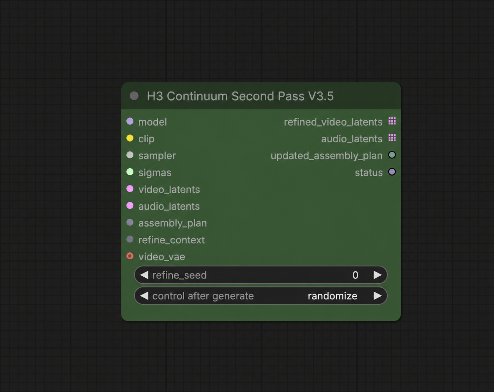

External latent processor wiring, such as LBH:

```text
H3 Continuum Sampler V3.5.video_latents
  -> external H3 latent processor
  -> H3 Continuum Second Pass V3.5
  -> Core Video / Audio VAE Decode
  -> H3 Continuum Assemble + Seam V3.5
```

Connect the original `audio_latents`, `assembly_plan`, and `refine_context` from Sampler V3.5 to the Hi-Res Fix or Second Pass node. Use the same final MODEL and CLIP, plus a separate sampler and workflow-side SIGMAS for the refinement pass. The nodes do not contain an internal denoise value.

The `BasicScheduler` is deliberately omitted from the screenshots. It is still required to create the Second Pass `SIGMAS`. The GPU-tested baseline is:

```text
sampler:   res_multistep
scheduler: simple
steps:     10
denoise:   0.35
```

Do not chain Hi-Res Fix and another Second Pass in the standard path: Hi-Res Fix already performs one Second Pass internally. `H3 Continuum Latent Resize V3.5` is an advanced utility, not the recommended Main 2x path; direct high-ratio interpolation of the 24-channel H3 latent produced persistent artifacts in testing.

If Hi-Res Fix is not connected, V3.4 sampling remains on its original path. V3.5 does not add a forced CPU-offload or low-VRAM sampler mode. `Hi-Res Fix enabled=false` is a lazy exact passthrough and does not evaluate its resize, VAE, or Second Pass dependencies.

See [V3.5 Hi-Res Fix and Second Pass workflow guide](docs/V35_HIRES_FIX.md) for exact sockets, bypass behavior, external-upscaler wiring, and limits.

### 2. Low-memory Assemble + Seam

**H3 Continuum Assemble + Seam V3.5** adds manual RAM / Disk-backed selection and a conservative Auto policy. Disk-backed mode writes the final video IMAGE directly to a mapped file instead of rebuilding the entire completed video in anonymous RAM. Audio remains in RAM.

| Backend | Behavior |
|---|---|
| Auto | Uses RAM only when the final IMAGE is at most 4 GiB and physical-memory reserve is sufficient; otherwise selects Disk-backed. Missing memory counters fail safely to Disk-backed. |
| RAM | Existing in-memory output behavior. |
| Disk-backed | Maps the final video IMAGE to a temporary file; video only. Audio remains in RAM. |

Disk-backed mode preserves the backing file while ComfyUI still references the returned Tensor. Downstream nodes can still allocate a full RAM copy, so Continuum's low-memory guarantee applies to its own assembly stage, not arbitrary downstream implementations.

#### Measured memory reduction

The validated stress case assembled a deterministic `1536 x 1536`, 360-frame float32 IMAGE with a final size of `9.49 GiB`. RAM and Disk-backed outputs were video/audio hash-identical.

| Windows process metric | RAM backend | Disk-backed | Reduction |
|---|---:|---:|---:|
| Private memory | 12.41 GiB | 2.91 GiB | **9.50 GiB** |
| USS | 10.29 GiB | 0.80 GiB | **9.49 GiB** |

This is a **system-RAM/private-commitment** reduction during Continuum Assembly, not a claim that sampler GPU VRAM is reduced. Windows RSS includes resident mapped-file pages and was therefore similar between the two backends; private memory and USS are the relevant measurements. Disk-backed I/O can make final assembly slower, but it does not slow the preceding model sampling path.

#### Optional Windows tip: disable pinned memory

For MiniMax H3 on Windows, starting ComfyUI with `--disable-pinned-memory` can substantially reduce host-RAM pressure. In one local RTX 5060 Ti 16 GB / RAM 64 GB check, a `0.4 MP (640 x 640), 2 x 5s` run completed in `5m 23s`, with about `6.1 GB` sampler RSS and `8.6 GB` after assembly, while showing little practical speed difference from normal startup.

```text
--disable-pinned-memory
```

This is an environment-specific tip, not a default requirement or a universal crash fix. Compare the same workflow and seed with only this option changed, and keep it only when memory use improves without a meaningful speed or stability regression. It disables ComfyUI's pinned host-memory path; it does not guarantee that Windows Shared GPU Memory will never be used.

### GPU acceptance at a glance

| Path | Tested condition | Result |
|---|---|---|
| Main Hi-Res Fix | FL2VA 1 x 5s, 576 -> 1152 | PASS |
| Main Hi-Res Fix | Hybrid FL2VA + Reference 1 x 5s, 576 -> 1152 | PASS |
| Advanced Second Pass | Hybrid/Reference 1 x 5s, 576 x 576 | PASS |
| Main Hi-Res Fix | FL2VA 3 x 5s, 576 -> 1152, RTX 5060 Ti 16 GiB | **CUDA OOM at terminal 77T group** |

For the failed 3 x 5s case, First Pass and the 37T Second Pass group completed. The final logical chunks `[2,3]` remained one 77T Long Terminal Merge physical group and exceeded the tested 16 GiB GPU at its first 1152x1152 Second Pass inference. This is a documented resource limit; the Continuum grouping contract did not change.

## V3.4 compatibility baseline

The historical V3.5 package retained V3.4 nodes for saved workflows; it did not replace their Node IDs, public sockets, Sampling, Conditioning, Terminal Merge, Assembly, Seam, or Run Storage behavior. Those historical workflows remain available through the corresponding Release/tag. Current V3.9 exports only its twelve registered IDs, even when older implementation modules remain in source.

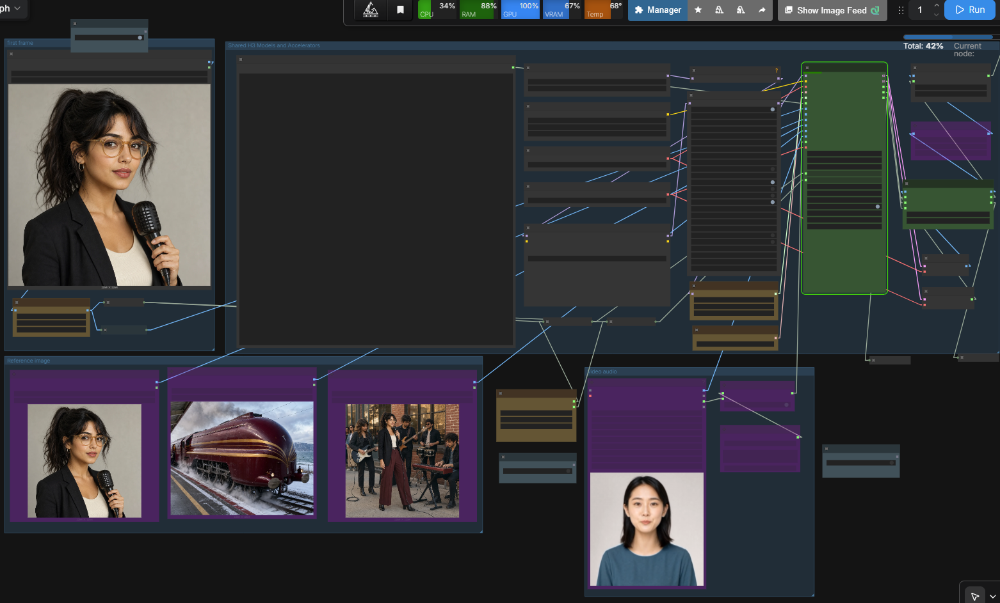

V3.4 focuses on the two reference workflows that are most useful in normal production:

- **Driving Audio**: use an existing audio source as the preserved final audio while it guides the H3 generation across chunks.
- **Video Guide Frames**: use a video loader's IMAGE frame batch as persistent guidance for appearance, motion, framing, and timing without treating it as a frame-by-frame copy.
- **Hybrid FLF + Reference**: use First Frame, Last Frame, and persistent Reference Images together without adding a separate mode or model allowlist.
- **FL2VA Terminal Merge**: keep the final two 5-second FL2VA chunks as one physical 10-second sampling and decode unit for Core-equivalent Last Frame handling.
- **Restartable chunks**: reuse completed chunks with Run Storage and regenerate only the selected part when the generation contract remains compatible.
- **Core compatibility**: remove Continuum-only rejection of unknown upstream/custom nodes and remove the obsolete `strict_compatibility` control.
- **Spectrum interoperability**: use the official H3 Continuum Interop API v1 when Spectrum is installed; Spectrum remains optional.
- **Simpler public interface**: Timeline Video and the earlier timeline-audio paths are hidden from the V3.4 public sampler interface rather than being presented as stable production features.

### Direction change: from timeline generation to preserved references

Earlier development explored Timeline Video and timeline-audio conditioning. Those paths can be useful for experiments, but they are not the default production behavior: chunk boundaries can change visual content, and generated audio can diverge from a supplied song, dialogue, or effects track.

V3.4 therefore prioritizes:

1. **Driving Audio** for cases where the supplied audio should remain the final audio stream.
2. **Video Guide Frames** for cases where a supplied video should guide the generated result without requiring exact frame reproduction.
3. **Chunked generation and Run Storage** for practical retries and long-form work.

This is a usability and reliability decision, not a claim that the experimental timeline paths are impossible. They are hidden from the stable interface while the public workflow stays focused on predictable user-controlled inputs.

## Example workflow

- [V3.9 workflow JSON](examples/workflows/MiniMax_H3_Continuum_V39.json) and [ZIP](examples/workflows/MiniMax_H3_Continuum_V39.zip) — current V3.9 graph; the ZIP contains only this JSON
- [V3.8X2 workflow JSON](examples/workflows/MiniMax_H3_Continuum_V38X2.json) — retained V3.8X2 graph; Spectrum is disabled by default
- [V3.8X2 workflow ZIP](examples/workflows/MiniMax_H3_Continuum_V38X2.zip) — contains both the V3.8X2 and V3.9 JSON files; it is not a custom-node installer
- [V3.8X2 Helper-explicit JSON](examples/workflows/MiniMax_H3_Continuum_V38X2+Decode_Cache_Helper.json) and [ZIP](examples/workflows/MiniMax_H3_Continuum_V38X2+Decode_Cache_Helper.zip) — the same graph under an explicit distribution name

The declared Registry payload includes both V3.9 and V3.8X2 graphs; it is **not dependency-free**. Spectrum, rgthree, and KJNodes must be installed separately; ComfyUI-Easy-Use is not required. Historical workflow files remain in GitHub source but are excluded from the Registry payload. For an older saved workflow, use its matching historical Release/tag as described in the [migration policy](docs/V38_RELEASE_AND_MIGRATION.md). Registry packaging validation/publication is separate from this GitHub source update.

## V3.4 feature details

### Driving Audio

Driving Audio is the primary V3.4 audio path.

- Source audio guides each chunk at its absolute sequence position.
- The original effective stream is preserved for final output.
- Generated audio and Audio Seam processing are bypassed while Driving Audio is active.
- Audio is not independently rewritten at every chunk boundary.
- Perfect lip sync is not guaranteed; results still depend on H3, source material, prompts, and sampling.

### Video Guide Frames

`Video Guide Frames` provides a persistent native H3 video guide across all chunks. Despite its ComfyUI `IMAGE` socket color, it expects the frame batch produced by a video loader rather than one ordinary still-image reference.

- It guides motion, framing, timing, and appearance.
- It is not a direct pixel-copy or deterministic identity-transfer system.
- Video and audio are independent. Route a loader's IMAGE output to `Video Guide Frames` and AUDIO output to `Driving Audio`.
- Source decoding and frame-rate conversion remain loader responsibilities. Continuum does not impose an unnecessary forced 24 fps conversion.

| Video Guide Size | Purpose |
|---|---|
| Efficient - 0.4 MP | Default; lower token cost and faster iteration. |
| Balanced - 0.6 MP | More detail at a higher compute cost. |
| Match Output | Largest reference input; potentially much slower and heavier. |

#### Conditional size controls and internal resize

The compact V3.5 UI shows each size control only when its corresponding input is connected:

- Connect any of `reference_image_1` through `reference_image_3` to reveal `Reference Size`.
- Connect `Video Guide Frames` to reveal `Video Guide Size`. Earlier workflows and reports may call this control `Video Reference Size`; V3.5.1 uses the clearer display name `Video Guide Size` while preserving the existing backend key and saved-workflow compatibility.

These controls are therefore not missing from a newly created node; they are hidden until relevant. Reference Images and Video Guide Frames are resized internally before VAE encoding. Video Guide Frames preserve their aspect ratio, align to the H3 canvas, and use Lanczos when reduction is needed. Smaller sources are not enlarged automatically. An external resize node is normally unnecessary, but remains useful for deliberate cropping, forced upscaling of a small source, or a custom resize/upscale algorithm. Video decoding and frame-rate conversion remain the loader's responsibility.

### Hybrid First/Last Frame + Reference Images

You need an hybrid version of MiniMax-H3 to make both I2V and reference images work:

https://huggingface.co/smhfacct/Minimax-H3-fl2va-ref2va-hybrid-models

https://www.reddit.com/r/StableDiffusion/comments/1vm62pj/i_tested_out_the_b2049_hybrid_variant_for_r2v/

V3.4 supports First Frame, Last Frame, and persistent Reference Images in the same Continuum run. The public sockets and controls are unchanged: connect the inputs that the selected H3 model supports.

- Pure FL2VA and pure Ref2VA identity contracts remain unchanged.
- The combined path receives a distinct hybrid identity so Run Storage does not reuse incompatible chunks.
- Prompt/reference mismatches produce guidance warnings rather than a Continuum-only execution stop.
- No model-name allowlist or automatic model replacement is used.

Local checks passed with the B2049 hybrid variant. FL-only models could run, but showed less reliable transitions when FLF and Reference Images were combined; a hybrid-capable model is therefore recommended for this path.

### FL2VA Terminal Merge

For 5-second FL2VA workflows, Continuum keeps the final two logical chunks together as one physical sampling and VAE decode unit.

- `2 x 5s`: one 243-frame physical sample, decoded once, then adjusted to the requested 240-frame output.
- `3 x 5s` and longer: earlier chunks use normal Continuation; the final two chunks use one 260-frame physical sample containing the 22-frame continuation context.
- After the terminal physical decode, the 22-frame context prefix is removed. For `3 x 5s`, this gives `124 + 238 = 362` frames before exact-duration adjustment to 360 frames.
- If the final two prompt sections differ, they are rebased internally to a local `[0-5s]` / `[5-10s]` timeline. Identical prompts retain the accepted shared-prompt path.
- The terminal pair uses one physical seed and one physical decode while Run Storage continues to preserve normal logical chunk entries.

Local GPU comparison confirmed that `2 x 5s` matches Core 10-second FL2VA sampling and terminal decode behavior. A `3 x 5s` Timeline run also passed with three logical chunks, two physical sampling passes, two physical decode groups, and a 15.000-second output. The short still period near the supplied Last Frame was also present in the equivalent Core result and is treated as normal FL2VA convergence rather than a Continuum-specific failure.

### Core-first, permissive execution

V3.4 removes or relaxes Continuum-only rejection rules that blocked otherwise runnable Core H3 experiments.

- Prompt problems prefer warnings and fallback behavior instead of stopping.
- Unknown upstream/custom wrapper classes are not blanket-rejected.
- There is no model allowlist and no automatic model replacement.
- The obsolete strict_compatibility control is removed from the V3.4 interface.
- Current Core PackedLayout behavior is supported without requiring the removed legacy frame_count argument.

Hard stops remain only for states that cannot execute safely, including corrupt latent topology, incompatible assembly data, invalid persisted revisions, or unusable mandatory payloads.

### Cleaner interface

The public nodes focus on normal production controls. Developer diagnostics and detailed reports are available through ComfyUI settings. The current release path uses `H3 Continuum Sampler V3.8`; older sampler and assembler notes below are retained for historical compatibility context.

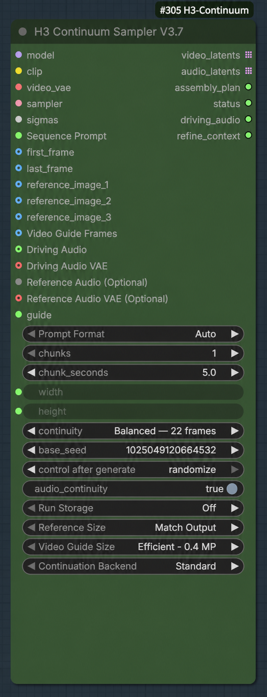

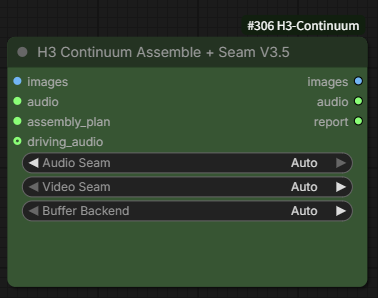

### Timeline paths

Experimental Timeline Video and earlier timeline-audio paths remain in historical implementation code but are not exported by V3.8. Open V3.3 workflows with their historical package; new V3.8 workflows should use `Driving Audio` and `Video Guide Frames`.

## Installation

V3.8 is verified against ComfyUI 0.34.2. Historical acceptance records below may mention older ComfyUI versions; they are not the current installation target.

### Updating an existing installation

For a Git checkout, run the update from the custom-node directory:

```powershell
cd ComfyUI/custom_nodes/ComfyUI-H3-Continuum
git pull --ff-only origin main
```

Restart ComfyUI after the update. If the node was installed with ComfyUI Manager, use its **Update** action instead of running `git pull` manually. Do not mix Manager updates and a separate Git checkout for the same installation.

After the backend restart, search for `H3 Continuum Sampler V3.8` with the V3.8X2 workflow, or `H3 Continuum Sampler V3.9` and `H3 Continuum Reference Images V3.9` with the V3.9 workflow. The source registers twelve IDs in total. If they are missing, check the startup console for the `H3 Continuum 3.9.0 loaded` message and any `ComfyUI-H3-Continuum` import error.

Search for H3 Continuum or Continuum in ComfyUI Manager, or install manually:

~~~bash
cd ComfyUI/custom_nodes
git clone https://github.com/ukr8b3g-cmyk/ComfyUI-H3-Continuum.git
~~~

Restart ComfyUI after installation or update.

## V3.5 nodes

### H3 Continuum Sampler V3.5

The V3.5 sampler preserves V3.4 generation behavior and adds `refine_context` as the sixth output. Connect it to V3.5 Hi-Res Fix, Second Pass, or Conditioning Bridge paths that need the original conditioning context. V3.5.1 also provides permanently visible optional Reference Audio sockets.

### H3 Continuum Conditioning Bridge V3.5

Advanced external-sampler bridge. It returns aligned `group_models` and complete `conditioning` objects per physical group together with the updated Assembly Plan. It does not create AV LATENT pairs, noise, SIGMAS, Audio Lock, or external sampling policy.

### H3 Continuum Hi-Res Fix V3.5 (Experimental)

Main convenience node. When enabled, it performs the Video VAE pixel-resize round trip and Second Pass internally. When disabled, video/audio LATENT objects and the Assembly Plan pass through unchanged and the sampling/VAE dependencies remain lazy.

### H3 Continuum Second Pass V3.5

Advanced Issue #8 bridge for an externally processed video latent. It samples once per physical group, reads the physical prompt contract from the Assembly Plan, and returns the original first-pass audio LATENT objects.

### H3 Continuum Latent Resize V3.5

Utility that changes only video-latent H/W. It does not sample. Direct 2x interpolation at large square targets is not the accepted Main Hi-Res Fix method.

### H3 Continuum Assemble + Seam V3.5

V3.4-compatible assembly with Auto, RAM, and Disk-backed video-buffer backends. Exact Duration and seam corrections write directly to the selected target buffer.

## V3.4 nodes

### H3 Continuum Sampler V3.4

Main inputs:

- model, clip, video_vae, sampler, sigmas
- Sequence Prompt
- first_frame, last_frame
- reference_image_1 through reference_image_3
- Video Guide Frames
- driving_audio, audio_vae

Outputs:

- video_latents, audio_latents
- assembly_plan, status
- driving_audio

Visible controls:

- Prompt Format, chunks, chunk_seconds
- width, height, continuity
- base_seed, control after generate
- audio_continuity
- Run Storage
- Reference Size
- Video Guide Size

`chunk_seconds` uses one shared duration for every chunk. The default is 5.0
seconds; 5–15 seconds remains the recommended and validated range. Durations up
to 30.0 seconds are supported, but values above 15 seconds can substantially
increase VRAM use and processing time, especially at high resolution. Per-chunk
variable durations are not supported.

### H3 Continuum Assemble + Seam V3.4

Inputs: images, audio, assembly_plan, and driving_audio.

Controls: Audio Seam and Video Seam.

When Driving Audio is connected, preserved source audio is selected for final output and generated audio seam processing is bypassed.

## Connection order

~~~text
H3 model / CLIP / Video VAE / sampler / sigmas
                         |
                         v
              H3 Continuum Sampler V3.4
                 |       |        |
          video_latents  |   assembly_plan
                         |
                  audio_latents

video_latents -> Core VAE Decode ------- images --+
audio_latents -> Core VAE Decode Audio -- audio  --+--> H3 Continuum Assemble + Seam V3.4
assembly_plan -------------------------------------+
driving_audio -------------------------------------+
~~~

For a source video with sound:

~~~text
Video loader IMAGE -> Video Guide Frames
Video loader AUDIO -> driving_audio
~~~

The supplied templates use Video Helper Suite for this split. Any compatible IMAGE/AUDIO loader may be substituted.

## Prompt formats

### Timeline

For **Timeline** mode, each time-range header must be written on its own line. Write the scene description on the following line or lines.

Recommended format:

~~~text
[0-5s]
First section: action, camera movement, and scene progression.

[5-10s]
Continue from the exact final state of the previous section.

[10-15s]
Continue naturally without resetting the scene.
~~~

For 10-second chunks:

~~~text
[0-10s]
Describe the first scene.

[10-20s]
Describe the next scene.

[20-30s]
Continue the sequence.

[30-40s]
Describe the final section.
~~~

**Important:** do not place the prompt text on the same line as the time header.

Correct:

~~~text
[0-5s]
Describe the scene.
~~~

Not recommended:

~~~text
[0-5s] Describe the scene.
~~~

The second form is not recognized as a Timeline header. When **Prompt Format = Auto**, it may therefore be interpreted as a Fixed prompt instead, causing the complete text to be reused across chunks.

The time ranges should normally match the configured `chunk_seconds`.

- `chunk_seconds = 5` → `[0-5s]`, `[5-10s]`, `[10-15s]` ...
- `chunk_seconds = 10` → `[0-10s]`, `[10-20s]`, `[20-30s]` ...
- `chunk_seconds = 15` → `[0-15s]`, `[15-30s]`, `[30-45s]` ...
- `chunk_seconds = 30` → `[0-30s]`, `[30-60s]`, `[60-90s]` ...

#### Global preamble and per-chunk prompting

Text placed before the first Timeline header is treated as a **global preamble** and is automatically included in every chunk prompt. This is a good place for information that should apply throughout the sequence, such as subject definitions, overall style, persistent environment details, or other global instructions.

However, the Timeline sections do not need to contain only the changing action or scene description. For complex scenes, multiple characters, or longer chunks such as 10–15 seconds, it can be useful to repeat important details about the subjects, appearance, location, camera, and current scene state inside each section. More self-contained chunk prompts may sometimes give H3 stronger continuity and reduce cut-like transitions or drift.

Continuum carries visual/audio context from the previous chunk, but that does not guarantee that H3 will preserve every semantic detail automatically. Instead of relying only on phrases such as "continue from the previous chunk," describe the intended next action and important continuity details explicitly.

For example:

~~~text
Subject: A woman in a red jacket.
Style: cinematic nighttime photography.

[0-15s]
A woman in a red jacket stands at the nightclub bar, speaking with two people beside her. Medium shot, slow handheld camera movement, crowded dance floor visible behind them.

[15-30s]
The same woman in the same red jacket continues the conversation at the same bar with the same two people. The camera remains close and slowly moves around the group as one person replies.

[30-45s]
The woman turns toward the dance floor while remaining beside the bar. Keep the same clothing, nightclub environment, nearby characters, and continuous camera style.
~~~

The global preamble is optional. If fully self-contained prompts inside every Timeline section give better continuity for a particular model or scene, that is also a valid approach.

### Other prompt formats

**List** prompts use `---` separators.

**Fixed** reuses one prompt for every chunk.

**Auto** detects Timeline, List, or Fixed formatting from the supplied text.

If Timeline syntax cannot be parsed, V3.4 reports a warning and falls back to an applicable prompt mode rather than rejecting an otherwise runnable workflow.

## Run Storage

Run Storage preserves completed chunks and can reuse them after restarting ComfyUI. Regenerate From selects the first chunk to regenerate; earlier compatible chunks remain unchanged.

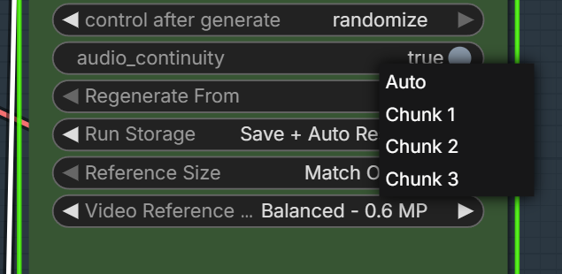

### Keep the first part and regenerate the second part

For a normal T2VA or I2VA run configured as `2 chunks x 5 seconds`, Chunk 1 is the first five seconds and Chunk 2 is the second five seconds.

Before the first generation:

1. Set `Run Storage` to `Save + Auto Resume`.
2. Choose a fixed `Run Name` and keep the Base Seed fixed.
3. Generate the complete ten-second video once. Continuum stores the raw Video/Audio latent for each completed chunk.

To generate a different second part while keeping the first part:

1. Keep the same Run Name, Base Seed, model, LoRA, resolution, sampler, SIGMAS/steps, references, and Continuation settings.
2. Set `Regenerate From` to `Chunk 2`.
3. Leave `Variation Nonce = 0` for automatic new variations after completed regenerations, or choose a different positive value for an explicit variation. A compatible interrupted regeneration at `0` resumes its existing variation; reusing the same positive value does not request a different result.
4. Queue the workflow again.

Continuum loads the stored Chunk 1 instead of Sampling it again, uses its finalized end as the continuation context, and Samples a new Chunk 2. The report should show `1 reused, 1 generated`. The complete output is then decoded and assembled again; the saved first chunk is reused, while boundary Seam processing is evaluated during the new assembly.

If the two parts need different instructions, define them with List or Timeline Prompt syntax before the first generation. Changing the Prompt Plan or other generation-contract inputs after a stored run can create a new revision, in which case the previous Chunk 1 may not be reusable. A run originally generated with `Run Storage = Off` cannot be reused retroactively. `Regenerate From` works at chunk boundaries; it does not edit an arbitrary region inside one chunk.

FL2VA Long Terminal Merge is an important exception: its final two logical chunks are one atomic physical Sampling unit, so those two chunks are regenerated together.

- Use a fixed seed for reproducible resume.
- Changing persistent models, LoRAs, references, prompts, resolution, or sampling settings can create a new revision.
- Unknown upstream node classes no longer cause rejection by themselves; reuse still depends on compatible observable contracts and hashes.

## Spectrum interoperability

Spectrum is optional. Current Spectrum releases officially support H3 Continuum Interop API v1.

- Chunk 1 uses the normal initial path.
- Chunk 2 and later request Actual Prefix 2.
- Successful continuation logs accepted H3 Continuum API v1, actual prefix=2.
- Unsupported Spectrum versions fall back without a private patch.

See [Spectrum v0.2.15 H3 Continuum interoperability](https://github.com/xmarre/ComfyUI-Spectrum-MiniMax-H3#v0215-h3-continuum-interoperability).

Turbo LoRA and Spectrum are not mutually exclusive. Quality and speed remain workflow-dependent.

## Issue and pull-request response

### Issue #3

V3.4 removes blanket rejection of unknown upstream/custom class names. Run Storage evaluates the observable generation contract instead of treating an unfamiliar wrapper as automatically incompatible.

See [Issue #3](https://github.com/ukr8b3g-cmyk/ComfyUI-H3-Continuum/issues/3).

### Issue #4

V3.4 follows the current Core H3 layout contract and no longer requires the legacy frame_count parameter. The old strict-compatibility toggle is not part of the public interface.

See [Issue #4](https://github.com/ukr8b3g-cmyk/ComfyUI-H3-Continuum/issues/4).

### Issue #7

V3.4 allows First Frame, Last Frame, and Reference Images to be used together without requiring the separate BigStationW node or introducing a model allowlist. Hybrid presentation ordering and Run Storage identity are handled by Continuum while pure FL2VA and pure Ref2VA behavior remain unchanged.

The combined path was exercised locally with the B2049 hybrid variant. FL-only models were less consistent for this specific combination, so the README recommends a hybrid-capable model rather than rejecting other models in code.

See [Issue #7](https://github.com/ukr8b3g-cmyk/ComfyUI-H3-Continuum/issues/7).

### Pull request #1 and #2

These older partial pull requests were superseded by the consolidated [Pull request #5](https://github.com/ukr8b3g-cmyk/ComfyUI-H3-Continuum/pull/5). V3.4 selectively includes the compatibility direction needed for the current Core H3 contract, while the broader upstream synchronization and release-automation scope remains a separate upstream review.

The older pull requests are not represented as merged V3.4 changes.

### Pull request #5

PR #5 is the consolidated upstream-to-fork proposal covering current H3 compatibility, reference-input handling, assembly memory behavior, exact-duration handling, continuation-reference interoperability, and CI/release automation. V3.4 already contains the user-facing stability decisions described above; the PR remains an upstream review item and is not claimed as merged here.

## V3.4 input connection patterns

V3.4 separates the video-guide frame input from the driving-audio input. Choose the connection pattern that matches your source material.

### 1. Audio only

Connect `Load Audio` to `Driving Audio`. Use this when an existing song, dialogue track, or sound effect should remain the final audio. `Video Guide Frames` is not required.

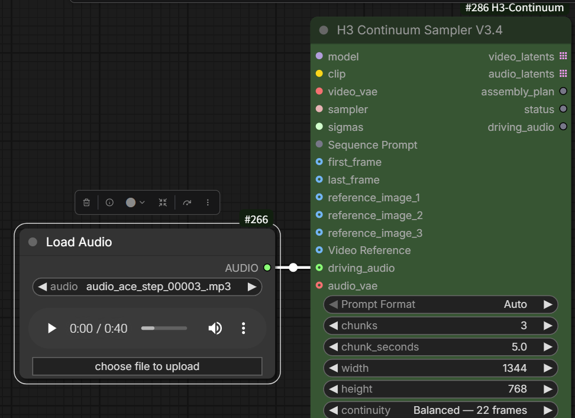

### 2. Video with its own audio

Connect `Load Video (Upload)` `IMAGE` to `Video Guide Frames`. If the uploaded video contains the audio you want to preserve, connect its `AUDIO` output to `Driving Audio` as well.

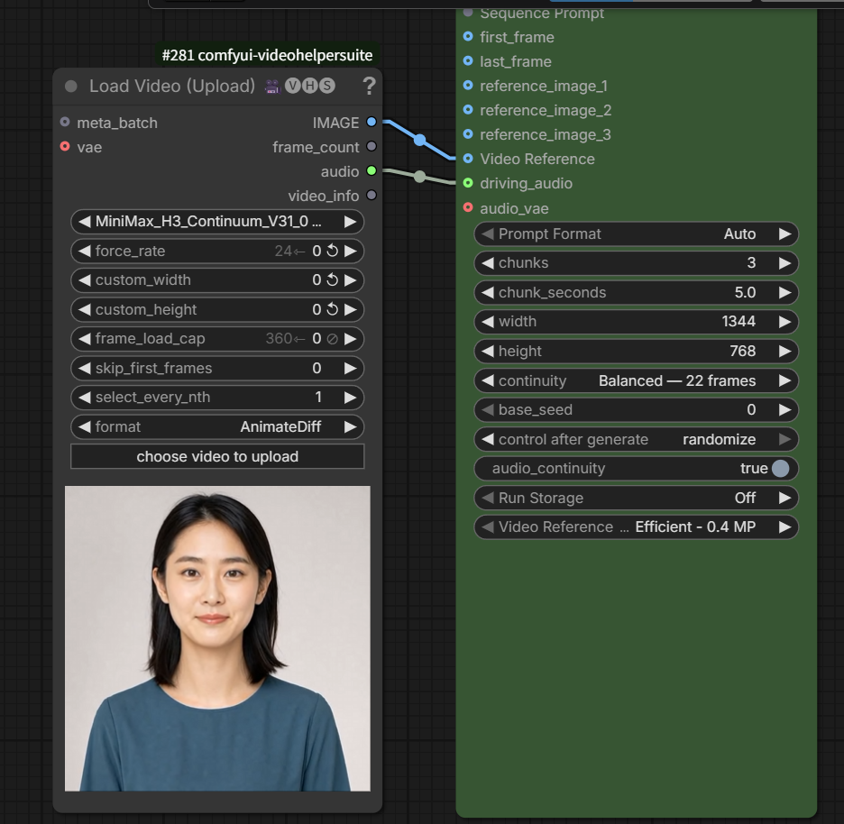

### 3. Video and audio from separate sources

Connect `Load Video (Upload)` `IMAGE` to `Video Guide Frames`, then connect a separate `Load Audio` node to `Driving Audio`. Use this when the video guide and the final audio source are different files.

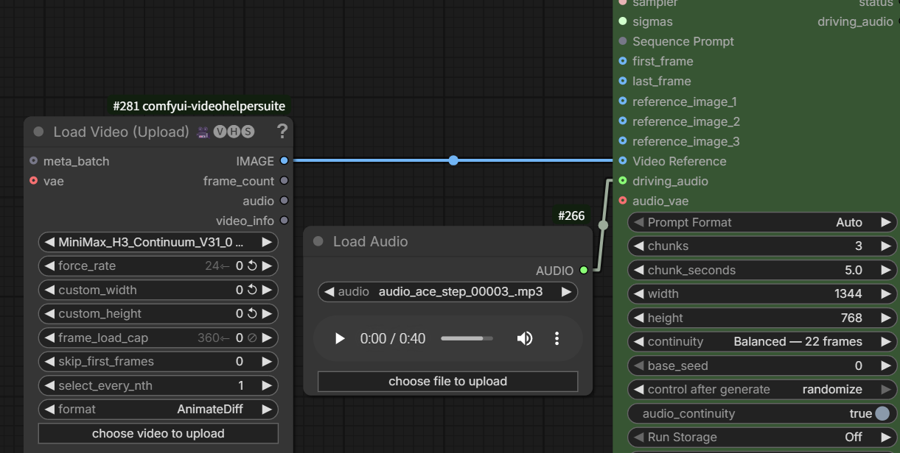

Both inputs are optional. Connect `Video Guide Frames` when video guidance is needed, and connect `Driving Audio` when the supplied audio should be preserved in the final output.

### Video Guide Frames frame rate

Use a 24 fps source for `Video Guide Frames`. `Load Video (Upload)` may accept files recorded at 25 fps or another frame rate, but acceptance alone does not guarantee correct temporal alignment with H3. For a non-24 fps source, set `force_rate` to `24` in `Load Video (Upload)`, or convert the file to 24 fps before loading it. If the source is already 24 fps, leave `force_rate` at its default and do not resample it.

## Current validation status

The public-surface suite checks ten V3.8X2 IDs and twelve IDs including V3.9, official workflows and matching ZIP payloads, declared external dependencies, Registry exclusions, preserved V3.8 widget/socket order, and presentation-only `Show Advanced Settings` / `Hide Advanced Settings` behavior. Registry payload hashes are recorded in `REGISTRY_MANIFEST.sha256`; source integrity is recorded in `MANIFEST.sha256`.

**Historical V3.8X2 preparation evidence:** the full CPU suite passed **1,367 passed / 1 skipped / 0 failed**. The prior dedicated GPU Functional Gate passed a `3 × 5 second` Review Each Chunk run: Q1–Q3 generated one physical group at a time, and Q4 reused all three groups with `3 reused / 0 generated`. Q3 and Q4 had identical decoded RGB and PCM SHA-256 values. The separate nine-reference Gate is recorded below. These checks confirm functional execution, prefix reuse, AV reconstruction, and the tested nine-reference path; they are not a full subjective image- or audio-quality rating.

### Nine-reference input gate (0.3 MP reference images)

On the tested NVIDIA GeForce RTX 5060 Ti 16 GB / 64 GB RAM system, a `3 × 5 second` Full Run completed with Reference Images 1–9, `512 × 608` output, Spectrum Off, LoRA Off, Sage Attention, Balanced 22-frame continuity, and test reference images sized to about `0.30 MP` each. Sampling used approximately `15.0–15.5 GiB` of the available `16,311 MiB` VRAM, so this is a high-resource configuration with little headroom on a 16 GB GPU.

Use the nine-reference bundle when the extra appearance or pose evidence is needed and the system has enough VRAM headroom. This single-seed gate confirms execution and basic visual continuity; it does not establish that nine references are universally higher quality than three, nor guarantee operation with higher-resolution references, larger output sizes, different models, or other concurrent GPU workloads.

For nine-reference use on a 16 GB GPU, pre-resize copies of the source images to around 0.30 MP before loading them. Internal conditioning resize remains active, but it should not be treated as a substitute for controlling the memory pressure of nine large source images.

Validation results apply to the tested local source and environment. They do not guarantee that an installed copy is current, that all models/wrappers fit every GPU, or that a different prompt will have the same visual quality.

## Limits

- V3.8 Second Pass / `refine_context` is not supported while a Review sequence is partial. V3.9 supports validated output-group conditioning for partial Review as described above.
- The 16GB GPU Gate passed with small VRAM headroom; memory use depends on the complete environment and workflow.
- Continuation does not guarantee frame-perfect identity or motion.
- Video Guide Frames guides H3; it does not reproduce every source frame.
- Driving Audio preserves selected audio, but visual lip synchronization remains model-dependent.
- FL2VA may settle on the supplied Last Frame before the requested duration ends; equivalent Core runs can show the same behavior.
- Long, high-resolution sequences may exceed system RAM during final decode and assembly even when chunk sampling succeeds.
- Disk-backed assembly lowers anonymous/private memory commitment for the final Continuum IMAGE, but Core Decode and downstream nodes may still allocate large RAM copies.
- Main Hi-Res Fix 3x5 2x is not accepted on the tested RTX 5060 Ti 16 GiB: the 37T group completed at 1152x1152, but the terminal 77T group failed at its first Second Pass inference with CUDA OOM. Reference/Hybrid-specific 1x5 acceptance passed; longer Hybrid/Reference cases remain unverified.
- Direct high-ratio interpolation with Latent Resize can create persistent H3 artifacts; use the Pixel/VAE Main path or an appropriate external H3 latent processor.
- Match Output can be substantially slower than 0.4 MP or 0.6 MP.
- Seam correction may keep the native boundary when a proposed correction is not safer.
- Optional template nodes must be installed, replaced, or bypassed by the user.

## License

See [LICENSE](LICENSE).
